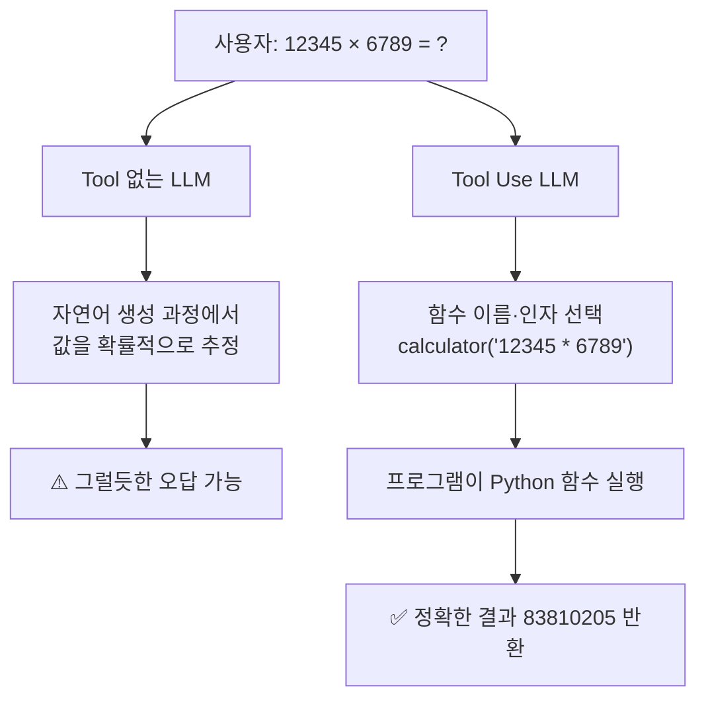
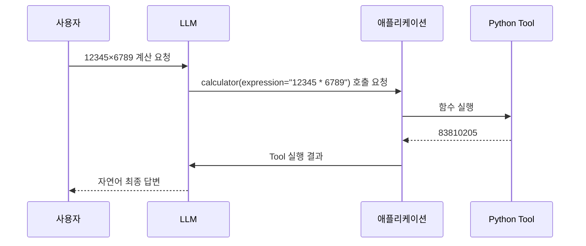
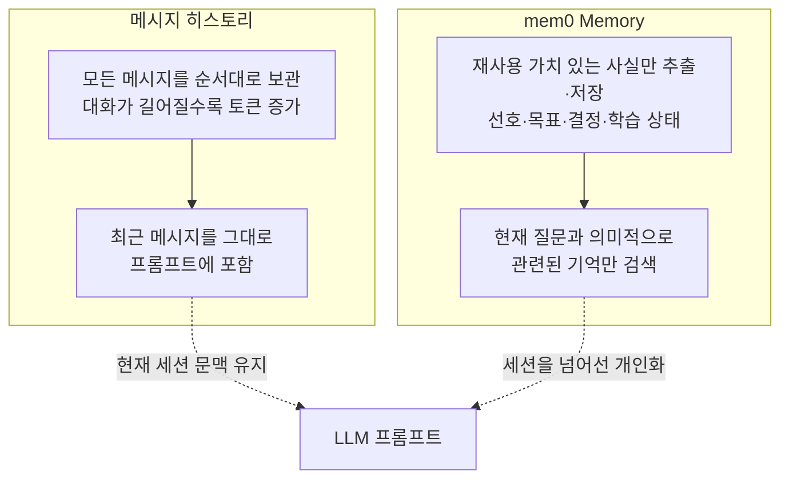
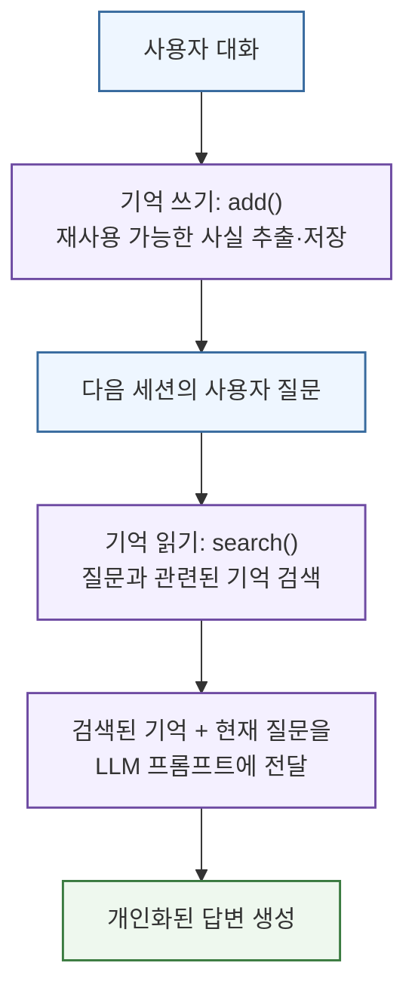
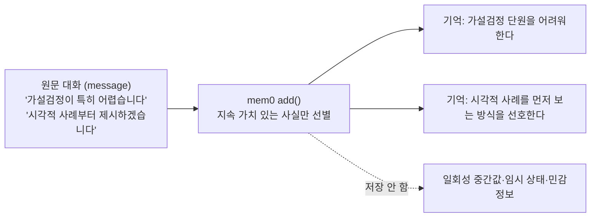
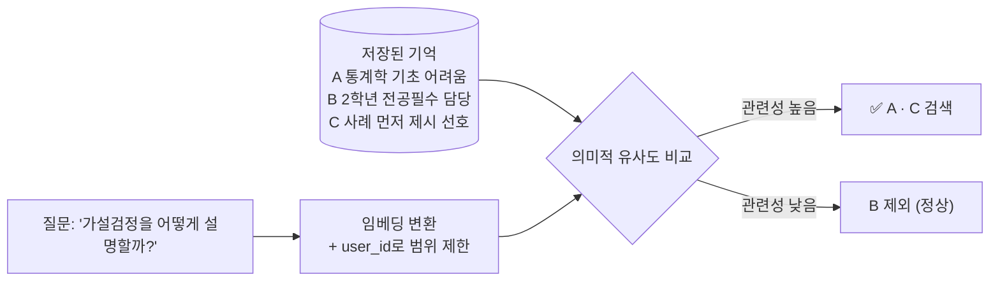
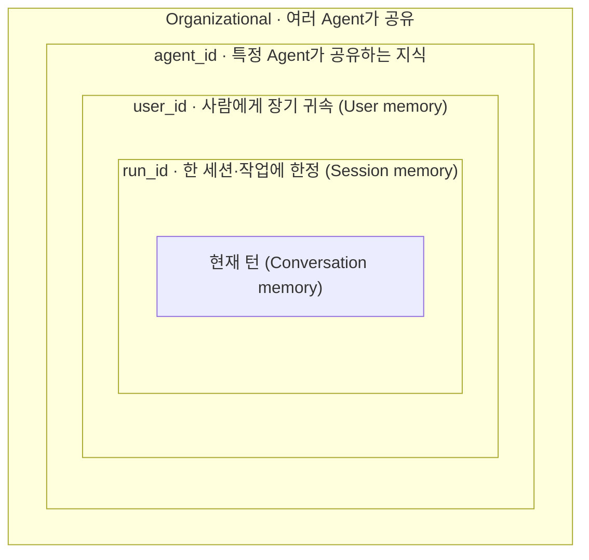
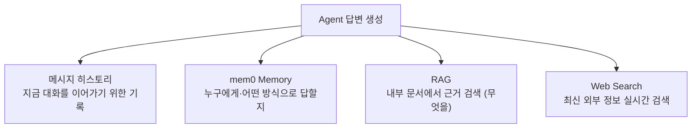

# AI MASTER 6주차 1일차 강의교재 — 8월 10일

## Tool Use·Function Calling·Memory

# 제1장. 질문에 답하는 모델에서 행동하고 기억하는 에이전트로

## 1.1 오늘의 목표

- 계산이나 텍스트 처리를 Python Tool에 맡긴다.
- Tool의 실행 결과(`response`) 구조를 뜯어보고, 멀티턴 대화에 연결한다.
- 여러 Tool 중 상황에 맞는 것을 모델이 스스로 고르도록 설계한다.
- 사용자별 사실을 mem0 Memory에 저장하고 검색한다.

---

# 제2장. Tool Use와 Function Calling

## 2.1 LLM이 계산을 직접 수행하게 하지 않는 이유

LLM은 입력 문맥 다음에 올 토큰을 확률적으로 예측한다. 자연어 설명에는 강하지만, 큰 수의 곱셈이나 정확한 날짜 계산처럼 결정적인 연산에서는 그럴듯한 오답을 만들 수 있다.

예를 들어 사용자가 다음을 묻는다.

```text
12345 × 6789는 얼마인가?
```

Tool이 없는 모델은 내부 생성만으로 답한다. Tool Use 모델은 계산이 필요하다고 판단하고 `calculator` 호출 요청을 만든다. 실제 계산은 Python 함수가 수행한다.

| 구분 | 처리 방식 |
|---|---|
| Tool 없는 LLM | 모델이 자연어 생성 과정에서 값을 추정 |
| Tool Use LLM | 모델이 함수 이름과 인자를 선택 → 프로그램이 함수 실행 → 결과를 모델에 반환 |

같은 질문이라도 두 방식의 경로가 다르다. Tool 없는 모델은 값을 "추정"하지만, Tool Use 모델은
계산을 프로그램에 "위임"한다.



## 2.2 Function Calling의 네 단계

1. 개발자가 Python 함수를 정의한다.
2. 함수 이름·설명·파라미터 스키마를 모델에 등록한다.
3. 모델이 사용자의 요청을 보고 호출할 함수와 인자를 제안한다.
4. 애플리케이션이 함수를 실행하고 결과를 다시 모델에 전달한다.



ReAct 관점에서는 다음과 같이 볼 수 있다.

```text
Reason: 계산이 필요하다.
Act: calculator를 호출한다.
Observe: 83810205가 반환되었다.
Answer: 계산 결과를 자연어로 설명한다.
```

이 Reason→Act→Observe는 한 번으로 끝나지 않고, 관찰 결과가 충분해질 때까지 반복될 수 있는
**루프**다.


## 2.3 Tool 호출 시 에이전트의 응답 메시지 흐름

2.2의 시퀀스 다이어그램을 코드 관점에서 보면, Tool 호출 한 번이 끝났을 때 대화
기록(`messages` 리스트)에는 다음 네 개의 메시지가 **순서대로 연속해서** 쌓여 있어야 한다.

```text
[HumanMessage, AIMessage(tool_call), ToolMessage, AIMessage(final)]
```

| 순서 | 메시지 | 만든 주체 | 담고 있는 것 |
|---|---|---|---|
| 1 | `HumanMessage` | 사용자 | 원래 질문 ("12345 곱하기 6789는 얼마야?") |
| 2 | `AIMessage(tool_call)` | 모델 | "calculator를 이 인자로 실행해 달라"는 **호출 요청**(`tool_calls`) |
| 3 | `ToolMessage` | 애플리케이션 | Tool을 실제로 실행한 **결과값**(83810205). `tool_call_id`로 2번 요청과 짝을 맞춘다 |
| 4 | `AIMessage(final)` | 모델 | Tool 결과를 반영한 **최종 자연어 답변** |

이 누적 구조가 있어야 Agent가 "무슨 Tool을 요청했고, Tool이 어떤 값을 반환했으며,
그 결과로 어떤 답변을 만들어야 하는지"를 연결해서 처리할 수 있다. 네 개 중 하나라도
빠지면 — 특히 3번 `ToolMessage`를 붙이지 않은 채 모델을 다시 호출하면 — 모델은 자신이
요청한 Tool의 결과를 알 길이 없으므로 오류가 나거나 결과를 지어내게 된다.

Tool을 여러 개 연쇄 호출하는 경우에는 2번·3번 쌍이 호출 횟수만큼 반복해서 쌓인 뒤
마지막에 최종 답변이 온다. 실습스크립트 A-2(도구 실행 결과를 손으로 모델에게 되돌려주는
실습)와 A-4 멀티턴 챗봇의 `get_ai_response` 루프가 바로 이 메시지 누적 구조를 코드로
옮긴 것이다.

## 2.4 좋은 Tool 설명의 조건

모델은 Tool의 docstring을 보고 어떤 도구를 사용할지 판단한다. 따라서 설명에는 단순한 기능뿐 아니라 **언제 사용해야 하는지**가 포함되어야 한다.

```python
@tool
def web_search(query: str) -> str:
    """최신 정보나 강의자료에 없는 내용을 실시간으로 검색한다."""
```

“검색한다”보다 “최신 정보나 내부 자료에 없는 내용을 검색한다”가 라우팅 기준을 더 명확히 제공한다.

## 2.5 더 알아보기 — 공식 문서와 최신 동향

오늘 다루는 Tool Use는 Anthropic이 2024년에 공개한 이후 계속 확장되고 있는 영역이다.
아래 자료는 개념을 더 깊이 확인하거나, 앞으로 확장될 방향을 미리 살펴볼 때 참고할 수 있다.

- [Anthropic — Tool use with Claude (공식 개요)](https://platform.claude.com/docs/en/agents-and-tools/tool-use/overview) — Tool 정의·등록·실행 흐름의 공식 설명
- [Anthropic — How tool use works](https://platform.claude.com/docs/en/agents-and-tools/tool-use/how-tool-use-works) — 모델이 Tool을 절대 직접 실행하지 않는다는 계약(contract) 구조를 설명
- [LangChain — Tools 공식 문서](https://docs.langchain.com/oss/python/langchain/tools) — `@tool` 데코레이터와 오늘 사용한 Tool 정의 방식의 근거
- [ReAct: Synergizing Reasoning and Acting in Language Models (arXiv:2210.03629)](https://arxiv.org/abs/2210.03629) — 오늘 인용한 Reason·Act·Observe 루프의 원 논문

> **더 나아간 이야기 — Advanced Tool Use**
> Anthropic은 2026년에 **Tool Search Tool**(도구가 수천 개로 늘어나도 필요한 것만 검색해서
> 불러오는 기능), **Programmatic Tool Calling**(여러 Tool 호출을 코드 실행 환경 안에서
> 한 번에 처리해 문맥 창 소비를 줄이는 기능)을 발표했다. 오늘 다루는 Tool 2~3개짜리
> 실습은 이 확장 기능들의 가장 작은 단위라고 볼 수 있다 — Tool이 수십~수백 개로 늘어나는
> 순간 오늘 배운 `bind_tools()` 방식만으로는 한계가 온다는 점을 미리 알아두면 좋다.
> 자세한 내용은 [Anthropic 공식 발표 — Introducing advanced tool use](https://www.anthropic.com/engineering/advanced-tool-use)에서 확인할 수 있다.
>
> 여러 서비스의 Tool을 표준화된 방식으로 연결하는 프로토콜인 **MCP(Model Context
> Protocol)**도 함께 알아두면 좋다. 6주차 이후 실습에서 다루는 커넥터·외부 서비스 연동은
> 대부분 이 MCP 방식을 따른다.

---

# 제3장. 실습 A — 계산기와 단어 수 Tool

## 3.1 `tool_basics.py`

```python
import os
from dotenv import load_dotenv
from langchain.chat_models import init_chat_model
from langchain_core.tools import tool

load_dotenv()

@tool
def calculator(expression: str) -> str:
    """사칙연산 수식 문자열을 계산한다. 예: '12345 * 6789'"""
    try:
        # 교육용 최소 예시다. 실제 서비스에서는 안전한 수식 파서를 사용한다.
        result = eval(expression, {"__builtins__": {}})
        return str(result)
    except Exception as e:
        return f"계산 오류: {e}"

@tool
def word_count(text: str) -> str:
    """텍스트의 단어 수와 글자 수를 센다."""
    return f"단어 수: {len(text.split())}, 글자 수: {len(text)}"

MODEL = "anthropic:claude-sonnet-4-6"  # 모델 선택은 실습 스크립트 A-1 박스 참고
model = init_chat_model(MODEL, temperature=0)
model_with_tools = model.bind_tools([calculator, word_count])

response = model_with_tools.invoke("12345 곱하기 6789는 얼마야?")
print(response.tool_calls)

if response.tool_calls:
    for call in response.tool_calls:
        if call["name"] == "calculator":
            print("실행 결과:", calculator.invoke(call["args"]))
```

실행:

```bash
uv run python tool_basics.py
```

## 3.2 코드 읽기

### `@tool`

일반 Python 함수를 LangChain Tool로 변환한다. 함수 이름, 타입 힌트, docstring이 Tool 스키마를 구성한다.

### `bind_tools`

모델에 사용 가능한 Tool 목록을 알려준다. 이 단계는 함수를 실행하는 단계가 아니라, 모델이 Tool을 선택할 수 있게 하는 등록 단계다.

### `response.tool_calls`

모델이 반환한 호출 요청 목록이다. 각 호출에는 보통 함수 이름과 인자가 포함된다.

## 3.3 체크포인트

- [ ] `response.tool_calls`에 `calculator`가 나타나는가?
- [ ] `calculator.invoke()`가 정확한 값을 반환하는가?
- [ ] `word_count`가 필요한 질문을 입력하면 해당 Tool이 선택되는가?
- [ ] 두 Tool의 docstring을 일부러 모호하게 바꾸면 선택 품질이 떨어지는가?

## 3.4 도전 과제

다음 Tool 가운데 본인의 교수 업무에 필요한 하나를 추가한다.

- 강의 주차 계산 Tool
- 점수 구간 판정 Tool
- 강의계획서 항목 검사 Tool
- 참고문헌 형식 검사 Tool
- 회의록 항목 수 집계 Tool

Tool 설계표:

| 항목 | 작성 내용 |
|---|---|
| Tool 이름 | |
| 해결할 문제 | |
| 입력값 | |
| 반환값 | |
| 사용 조건 | |
| 오류 입력 예 | |
| 오류 처리 방식 | |

---

# 제4장. Memory

## 4.1 대화 기록과 장기 기억의 차이

대화 이력과 장기 Memory는 모두 과거 정보를 다시 사용하기 위한 장치이지만, **무엇을 저장하고
언제 다시 꺼내는지**가 다르다. 대화 이력은 현재 대화의 흐름을 유지하기 위해 메시지를 순서대로
보관하는 반면, mem0 Memory는 여러 대화에서 다시 활용할 가치가 있는 사실을 추출해 사용자별로
저장하고 필요한 순간에 검색한다.

| 구분 | 메시지 히스토리 | mem0 Memory |
|---|---|---|
| 저장 단위 | 사용자와 AI가 주고받은 메시지 | 선호, 목표, 결정, 학습 상태 등 재사용 가능한 사실 |
| 저장 목적 | 현재 대화의 문맥 유지 | 세션을 넘어선 개인화와 맥락 재사용 |
| 검색 방식 | 최근 메시지를 순서대로 프롬프트에 포함 | 현재 질문과 의미적으로 관련된 기억을 검색 |
| 지속 범위 | 주로 현재 세션 | 사용자·Agent·실행 단위로 장기간 유지 가능 |
| 장점 | 구현이 단순하고 대화 흐름을 그대로 보존 | 불필요한 전체 대화를 반복 입력하지 않고 필요한 사실만 사용 |
| 주의점 | 대화가 길어질수록 토큰 사용량 증가 | 잘못되거나 오래된 기억의 수정·삭제와 개인정보 관리 필요 |

두 장치는 저장 단위와 검색 방식이 다르다. 히스토리는 메시지를 통째로 이어 붙이고, mem0는 사실을
추출해 관련된 것만 골라 쓴다.



### 4.1.1 mem0 Memory의 역할

mem0는 애플리케이션과 LLM 사이에서 동작하는 **기억 계층(memory layer)**이다. 애플리케이션은
대화가 끝난 뒤 기억할 가치가 있는 내용을 mem0에 저장하고, 다음 요청을 LLM에 보내기 전에 현재
질문과 관련된 기억을 검색한다. 검색된 기억 가운데 어떤 내용을 실제 프롬프트에 넣을지는
애플리케이션이 결정한다.

### 그림 4-1. mem0 기억 쓰기·읽기 흐름



이 구조의 핵심은 **과거 대화 전체를 매번 다시 읽히는 대신, 필요한 사실만 검색해 제공한다는 것**이다.
따라서 프롬프트가 불필요하게 길어지는 것을 줄이고, 세션이 바뀌어도 사용자 맥락을 이어갈 수 있다.

### 4.1.2 기억 쓰기: 대화를 사실로 압축하기

mem0의 `add()`에 대화 메시지를 전달하면, 기본적으로 메시지 전체를 그대로 저장하기보다 다음 대화에서
다시 쓸 수 있는 사실을 추출해 기억으로 만든다.

예를 들어 다음 대화를 생각해 보자.

```text
사용자: 통계학 수업을 듣고 있는데 가설검정 부분이 특히 어렵습니다.
AI: 다음부터는 가설검정을 설명할 때 시각적 사례부터 제시하겠습니다.
```

mem0가 장기 기억으로 저장할 수 있는 내용은 다음과 같이 정리될 수 있다.

```text
사용자는 통계학의 가설검정 단원을 어려워한다.
사용자는 추상적 설명보다 시각적 사례를 먼저 보는 방식을 선호한다.
```

`add()`는 대화 원문을 그대로 쌓지 않고, 다음 대화에서 다시 쓸 만한 사실만 골라 압축한다.



즉, **메시지(message)는 원문 대화이고, 기억(memory)은 이후 활용을 위해 압축된 사실**이다. 모든 문장을
무조건 저장하는 것이 아니라, 선호·계획·결정·반복적으로 필요한 상태처럼 지속 가치가 있는 정보를
선별해야 한다.

장기 기억에 적합한 예시는 다음과 같다.

- 학습자가 어려워하는 개념이나 선수 지식 수준
- 설명 순서, 예시 유형, 답변 길이 같은 학습 선호
- 담당 교과목, 연구 분야, 프로젝트 목표
- 사용자가 명시적으로 내린 결정이나 지속 중인 계획
- 이전 피드백에서 확인된 반복 오류와 개선 방향

반대로 다음 정보는 일반적으로 장기 기억에 적합하지 않다.

- 한 번의 계산에서만 필요한 중간값
- 현재 실행에서만 쓰이는 Tool 반환값
- 곧 만료되는 임시 상태
- 비밀번호, API Key, 주민등록번호와 같은 민감정보
- 근거가 불확실하거나 사용자가 확인하지 않은 추정

### 4.1.3 기억 읽기: 관련 있는 기억만 검색하기

`search()`는 저장된 모든 기억을 반환하는 기능이 아니다. 현재 질문을 임베딩으로 변환하고, 저장된
기억과의 의미적 유사도를 비교하여 관련성이 높은 기억을 찾는다. 실습에서는 반드시 `user_id`를 함께
사용해 다른 사용자의 기억과 섞이지 않도록 범위를 제한한다.

예를 들어 다음 기억이 저장되어 있다고 가정한다.

```text
A. 사용자는 통계학 기초를 어려워한다.
B. 사용자는 2학년 전공필수 수업을 담당한다.
C. 사용자는 설명 전에 실제 사례를 먼저 제시하는 방식을 선호한다.
```

질문이 "이 학습자에게 가설검정을 어떻게 설명하면 좋을까?"라면 A와 C가 우선 검색될 가능성이 높다.
B는 사용자 정보로서 사실이지만 현재 질문과의 관련성이 낮으므로 검색되지 않아도 정상이다.



검색된 기억은 정답 그 자체가 아니라 **LLM이 답변을 만들 때 참고할 추가 문맥**이다. 따라서 다음과 같은
프롬프트 구성을 권장한다.

```text
[검색된 사용자 기억]
- 통계학 기초를 어려워함
- 실제 사례를 먼저 보는 방식을 선호함

[현재 질문]
가설검정의 p-value를 설명해줘.

[답변 지시]
사용자의 학습 수준과 설명 선호를 반영하되, 기억에 없는 사실을 임의로 만들지 말 것.
```

### 4.1.4 기억의 범위: `user_id`, `agent_id`, `run_id`

mem0에서는 식별자를 사용해 기억이 적용되는 범위를 구분한다.

| 식별자 | 의미 | 교육용 활용 예 |
|---|---|---|
| `user_id` | 특정 사용자에게 지속되는 기억 | 교수자별 선호, 학생별 학습 상태 |
| `agent_id` | 특정 Agent가 공유하는 기억 | AI 조교, 연구 보조 Agent별 운영 지식 |
| `run_id` | 한 세션이나 한 작업에 한정된 기억 | 특정 강의 설계 작업, 일회성 분석 세션 |
| metadata | 기억을 추가로 분류하는 속성 | 교과목명, 학기, 프로젝트명, 자료 유형 |

이 식별자들은 서로 배타적이지 않고 **범위의 넓이**로 이해하면 쉽다. 아래 그림처럼 안쪽으로 갈수록
좁은 범위(한 작업)이고, 바깥으로 갈수록 넓은 범위(여러 Agent 공유)다. 괄호는 mem0 공식 문서의
레이어 용어다.



개인화가 목적이면 `user_id`를 일관되게 유지해야 한다. 반면 한 번의 작업이 끝나면 버려야 하는 상태는
`run_id`로 분리하는 편이 안전하다. 여러 사용자가 같은 `user_id`를 공유하면 기억이 서로 섞일 수 있으므로,
실습에서도 임의의 공용 ID보다 개인별 ID를 사용하는 것이 좋다.

> **참고 — 최신 문서의 용어**
> [Mem0 공식 문서의 Memory Types 페이지](https://docs.mem0.ai/core-concepts/memory-types)는 같은 개념을
> `user_id`/`agent_id`/`run_id` 같은 식별자 대신, **Conversation memory(현재 턴), Session memory(현재
> 작업 동안만 유지), User memory(사람에게 장기간 귀속), Organizational memory(여러 Agent가 공유)**라는
> 네 단계 레이어로 설명한다. 오늘 실습에서 쓰는 `user_id`는 이 중 **User memory**에, `run_id`는
> **Session memory**에 대응한다고 이해하면 된다.

### 4.1.5 Memory가 답변에 미치는 영향

Memory를 사용하지 않은 Agent는 매 요청을 독립적으로 처리한다.

```text
사용자: 저는 수식보다 사례를 먼저 보는 것이 좋습니다.
... 세션 종료 ...
사용자: 베이즈 정리를 설명해줘.
AI: 수식 중심의 일반적인 설명을 생성할 수 있음
```

Memory를 사용하는 Agent는 이전 선호를 검색하여 답변 방식을 조정할 수 있다.

```text
검색된 기억: 사용자는 수식보다 사례를 먼저 보는 방식을 선호한다.
현재 질문: 베이즈 정리를 설명해줘.
AI 응답 전략: 의료검사나 스팸메일 사례 → 직관 → 수식 순서로 설명
```

이때 Memory는 모델의 지식을 늘리는 장치가 아니라, **누구에게 어떤 방식으로 답할지 결정하는 문맥을
제공하는 장치**이다. 최신 뉴스나 외부 사실 확인은 Tavily 같은 Web Search가 담당하고, 강의자료의
정확한 내용은 RAG가 담당한다.

### 4.1.6 수정·삭제와 기억 거버넌스

장기 기억은 틀리거나 오래될 수 있다. 예를 들어 사용자가 "이제는 수식부터 설명해도 된다"고 말했는데
이전 선호만 계속 검색되면 개인화가 오히려 부정확해진다. 따라서 실제 서비스에서는 기억을 추가하는 것뿐
아니라 조회·수정·삭제하는 관리 기능이 필요하다.

운영 시 다음 원칙을 적용한다.

1. **최소 저장**: 다음 대화에서 실제로 필요한 사실만 저장한다.
2. **범위 분리**: `user_id`, `agent_id`, `run_id`를 명확히 구분한다.
3. **민감정보 배제**: 비밀번호, API Key, 주민등록번호, 상세 성적정보 등을 장기 기억에 저장하지 않는다.
4. **사용자 확인**: 중요한 선호나 상태는 사용자가 확인하거나 수정할 수 있게 한다.
5. **정정 가능성**: 오래되거나 잘못된 기억을 update 또는 delete할 수 있어야 한다.
6. **검색 결과 검증**: 관련성이 낮은 기억은 최종 프롬프트에 넣지 않는다.

> **교육 적용 시 주의**: 학생별 Memory를 사용하면 개인화된 피드백이 가능하지만, 성적·상담·건강정보처럼
> 민감한 데이터는 별도의 동의, 접근 통제, 보존 기간, 삭제 절차를 먼저 설계해야 한다. 실습에서는 실제
> 학생정보 대신 가상의 사용자 ID와 예시 데이터를 사용한다.

### 4.1.7 핵심 정리

```text
메시지 히스토리 = 지금 대화를 이어가기 위한 기록
mem0 Memory     = 다음 대화에서도 활용할 사실의 저장소
RAG             = 내부 문서에서 근거를 찾는 지식 검색
Web Search      = 최신 외부 정보를 찾는 실시간 검색
```

네 가지는 경쟁하지 않고 **역할이 다른 문맥 공급원**이다. 답변을 만들 때 각자 다른 질문에 답한다.



mem0의 기본 사용 흐름은 다음 두 줄로 요약할 수 있다.

```python
memory.add("다음 대화에서 기억할 사실", user_id="professor_kim")
results = memory.search("현재 질문과 관련된 기억", user_id="professor_kim")
```

실제 구현에서는 검색 결과를 그대로 답변하지 않고, 관련성·민감도·최신성을 확인한 뒤 LLM 프롬프트의
보조 문맥으로 사용한다.

> 참고: [Mem0 공식 문서](https://docs.mem0.ai/)의 *How Mem0 Works*, *Memory Types*, *Add Memory*, *Search Memory*에서
> 기억 추출, 사용자별 범위 지정, 의미 기반 검색, 수정·삭제 원칙을 확인할 수 있다.


---

# 제5장. 실습 B-1 — mem0 최소 연동

## 5.1 `memory_demo.py`

```python
import os
from dotenv import load_dotenv
from mem0 import Memory

load_dotenv()

memory = Memory()

user_id = "professor_kim"

memory.add("이 학생은 통계학 기초를 특히 어려워한다", user_id=user_id)
memory.add("2학년 전공필수 수업을 담당한다", user_id=user_id)

results = memory.search("이 학생에게 어떤 자료를 추천할까?", user_id=user_id)
for r in results["results"]:
    print("-", r["memory"])
```

실행:

```bash
uv run python memory_demo.py
```

## 5.2 체크포인트

- [ ] 질의와 관련된 “통계학 기초” 기억이 검색되는가?
- [ ] 관련성이 낮은 기억이 반드시 검색되지 않아도 정상임을 이해했는가?
- [ ] `user_id`를 바꾸면 사용자별 Memory가 분리되는가?

## 5.3 적용 과제

본인 프로젝트에서 저장할 기억과 저장하지 않을 정보를 구분한다.

| 저장 후보 | 저장 여부 | 이유 |
|---|---:|---|
| 학습자가 어려워하는 주제 | | |
| 선호하는 설명 방식 | | |
| 주민등록번호 | 저장 금지 | 민감 개인정보 |
| 전화번호 | 원칙적으로 저장 금지 | 목적·동의·보안 검토 필요 |
| 담당 교과목 | | |
| 이전 피드백 요약 | | |

---

# 제6장. 1일차 트러블슈팅

## 6.1 `uv add` 버전 충돌

```bash
uv add langgraph langchain-anthropic python-dotenv pydantic rich
uv sync --upgrade
```

핵심 패키지를 먼저 설치하고 확장 패키지를 나중에 추가한다.

## 6.2 API 호출 비용

- `temperature=0`으로 재현성을 높인다.
- 짧은 질문으로 흐름을 먼저 확인한다.
- 정상 작동을 확인한 뒤 실제 강의자료를 사용한다.

## 6.3 mem0 설치 또는 임베딩 Key 문제

mem0는 제공 스크립트 기준으로 OpenAI 임베딩을 사용한다. OpenAI Key가 없거나 설치가 무거우면 `Memory.from_config()`와 로컬 임베딩 설정으로 대체할 수 있다. 실습 시간에는 우선 제공 환경으로 진행하고, 대체 설정은 멘토링에서 적용한다.

---

# 제7장. 1일차 산출물과 제출 양식

## 7.1 산출물 체크

- [ ] `tool_basics.py`
- [ ] `tool_calls_result.ipynb`
- [ ] `get_current_time_tool.ipynb`
- [ ] `multiturn_chatbot.py`
- [ ] `memory_demo.py`
- [ ] 실행 결과 캡처 또는 로그
- [ ] `W6_D1_이름.md`

## 7.2 제출 템플릿

```markdown
# AI MASTER 6주차 1일차 — [이름 / 학과]

## 1. Tool Use
- 등록한 Tool 목록 및 각 도구의 용도:
- 모델이 도구를 잘못 고른 사례가 있었나:
- `response`에서 확인한 `stop_reason`(tool_use/end_turn) 차이:
- 멀티턴 대화에서 이전 턴의 결과를 기억한 사례:

## 2. Memory (mem0)
- 저장한 사실 예시 2개:
- 검색 시 관련 없는 기억이 걸러졌는가:

## 3. 본인 에이전트 적용 계획
- 3~5주차 조교/RAG에 오늘 배운 Tool Use·Memory 중 무엇을 먼저 붙일 것인가:
```

---

# 부록. 참고 링크 모음

오늘 본문에서 인용한 공식 문서·논문입니다. 실습 중 세부 파라미터나
최신 변경 사항이 궁금할 때 확인하세요.

**Tool Use / Function Calling**
- [Anthropic — Tool use with Claude](https://platform.claude.com/docs/en/agents-and-tools/tool-use/overview)
- [Anthropic — How tool use works](https://platform.claude.com/docs/en/agents-and-tools/tool-use/how-tool-use-works)
- [Anthropic — Introducing advanced tool use (Tool Search Tool, Programmatic Tool Calling)](https://www.anthropic.com/engineering/advanced-tool-use)
- [LangChain — Tools 공식 문서](https://docs.langchain.com/oss/python/langchain/tools)
- [ReAct: Synergizing Reasoning and Acting in Language Models (arXiv:2210.03629)](https://arxiv.org/abs/2210.03629)

**Memory (mem0)**
- [Mem0 공식 문서](https://docs.mem0.ai/)
- [Mem0 — Memory Types (Conversation/Session/User/Organizational)](https://docs.mem0.ai/core-concepts/memory-types)

> 링크가 열리지 않거나 문서 구조가 바뀌었다면, 서비스 정책·문서 개편에 따른 것일 수 있으니
> 각 공식 사이트의 검색 기능으로 같은 주제를 다시 찾아보기 바랍니다.
