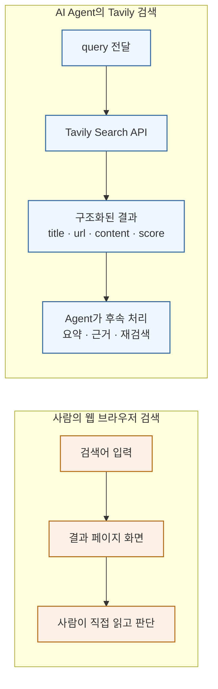
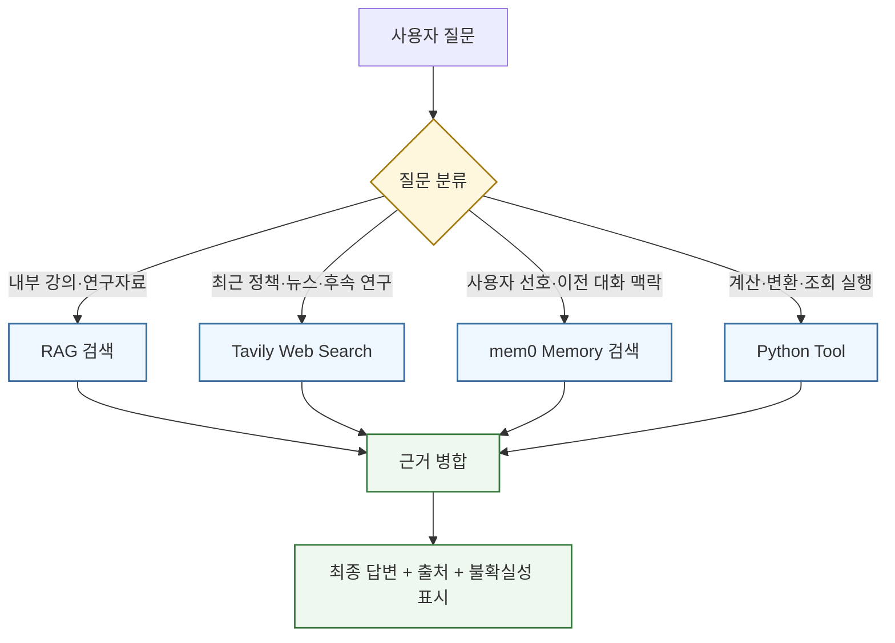
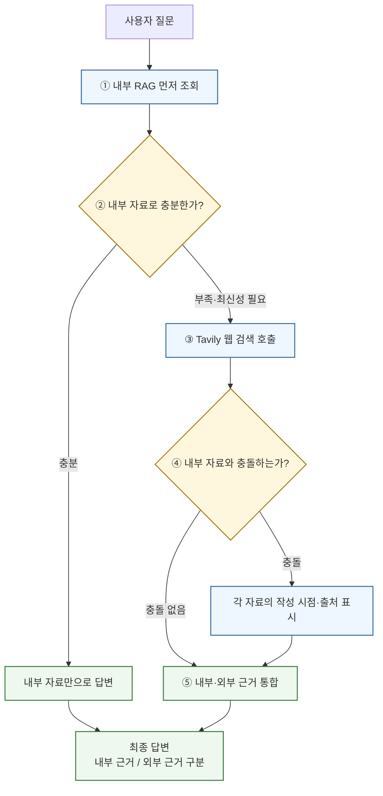
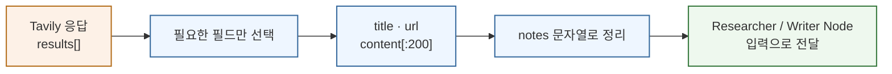
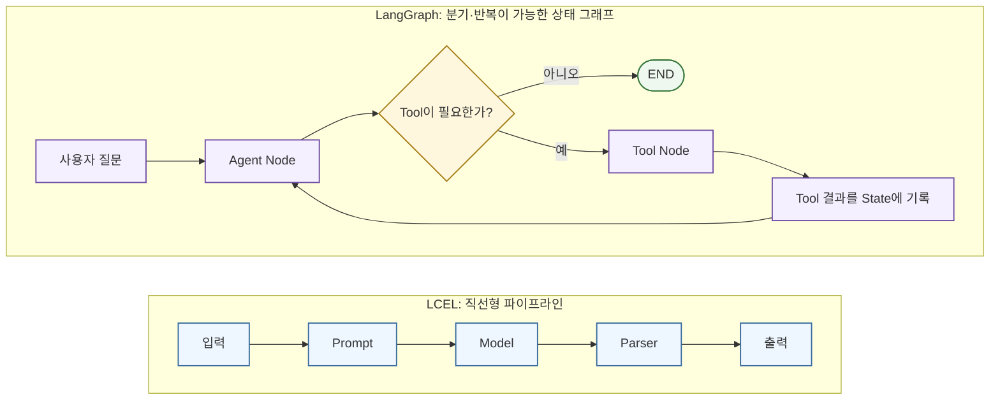
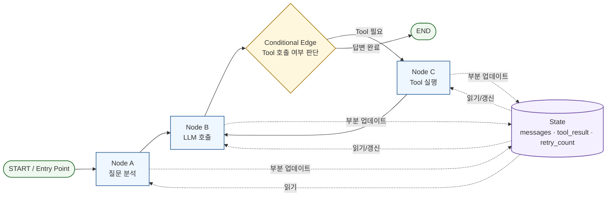
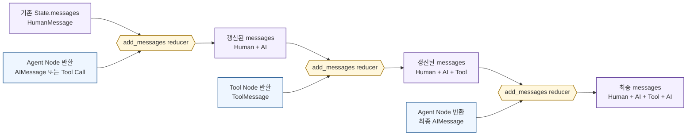
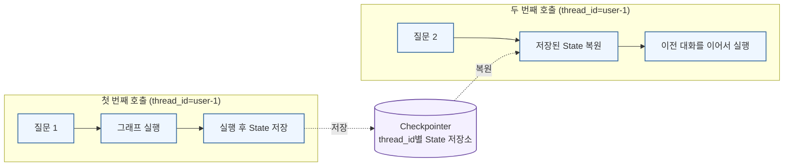
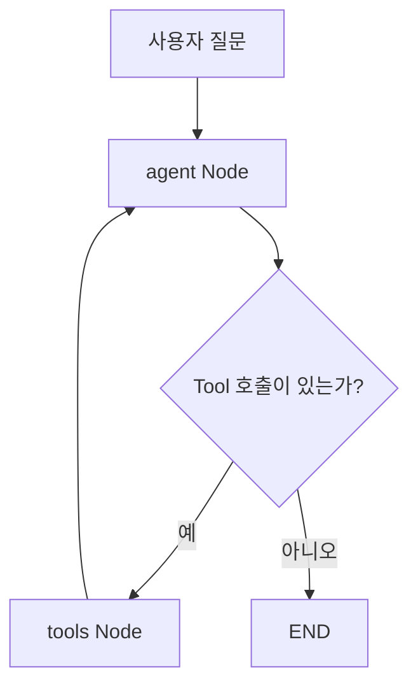

# AI MASTER 6주차 2일차 강의교재 — 8월 11일

## Web Search·LangGraph

# 제1장. 검색하고 흐름을 관리하는 에이전트로

## 1.1 오늘의 목표

- 최신 정보가 필요하면 Tavily 검색을 실행한다.
- Tool 실행 여부와 반복 흐름을 LangGraph로 제어한다.

---

# 제2장. Web Search

## 2.1 내부 RAG와 웹 검색의 역할 분담

AI Agent가 모든 질문을 하나의 정보원으로 처리하면 답변의 신뢰성과 최신성이 함께 떨어질 수 있다.
따라서 **내부 자료를 근거로 답해야 하는 질문은 RAG**, **최근에 바뀐 외부 정보를 확인해야 하는
질문은 Web Search**, **사용자별 맥락은 Memory**, **계산이나 변환은 Tool**로 역할을 나누는 것이
안정적이다.

| 질문 유형 | 우선 정보원 | 선택 이유 |
|---|---|---|
| 강의계획서, 교수 자료, 연구실 내부 문서 | RAG | 승인된 내부 자료를 근거로 답하고 출처 범위를 통제할 수 있다. |
| 사용자 선호, 과거 대화에서 확인된 사실 | Memory | 사용자별 맥락을 다음 대화에서 재사용할 수 있다. |
| 최근 정책, 최신 동향, 후속 연구, 현재 상태 | Web Search | 모델 학습 시점 이후에 공개되거나 변경된 정보를 조회할 수 있다. |
| 정확한 계산, 날짜 처리, 형식 변환 | Tool | 결정론적 함수나 외부 시스템의 실행 결과를 사용할 수 있다. |

### 2.1.1 Tavily란 무엇인가

**Tavily**는 LLM과 AI Agent가 웹 정보를 검색하여 사용할 수 있도록 설계된 검색 API이다.
일반적인 웹 브라우저 검색처럼 화면을 사람에게 보여주는 것이 아니라, Python 코드나 Agent가
검색 결과를 받아 후속 처리할 수 있도록 **제목, URL, 관련 내용 조각(content), 관련도 점수(score)를
담아 관련도 순으로 정렬한 결과 목록**을 구조화된 데이터로 반환한다.

### 그림 2-1. 사람의 브라우저 검색 vs Tavily API 검색

아래 그림은 사람이 직접 웹을 검색할 때와 AI Agent가 Tavily로 검색할 때의 차이를 보여준다.
사람은 결과 **화면**을 읽지만, Agent는 후속 처리가 가능한 **구조화된 데이터**를 받는다.



6주차 실습에서 Tavily는 다음 역할을 맡는다.

1. 내부 RAG에 없는 최신 정보를 검색한다.
2. Researcher Agent가 조사에 사용할 외부 근거를 수집한다.
3. 검색 결과의 제목·URL·내용 조각을 Writer 또는 Evaluator Node에 전달한다.
4. 최신 정보가 필요한 질문과 내부 자료만으로 답할 질문을 분리한다.
5. 검색 실패, 결과 0건, 인증 오류를 Agent의 예외 처리 실습에 활용한다.

Tavily Search의 주요 입력 항목은 다음과 같다.

| 항목 | 의미 | 실습 권장값 |
|---|---|---|
| `query` | 검색할 자연어 질의 | 구체적인 주제·기간·대상을 포함한다. |
| `max_results` | 반환할 검색 결과 수 | 실습에서는 `3`~`5` |
| `search_depth` | 검색 깊이와 비용·지연 수준 | 기본 실습은 `basic`, 정밀 조사는 `advanced` (`fast`, `ultra-fast`도 지원되며, 속도와 정확도의 절충점이 다르다 — [Tavily SDK 공식 레퍼런스](https://docs.tavily.com/sdk/python/reference) 참고) |
| `topic` | 검색 유형 | 일반 검색은 `general`, 최신 뉴스는 `news` |
| `include_answer` | Tavily가 생성한 요약 답변 포함 여부 | 근거 확인 실습에서는 `False` 권장 |
| `include_raw_content` | 원문에 가까운 긴 콘텐츠 포함 여부 | 토큰 사용량이 커질 수 있어 기본은 `False` |
| `include_domains` | 검색을 허용할 도메인 목록 | 정부·대학·학술기관 등 신뢰 도메인 제한 시 사용 |
| `exclude_domains` | 제외할 도메인 목록 | 신뢰하기 어려운 사이트를 제외할 때 사용 |

> **검색 결과와 정답은 다르다.** Tavily는 관련 웹 문서를 찾아주는 도구이며, 검색 결과가
> 자동으로 사실임을 보장하지는 않는다. Agent는 URL, 발행일, 기관명, 서로 다른 출처의 일치
> 여부를 확인하고, 불확실하면 그 한계를 답변에 밝혀야 한다.

#### Tavily를 내부 RAG와 함께 사용하는 권장 패턴

### 그림 2-2. 질문 유형별 정보원 라우팅



내부 자료와 외부 웹 검색을 동시에 사용하는 경우에는 다음 순서를 권장한다.

1. 내부 RAG 결과를 먼저 조회한다.
2. 내부 자료가 충분하면 그 자료만으로 답한다.
3. 내부 자료가 부족하거나 최신성 확인이 필요하면 Tavily를 호출한다.
4. 내부 자료와 웹 자료가 충돌하면 각각의 작성 시점과 출처를 표시한다.
5. 최종 답변에서 내부 근거와 외부 근거를 구분한다.

### 그림 2-3. 내부 RAG와 웹 검색을 병행하는 순서



### 2.1.2 Tavily API Key 발급 방법

Tavily Python SDK를 사용하려면 Tavily Platform에서 API Key를 발급받아야 한다.
다음 순서는 개인 실습용 Key를 준비하는 기본 절차이다.

### 그림 2-4. Tavily API Key 발급 절차

```mermaid
flowchart LR
    A["app.tavily.com<br/>접속"] --> B["Sign in / Sign up"]
    B --> C["Dashboard →<br/>API Keys"]
    C --> D["Create API Key<br/>(예: ai-master-week6)"]
    D --> E["Development 유형<br/>낮은 호출 한도 설정"]
    E --> F["tvly-... 키 복사"]
    F --> G[".env 저장<br/>TAVILY_API_KEY=tvly-..."]
    G --> H[".gitignore에<br/>.env 포함 확인"]

    classDef step fill:#eef6ff,stroke:#376a9e,stroke-width:1.5px;
    classDef secure fill:#eef8ee,stroke:#397a3f,stroke-width:1.5px;
    class A,B,C,D,E,F step;
    class G,H secure;
```



1. 웹 브라우저에서 [Tavily Platform](https://app.tavily.com/)에 접속한다.
2. **Sign in**을 선택하여 로그인한다. 계정이 없으면 **Sign up**으로 계정을 만든다.
3. 로그인 후 Dashboard에서 **API Keys** 영역으로 이동한다.
4. 화면에 기본 API Key가 제공되어 있으면 복사 버튼을 눌러 Key를 복사한다.
5. 별도의 실습용 Key를 만들 수 있는 경우 **Create API Key**, **Add Key** 또는 `+` 버튼을 선택한다.
6. Key 이름을 입력한다. 예: `ai-master-week6`.
7. Key 유형을 선택할 수 있으면 실습 단계에서는 **Development**를 선택한다.
8. 호출 한도나 사용량 제한을 설정할 수 있으면 실습 목적에 맞게 낮은 한도를 설정한다.
9. 생성된 Key를 복사한다. Tavily Key는 일반적으로 `tvly-...` 형태이다.
10. Key를 프로젝트 루트의 `.env` 파일에 다음과 같이 저장한다.

```dotenv
TAVILY_API_KEY=tvly-발급받은_키
```

11. `.gitignore` 파일에 `.env`가 포함되어 있는지 확인한다.

```gitignore
.env
```

12. 필요한 패키지를 설치하고 연결을 확인한다.

```bash
uv add tavily-python python-dotenv
```

```python
import os
from dotenv import load_dotenv
from tavily import TavilyClient

load_dotenv()

api_key = os.getenv("TAVILY_API_KEY")
if not api_key:
    raise RuntimeError("TAVILY_API_KEY가 .env에 설정되지 않았습니다.")

client = TavilyClient(api_key=api_key)
response = client.search(
    query="생성형 AI를 활용한 대학 교육 사례",
    search_depth="basic",
    max_results=3,
    include_answer=False,
)

for item in response.get("results", []):
    print(item.get("title"))
    print(item.get("url"))
    print(item.get("content", "")[:200])
    print("-" * 60)
```

```bash
uv run python search_tool.py
```

#### API Key 보안 체크리스트

- [ ] API Key를 Python 소스 코드에 직접 적지 않았다.
- [ ] `.env`를 Git 저장소에 커밋하지 않았다.
- [ ] Key가 포함된 화면을 강의 녹화·화면 공유·스크린샷에 노출하지 않았다.
- [ ] 수강생 간에 하나의 Key를 공동 사용하지 않는다.
- [ ] 사용량 Dashboard에서 비정상적인 호출 증가를 확인한다.
- [ ] Key가 노출되면 Dashboard에서 즉시 폐기하고 새 Key로 교체한다.
- [ ] 운영 환경에서는 개발용 Key와 배포용 Key를 분리한다.

> [Tavily 공식 Quickstart](https://docs.tavily.com/)는 Platform에 로그인한 뒤 Dashboard에서 API Key를 복사하고,
> `tavily-python`을 설치하여 `TavilyClient`에 Key를 전달하는 흐름을 안내한다. 무료 크레딧,
> 요금, Key 생성 화면과 버튼 명칭은 서비스 정책에 따라 바뀔 수 있으므로 수업 당일 Dashboard의
> 최신 표시를 기준으로 진행한다.


---

# 제3장. 실습 A-1 — Tavily Web Search

## 3.1 `search_tool.py`

```python
import os
from dotenv import load_dotenv
from tavily import TavilyClient

load_dotenv()
client = TavilyClient(api_key=os.environ["TAVILY_API_KEY"])

response = client.search("2026년 생성형 AI 교육 활용 사례", max_results=3)
for r in response["results"]:
    print(r["title"], "-", r["url"])
```

실행:

```bash
uv run python search_tool.py
```

## 3.2 검색 결과를 구조화해야 하는 이유

검색 API의 결과를 그대로 최종 답변으로 쓰지 않는다. 제목, 내용(content), URL 등 필요한 필드를 추려 Researcher나 Writer가 사용할 수 있는 형태로 정리한다.

### 그림 3-1. 검색 결과를 구조화하는 과정



```python
notes = "\n".join(
    f"- {r['title']}: {r['content'][:200]}"
    for r in response["results"]
)
```

## 3.3 체크포인트

- [ ] `TAVILY_API_KEY`가 로딩되는가?
- [ ] 결과가 0건일 때 처리 방법을 정했는가?
- [ ] 검색 실패를 Python 예외로 끝내지 않고 문자열 또는 상태값으로 변환할 계획이 있는가?
- [ ] 검색 결과의 출처 정보를 최종 응답에 남길 구조를 고려했는가?

---

# 제4장. LangGraph — 흐름을 코드로 표현하기

## 4.1 LCEL과 LangGraph — 직선 파이프라인과 상태 기반 그래프

LCEL(LangChain Expression Language)과 LangGraph는 서로 경쟁하는 도구라기보다 **문제의 흐름 복잡도에 따라 선택하는 두 가지 구성 방식**이다.

- **LCEL**은 입력이 정해진 순서로 한 방향으로 흐르는 작업에 적합하다.
- **LangGraph**는 실행 중간의 State를 보고 분기하거나, 앞 단계로 되돌아가거나, 여러 Node가 협업해야 하는 작업에 적합하다.

> **Mermaid로 도식 보기**  
> 아래 그림은 Mermaid 문법으로 작성했다. 교재를 GitHub, Notion, Obsidian, MkDocs Material 등 Mermaid를 지원하는 환경에서 보면 그대로 렌더링된다.  
> - Mermaid 공식 사이트: https://mermaid.js.org/  
> - Mermaid Live Editor: https://mermaid.live/

### 그림 4-1. LCEL과 LangGraph의 구조 비교



### 그림을 읽는 방법

#### LCEL 쪽

```text
입력 → Prompt → Model → Parser → 출력
```

각 단계는 앞 단계의 결과를 받아 다음 단계로 전달한다. 일반적인 요약, 번역, 구조화 출력처럼 **처리 순서가 고정된 작업**은 LCEL만으로도 충분하다.

#### LangGraph 쪽

```text
Agent → 판단 → Tool 실행 → Agent 복귀 → 최종 답변 → END
```

Agent가 매번 같은 경로를 가는 것이 아니라 현재 State를 보고 다음 행동을 결정한다. 따라서 다음 상황을 코드 구조로 표현할 수 있다.

- Tool 호출이 필요하면 Tool Node로 이동한다.
- Tool 실행 결과를 State에 추가한 뒤 Agent Node로 돌아온다.
- Tool이 더 이상 필요하지 않으면 END로 종료한다.
- 평가 점수가 낮으면 Writer Node로 되돌아가 재작성한다.
- 개인정보 요청이면 Guard Node에서 즉시 종료한다.


| 판단 질문 | LCEL이 적합한 경우 | LangGraph가 적합한 경우 |
|---|---|---|
| 실행 순서 | 항상 동일 | State에 따라 변경 |
| 분기 | 거의 없음 | 조건 분기가 핵심 |
| 반복 | 보통 없음 | Tool·평가·수정 루프 존재 |
| 공유 데이터 | 단계별 전달값 중심 | 전체 Node가 State를 공유 |
| 대표 예 | Prompt → Model → Parser | Agent → Tool → Agent, Writer → Evaluator → Writer |

> **실습 판단 기준**  
> “한 번 실행하고 끝나는가?”보다 “실행 중간 결과에 따라 다음 행동이 달라지는가?”를 먼저 묻는다. 다음 행동이 달라진다면 LangGraph를 고려한다.

## 4.2 핵심 구성요소

LangGraph의 그래프는 **State를 공유하는 Node들을 Edge로 연결한 실행 구조**다. 다음 그림에서 각 구성요소의 위치를 먼저 확인한다.

### 그림 4-2. LangGraph 핵심 구성요소 지도



### 4.2.1 State — 그래프의 공유 데이터

**State**는 그래프 실행 중 모든 Node가 함께 읽고 갱신하는 데이터 구조다. 대화형 Agent에서는 대화 메시지, 검색 결과, 평가 결과, 재시도 횟수 등을 State에 넣는다.

```python
class State(TypedDict):
    messages: Annotated[list, add_messages]
    search_results: list[dict]
    final_answer: str
    retry_count: int
```

#### State가 하는 일

1. 그래프가 시작될 때 초기 입력을 받는다.
2. 현재 실행되는 Node가 필요한 값을 State에서 읽는다.
3. Node는 변경된 필드만 부분 딕셔너리로 반환한다.
4. StateGraph는 각 필드의 갱신 규칙에 따라 기존 State와 Node 결과를 합친다.
5. 다음 Node는 갱신된 State를 읽는다.

```python
def search_node(state: State):
    query = state["messages"][-1].content
    results = run_search(query)
    return {"search_results": results}  # 전체 State가 아니라 변경 필드만 반환
```

#### 설계 원칙

- State에는 **Node 사이에 공유해야 하는 값**만 넣는다.
- API Client, 대형 모델 객체처럼 실행 중 변하지 않는 객체는 전역 설정이나 별도 의존성으로 관리한다.
- `retry_count`, `_blocked`, `route`처럼 분기에 필요한 값은 이름과 의미를 명확하게 정의한다.
- 필드마다 “덮어쓸지, 누적할지, 합칠지”를 결정한다. 이 규칙을 **reducer**라고 한다.

### 4.2.2 Node — 한 단계의 작업 함수

**Node**는 그래프에서 실제 작업을 수행하는 단위다. 일반적으로 State를 입력으로 받고, State의 일부를 갱신하는 딕셔너리를 반환한다.

```python
def call_model(state: State):
    response = model.invoke(state["messages"])
    return {"messages": [response]}
```

#### Node의 대표 역할

- LLM 호출
- Tool 실행
- RAG 검색
- 웹 검색
- 사용자 Memory 조회
- 답변 작성
- 품질 평가
- 입력 안전성 검사

#### 좋은 Node의 조건

- **한 가지 책임**만 수행한다.
- 입력으로 어떤 State 필드를 읽는지 명확하다.
- 어떤 State 필드를 반환하는지 명확하다.
- 실패 시 예외로 그래프 전체를 종료하기보다 오류 정보를 State 또는 안전한 문자열로 변환한다.
- 테스트할 수 있도록 외부 효과를 최소화한다.

```python
graph.add_node("agent", call_model)
graph.add_node("tools", ToolNode(tools))
```

Node 이름은 그래프의 경로를 읽을 때 역할이 바로 보이도록 `agent`, `tools`, `researcher`, `evaluator`처럼 작성한다.

### 4.2.3 Edge — 다음 Node를 연결하는 고정 경로

**Edge**는 한 Node가 끝난 뒤 항상 실행할 다음 Node를 지정한다. 실행 순서가 고정된 구간에 사용한다.

```python
graph.add_edge("planner", "researcher")
graph.add_edge("researcher", "writer")
```

위 코드는 다음 고정 흐름을 만든다.

```text
planner → researcher → writer
```

#### Edge 사용 시점

- 다음 단계가 조건과 관계없이 하나로 정해져 있을 때
- Tool 실행 후 다시 Agent로 복귀시킬 때
- Planner 다음에 반드시 Researcher를 실행할 때

```python
graph.add_edge("tools", "agent")
```

### 4.2.4 Conditional Edge — State를 보고 경로를 선택

**Conditional Edge**는 라우팅 함수가 State를 읽고 다음 Node를 결정하게 한다. LangGraph의 분기와 반복은 대부분 이 구성요소에서 만들어진다.

```python
def route_after_agent(state: State) -> str:
    last_message = state["messages"][-1]
    if getattr(last_message, "tool_calls", None):
        return "tools"
    return "end"

graph.add_conditional_edges(
    "agent",
    route_after_agent,
    {
        "tools": "tools",
        "end": END,
    },
)
```

#### 동작 순서

1. `agent` Node가 실행된다.
2. `route_after_agent()`가 갱신된 State를 받는다.
3. 라우팅 함수가 `"tools"` 또는 `"end"`를 반환한다.
4. 경로 매핑표가 반환값을 실제 Node 또는 `END`로 연결한다.

#### 설계 주의사항

- 라우팅 함수는 가능하면 **판단만 수행**하고, LLM 호출이나 파일 저장 같은 부수 작업을 넣지 않는다.
- 반환 가능한 경로를 `Literal` 타입 또는 명시적 매핑으로 제한하면 그래프를 이해하고 시각화하기 쉽다.
- 되돌아가는 경로가 있으면 반드시 재시도 상한이나 종료 조건을 둔다.

### 4.2.5 Entry Point — 그래프 시작 위치

**Entry Point**는 그래프가 실행될 때 가장 먼저 호출할 Node다.

이 교재의 기존 코드에서는 다음 형식을 사용한다.

```python
graph.set_entry_point("agent")
```

같은 의미를 가상 시작 Node인 `START`를 이용해 표현할 수도 있다.

```python
from langgraph.graph import START

graph.add_edge(START, "agent")
```

#### 선택 기준

- 단일 시작 Node를 간단히 표현할 때: `set_entry_point()`
- 시작 흐름을 다른 Edge와 같은 방식으로 명시하고 싶을 때: `START` 사용

두 방식 모두 “첫 번째로 실행할 Node를 지정한다”는 목적은 같다. 한 그래프 안에서는 한 방식을 일관되게 사용한다.

### 4.2.6 END — 그래프 종료

**END**는 더 이상 실행할 Node가 없음을 나타내는 가상 종료 지점이다.

고정 경로로 종료할 수 있다.

```python
from langgraph.graph import END

graph.add_edge("writer", END)
```

조건에 따라 종료할 수도 있다.

```python
graph.add_conditional_edges(
    "evaluator",
    route_after_eval,
    {
        "retry": "writer",
        "end": END,
    },
)
```

#### END가 필요한 이유

- 정상 완료와 오류 종료의 조건을 코드에 명시한다.
- 무한 반복을 방지할 종료 경로를 만든다.
- 최종 State를 호출자에게 반환할 시점을 정한다.

### 핵심 구성요소 요약표

| 개념 | 핵심 역할 | 코드에서 확인할 위치 | 자주 발생하는 오류 |
|---|---|---|---|
| State | 모든 Node가 공유하는 데이터와 갱신 규칙 정의 | `class State(TypedDict)` | 필요한 필드 누락, 덮어쓰기·누적 규칙 혼동 |
| Node | 한 단계의 작업 수행 후 부분 State 반환 | `graph.add_node()` | 전체 State를 불필요하게 반환, 책임이 너무 많음 |
| Edge | 고정된 다음 Node 연결 | `graph.add_edge()` | 잘못된 Node 이름, 의도하지 않은 순환 |
| Conditional Edge | State에 따라 다음 경로 선택 | `graph.add_conditional_edges()` | 반환값과 경로 매핑 불일치, 종료 조건 없음 |
| Entry Point | 최초 실행 Node 지정 | `set_entry_point()` 또는 `START` | 시작 Node 미지정 |
| END | 실행 종료 및 최종 State 반환 | `END` | 반복 경로만 있고 종료 경로가 없음 |

## 4.3 최소 상태 모델 — `TypedDict`, `Annotated`, `add_messages`

다음 코드는 대화형 LangGraph에서 가장 자주 사용하는 최소 State 모델이다.

```python
from typing import Annotated, TypedDict
from langchain_core.messages import AnyMessage
from langgraph.graph.message import add_messages

class State(TypedDict):
    messages: Annotated[list[AnyMessage], add_messages]
```

> **함수 이름 주의**  
> 정확한 함수 이름은 `add_message`가 아니라 **`add_messages`**이다.

### 4.3.1 `TypedDict` — 딕셔너리의 구조를 타입으로 선언

`TypedDict`는 “이 딕셔너리에는 어떤 Key가 있고, 각 Value가 어떤 타입인지”를 선언한다.

```python
class State(TypedDict):
    messages: list[AnyMessage]
    retry_count: int
```

이 선언은 다음과 같은 일반 Python 딕셔너리의 구조를 설명한다.

```python
state = {
    "messages": [],
    "retry_count": 0,
}
```

#### 중요한 특징

- 실행 시 별도의 State 객체를 만드는 클래스가 아니다. 실제 값은 일반 `dict`다.
- IDE 자동완성, 정적 타입 검사, 코드 문서화에 도움을 준다.
- 잘못된 Key 이름이나 타입 사용을 개발 단계에서 찾기 쉬워진다.
- 기본적으로 선언된 Key는 필요한 필드로 간주된다.

즉, `TypedDict`는 State의 **데이터 계약**이다. 각 Node가 어떤 값을 읽고 반환해야 하는지 팀 전체가 같은 구조를 보게 한다.

### 4.3.2 `Annotated` — 타입에 LangGraph용 메타데이터 추가

`Annotated`는 실제 타입에 추가 정보를 붙이는 Python 타입 표현이다.

```python
Annotated[list[AnyMessage], add_messages]
```

이 표현은 두 부분으로 읽는다.

| 부분 | 의미 |
|---|---|
| `list[AnyMessage]` | `messages` 필드의 실제 데이터 타입 |
| `add_messages` | 새 값이 들어올 때 기존 값과 합치는 reducer |

Python의 타입 검사 관점에서는 `messages`가 메시지 목록이라는 뜻이다. LangGraph는 `Annotated`에 들어 있는 추가 메타데이터를 읽고, 이 필드의 State 업데이트에 `add_messages`를 사용한다.

### 4.3.3 reducer — 기존 State와 Node 결과를 합치는 규칙

Node는 보통 전체 State가 아니라 변경할 필드만 반환한다.

```python
def call_model(state: State):
    response = model.invoke(state["messages"])
    return {"messages": [response]}
```

여기서 중요한 질문은 다음과 같다.

> 기존 `messages`가 있는데 Node가 새 `messages`를 반환하면, 기존 값을 지울 것인가 아니면 합칠 것인가?

StateGraph는 필드에 reducer가 없으면 일반적으로 해당 필드를 새 값으로 갱신한다. 반면 다음처럼 reducer를 지정하면 기존 값과 새 값을 reducer 규칙으로 합친다.

```python
messages: Annotated[list[AnyMessage], add_messages]
```

### 그림 4-3. `add_messages`가 State를 갱신하는 과정



### 4.3.4 `add_messages`의 기능

`add_messages`는 기존 메시지 목록과 Node가 새로 반환한 메시지를 병합하는 LangGraph용 reducer다.

#### 핵심 기능

1. 기존 메시지 목록을 유지한다.
2. 새 메시지를 뒤에 추가한다.
3. 새 메시지의 ID가 기존 메시지 ID와 같으면 해당 메시지를 갱신한다.
4. HumanMessage, AIMessage, ToolMessage가 하나의 대화 흐름으로 유지되게 한다.
5. Tool 호출 뒤 Agent가 다시 실행될 때 이전 Tool 결과를 문맥으로 읽을 수 있게 한다.

단순한 `list + list`와 비슷해 보이지만, 메시지 ID를 기준으로 기존 메시지를 갱신할 수 있다는 점이 중요하다.

### 4.3.5 단계별 실행 예

초기 입력 State:

```python
{
    "messages": [HumanMessage(content="현재 환율을 검색해줘")]
}
```

#### 1단계 — Agent Node 실행

Agent가 Tavily Tool 호출을 요청하는 AIMessage를 반환한다.

```python
return {
    "messages": [AIMessage(content="", tool_calls=[...])]
}
```

`add_messages` 적용 후:

```text
[HumanMessage, AIMessage(tool_call)]
```

#### 2단계 — Tool Node 실행

Tool이 검색 결과를 ToolMessage로 반환한다.

```python
return {
    "messages": [ToolMessage(content="검색 결과 ...")]
}
```

`add_messages` 적용 후:

```text
[HumanMessage, AIMessage(tool_call), ToolMessage]
```

#### 3단계 — Agent Node 재실행

Agent는 누적된 HumanMessage, AIMessage, ToolMessage를 모두 읽고 최종 답변을 만든다.

```python
return {
    "messages": [AIMessage(content="검색 결과에 따르면 ...")]
}
```

최종 State:

```text
[HumanMessage, AIMessage(tool_call), ToolMessage, AIMessage(final)]
```

이 누적 구조가 있어야 Agent가 “무슨 Tool을 요청했고, Tool이 어떤 값을 반환했으며, 그 결과로 어떤 답변을 만들어야 하는지”를 연결해서 처리할 수 있다.

### 4.3.6 reducer가 없을 때와 있을 때

#### reducer가 없는 경우

```python
class State(TypedDict):
    messages: list[AnyMessage]
```

Node가 다음 값을 반환하면:

```python
return {"messages": [new_message]}
```

이전 메시지 목록 대신 새 값만 남을 수 있다. 그러면 Tool 실행 전 대화나 이전 질문 문맥을 잃게 된다.

#### `add_messages` reducer가 있는 경우

```python
class State(TypedDict):
    messages: Annotated[list[AnyMessage], add_messages]
```

Node가 새 메시지를 반환할 때 기존 메시지와 병합된다.

```text
기존 메시지 + 새 메시지 → 누적된 대화 State
```

### 4.3.7 사용자 정의 reducer 예시

메시지 외의 필드도 같은 방식으로 누적 규칙을 정의할 수 있다.

```python
from typing import Annotated, TypedDict


def append_logs(left: list[str], right: list[str]) -> list[str]:
    return left + right


class State(TypedDict):
    logs: Annotated[list[str], append_logs]
    retry_count: int
```

- `logs`는 `append_logs`에 따라 누적된다.
- `retry_count`는 별도 reducer가 없으므로 Node가 반환한 새 값으로 갱신된다.

> **공식 참고**  
> [LangGraph Graph API 공식 문서](https://docs.langchain.com/oss/python/langgraph/graph-api)는 State, Node, Edge와 reducer 기반 State 업데이트 구조를 설명한다. `add_messages` API는 두 메시지 목록을 병합하고 동일한 메시지 ID가 있으면 기존 메시지를 갱신하는 동작을 제공한다.

**참고 — `MessagesState` 단축 표기**

오늘 실습에서는 `class State(TypedDict): messages: Annotated[list[AnyMessage], add_messages]`처럼
직접 선언했지만, 공식 문서는 이 패턴이 매우 흔해서 아예 미리 만들어 둔 `MessagesState` 클래스를
제공한다고 안내한다.

```python
from langgraph.graph import MessagesState

class State(MessagesState):
    retry_count: int  # messages 필드는 이미 포함되어 있으므로 추가 필드만 선언
```

대화 중심 그래프에서는 이 방식이 코드를 더 짧게 만든다. 다만 오늘 교재는 "reducer가 무엇을 하는지"를
직접 눈으로 확인하는 것이 목적이므로, 실습에서는 `Annotated` 방식을 그대로 사용한다.

---

## 4.4 메모리 기능 — 체크포인터

**체크포인터(Checkpointer)**는 그래프 실행이 끝난 뒤에도 State를 저장해 두었다가, 같은
`thread_id`로 다시 호출될 때 이전 State를 복원하는 장치다. 이 덕분에 한 번의 실행으로 끝나지
않고 여러 번의 대화가 하나의 맥락으로 이어진다.

### 그림 4-4. 체크포인터를 이용한 대화 상태 유지



---

# 제5장. 실습  

## 5.1 B-2 `agent_graph.py`
### 실행 흐름

### 그림 5-1. B-2 에이전트 실행 흐름 (agent ↔ tools 반복)



한 질문에서 검색과 계산이 모두 필요하면 다음과 같은 반복이 가능하다.

```text
agent → web_search → agent → calculator → agent → END
```

### 체크포인트

- [ ] `web_search`가 먼저 호출되는가?
- [ ] 검색 결과에 숫자가 포함되면 `calculator`가 이어서 호출되는가?
- [ ] Tool 실행 후 `agent`로 돌아와 자연어 답변을 생성하는가?
- [ ] Tool을 호출할 필요가 없는 질문은 바로 종료되는가?

## 5.2 B-3 LangGraph 메모리 기능  — `langgraph_memory.ipynb`


## 5.3 B-4 LangGraph 라우터  — `langgraph_router.py`

---

# 제6장. 2일차 트러블슈팅

## 6.1 `tools_condition`이 항상 END로 이동

점검 순서:

1. Tool docstring이 구체적인가?
2. 모델에 `bind_tools()`가 적용되었는가?
3. 질문이 Tool을 호출할 만큼 명확한가?
4. `graph.add_conditional_edges("agent", tools_condition)`가 있는가?
5. Tool 실행 뒤 `graph.add_edge("tools", "agent")`가 있는가?

## 6.2 `uv add` 버전 충돌

```bash
uv add tavily-python
uv sync --upgrade
```

어제 이미 설치한 `langgraph`, `langchain-anthropic`과 충돌하면, 이 패키지를
단독으로 추가한 뒤 확인한다.

## 6.3 API 호출 비용

- `temperature=0`으로 재현성을 높인다.
- 짧은 질문으로 흐름을 먼저 확인한다.
- 정상 작동을 확인한 뒤 실제 강의자료를 사용한다.
- 반복 루프가 있는 그래프에는 반드시 종료 조건을 둔다.

---

# 제7장. 2일차 산출물과 제출 양식

## 7.1 산출물 체크

- [ ] `search_tool.py` / `search_tool.ipynb`
- [ ] `agent_graph.py` /  `langgraph_memory.ipynb` /  `langgraph_router.py`
- [ ] 실행 결과 캡처 또는 로그
- [ ] `W6_D2_이름.md`

## 7.2 제출 템플릿

```markdown
# AI MASTER 6주차 2일차 — [이름 / 학과]

## 1. Web Search (Tavily)
- 검색한 질의:
- 결과 품질 평가(관련성):
- 스니펫(content) vs 원문(raw_content) 글자 수·토큰 비교 결과:
- 본인 에이전트에는 언제 raw_content가 필요하다고 판단했는가:

## 2. LangGraph
- (simple_agent.ipynb) 직렬 구조(START→generate_joke→END)와 병렬 구조(fan-out/fan-in)의 차이:
- Node 구성 (agent/tools 외 추가한 Node가 있다면):
- 조건 분기가 작동한 예시(질문과 결과):

## 3. 본인 LangGraph 적용 계획
```

---

# 부록. 참고 링크 모음


**Web Search (Tavily)**
- [Tavily Platform (API Key 발급)](https://app.tavily.com/)
- [Tavily 공식 문서 / Quickstart](https://docs.tavily.com/)
- [Tavily Python SDK Reference](https://docs.tavily.com/sdk/python/reference)

**LangGraph**
- [LangGraph Graph API 공식 문서](https://docs.langchain.com/oss/python/langgraph/graph-api)

> 링크가 열리지 않거나 문서 구조가 바뀌었다면, 서비스 정책·문서 개편에 따른 것일 수 있으니
> 각 공식 사이트의 검색 기능으로 같은 주제를 다시 찾아보세요.
