# AI MASTER 6주차 3일차 강의교재 — 8월 12일

## Supervisor 기반 Multi-Agent와 Evaluator Agent

# 제1장. 하나의 에이전트를 팀으로 분해하기

## 1.1 오늘의 목표

1일차의 에이전트는 Tool을 사용할 수 있고 Memory가 있으며, 2일차의 에이전트는 여기에 Web Search·
LangGraph까지 갖췄다. 하지만 여전히 하나의 Agent Node가 계획·검색·답변을 모두 담당한다.
3일차인 오늘은 역할을 분리한다.

- Planner: 요청을 하위 작업으로 분해
- Researcher: 자료 수집
- Writer: 최종 답변 작성
- Evaluator: 정확성·완결성 평가
- Supervisor: 다음 역할 결정


## 1.2 역할 분리의 필요성

하나의 프롬프트에 “계획하고, 검색하고, 작성하고, 검증하라”를 동시에 넣으면 역할별 지시가 서로 희석되고 프롬프트가 비대해진다. 역할을 분리하면 각 Node의 책임과 입력·출력이 명확해진다.

| 역할 | 책임 | 대표 입력 | 대표 출력 |
|---|---|---|---|
| Supervisor | 다음 작업자 결정 | 현재 State | `next` |
| Planner | 작업 분해 | 사용자 질의 | `plan` |
| Researcher | 근거 수집 | 질의·계획 | `research_notes` |
| Writer | 답변 작성 | 계획·근거 | `final_answer` |
| Evaluator | 품질 평가 | 근거·답변 | 점수·피드백 |

아래 그림은 "하나의 Agent가 전부 담당"하던 구조를 "역할을 나눈 팀"으로 분해하는 오늘의 핵심 아이디어를 나타낸다.

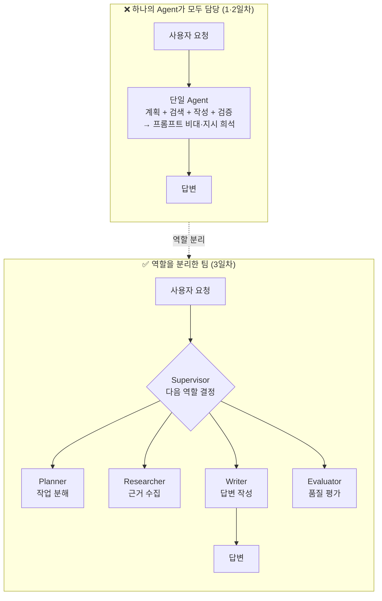

## 1.3 Supervisor 패턴 동작 원리

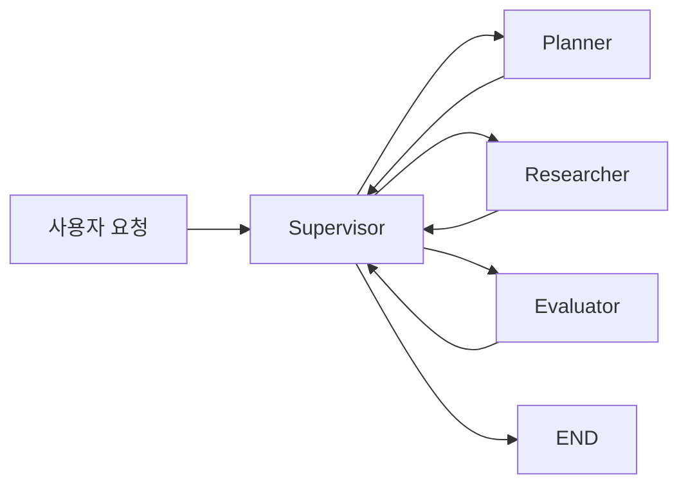
Supervisor는 그 자체로 하나의 LLM 호출입니다 — "지금까지의 대화를 보고, Planner·
Researcher·Evaluator 중 누가 다음에 일해야 하는지, 아니면 끝낼지"를 **구조화된 출력**
(예: `{"next": "researcher"}`)으로 판단합니다. LangGraph의 조건 분기(`add_conditional_edges`)가
이 판단을 실제 흐름 전환으로 연결합니다.

> 💡 핵심은 "각 Agent는 자기 역할만 안다"는 것입니다. Researcher는 Evaluator가 존재하는지도
> 모릅니다. Supervisor만 전체 그림을 봅니다 — 이게 유지보수를 쉽게 만드는 이유입니다.


## 1.4 Pydantic: 출력 형식 정형화의 필요성

LLM은 기본적으로 자연어를 생성한다. 자연어는 사람이 읽기에는 편하지만, 프로그램이 다음 행동을
결정하기 위한 입력으로 사용하기에는 불안정하다. 같은 의미라도 다음처럼 서로 다른 문장으로 표현될 수
있기 때문이다.

```text
다음에는 Researcher가 조사해야 합니다.
researcher로 이동하세요.
조사 단계가 필요합니다.
{"next": "researcher"}
```

사람은 네 문장을 같은 의미로 이해할 수 있지만, 조건 분기 함수가 문자열을 직접 해석하면 대소문자,
띄어쓰기, 부가 설명, 오탈자에 따라 라우팅이 실패할 수 있다. Multi-Agent 시스템에서는 한 Agent의
출력이 다음 Node를 결정하므로, 출력 형식이 흔들리면 그래프 전체의 실행 경로가 흔들린다.

**Pydantic**은 Python 데이터의 필드, 타입, 허용값, 기본값, 설명을 모델로 선언하고, 입력값이 그
규칙을 만족하는지 검증하는 라이브러리다. 이 교재에서는 LLM 또는 Supervisor가 반환해야 하는 결과를
자유로운 문장이 아니라 **정해진 데이터 계약(data contract)** 으로 표현하기 위해 사용한다.

### 1.4.1 자연어 출력과 구조화 출력의 차이

#### 자연어 출력

```text
계획은 완료되었지만 아직 조사가 부족하므로 Researcher가 다음 작업을 수행해야 합니다.
```

이 출력에서 프로그램은 `"researcher"`라는 값을 다시 찾아내야 한다. 문장이 달라지거나 한국어 대신
영어가 섞이면 별도의 파싱 로직이 필요하다.

#### 구조화 출력

```json
{
  "next": "researcher",
  "reason": "계획은 있으나 자료 조사가 없음"
}
```

프로그램은 다음과 같이 필드에 직접 접근할 수 있다.

```python
next_node = result.next
reason = result.reason
```

구조화 출력의 목적은 답변을 보기 좋게 만드는 것이 아니라, **후속 코드가 결과를 안전하게 사용할 수
있도록 하는 것**이다.

같은 LLM 판단이라도, 자연어로 내보내면 파싱이 흔들려 라우팅이 불안정해지고, 구조화해서 내보내면
필드에 바로 접근할 수 있어 라우팅이 안정된다.

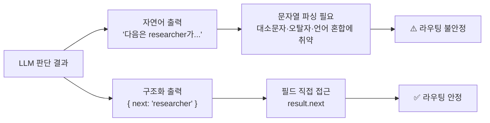

### 1.4.2 `BaseModel`의 역할

Pydantic의 `BaseModel`을 상속하면 데이터 구조를 클래스로 선언할 수 있다.

```python
from pydantic import BaseModel

class RouteDecision(BaseModel):
    next: str
    reason: str
```

이 모델은 다음 계약을 뜻한다.

- 결과에는 `next` 필드가 있어야 한다.
- 결과에는 `reason` 필드가 있어야 한다.
- 두 필드의 값은 문자열이어야 한다.
- 필드가 없거나 타입이 맞지 않으면 검증 오류가 발생한다.

예시:

```python
decision = RouteDecision(
    next="researcher",
    reason="계획은 있으나 자료 조사가 없음",
)

print(decision.next)
print(decision.reason)
```

딕셔너리로 변환할 때는 `model_dump()`를 사용한다.

```python
decision_dict = decision.model_dump()

# {
#     "next": "researcher",
#     "reason": "계획은 있으나 자료 조사가 없음"
# }
```

### 1.4.3 `Field`의 역할

`Field`는 각 필드에 설명, 기본값, 범위와 같은 추가 규칙을 붙인다.

```python
from pydantic import BaseModel, Field

class RouteDecision(BaseModel):
    next: str = Field(description="다음에 실행할 역할 이름")
    reason: str = Field(description="해당 역할을 선택한 이유")
```

이 교재에서 `description`을 구체적으로 작성하는 이유는 두 가지다.

1. 개발자에게 필드의 의미를 문서화한다.
2. LLM의 구조화 출력 기능을 사용할 때 모델이 각 필드에 어떤 값을 넣어야 하는지 설명한다.

설명이 모호하면 LLM이 `next`에 역할 이름 대신 긴 문장을 넣거나, `reason`에 JSON 전체를 넣는 등
예상하지 못한 결과를 만들 수 있다.

좋지 않은 예:

```python
next: str = Field(description="다음")
```

권장 예:

```python
next: str = Field(
    description="다음에 실행할 역할. planner, researcher, end 중 하나"
)
```

### 1.4.4 `Literal`로 허용값 제한하기

`next`가 단순한 `str`이면 어떤 문자열도 들어갈 수 있다.

```python
next="research"
next="Researcher"
next="research_agent"
next="조사자"
```

하지만 LangGraph의 조건 분기에는 정확히 `"planner"`, `"researcher"`, `"end"`만 필요하다.
이때 `Literal`을 사용하면 허용값을 제한할 수 있다.

```python
from typing import Literal
from pydantic import BaseModel, Field

class RouteDecision(BaseModel):
    next: Literal["planner", "researcher", "end"] = Field(
        description="다음에 실행할 역할"
    )
    reason: str = Field(description="해당 역할을 선택한 이유")
```

이 모델에서 다음 값은 유효하다.

```python
RouteDecision(next="planner", reason="계획이 없음")
RouteDecision(next="researcher", reason="조사가 필요함")
RouteDecision(next="end", reason="필요한 작업이 완료됨")
```

다음 값은 허용 목록에 없으므로 검증에 실패한다.

```python
RouteDecision(next="writer", reason="답변 작성 필요")
```

`Literal`의 허용값과 LangGraph 조건 분기 맵의 Key는 반드시 일치해야 한다.

```python
graph.add_conditional_edges(
    "supervisor",
    route,
    {
        "planner": "planner",
        "researcher": "researcher",
        "end": END,
    },
)
```

즉, Pydantic 모델은 **출력 가능한 경로의 목록**을 정의하고, LangGraph의 조건 분기는 그 값을
**실제 Node 경로**에 연결한다.

### 1.4.5 검증이 필요한 이유

Multi-Agent에서는 Agent의 출력이 단순한 표시용 문장이 아니라 다음 실행을 결정하는 제어 데이터다.
따라서 잘못된 출력은 다음과 같은 문제를 일으킬 수 있다.

| 문제 | 예시 | 결과 |
|---|---|---|
| 필드 누락 | `{"next": "planner"}` | 선택 이유를 기록할 수 없음 |
| 허용되지 않은 값 | `{"next": "research_agent"}` | 조건 분기에서 경로를 찾지 못함 |
| 잘못된 타입 | `{"next": 3}` | 문자열 기반 라우팅 실패 |
| 형식 혼합 | `다음은 researcher입니다.` | JSON 또는 객체로 바로 사용할 수 없음 |
| 평가값 범위 오류 | `accuracy=9` | 1~5점 기준이 무너짐 |

Pydantic은 이러한 문제를 가능한 한 실행 초기에 발견하게 한다. 잘못된 값을 그대로 다음 Node에
전달하는 것보다, 검증 오류를 확인하고 재요청하거나 안전한 기본 경로로 보내는 편이 안정적이다.

### 1.4.6 제2장 실습에서 Pydantic을 사용하는 이유

제2장의 `multi_agent.py`에서는 다음 모델을 사용한다.

```python
class RouteDecision(BaseModel):
    next: Literal["planner", "researcher", "end"] = Field(
        description="다음에 일할 역할"
    )
    reason: str = Field(description="그렇게 판단한 이유 한 줄")
```

이 모델은 Supervisor의 판단 결과를 두 부분으로 분리한다.

| 필드 | 역할 | 제2장 코드에서의 사용 |
|---|---|---|
| `next` | 다음에 실행할 역할 | `_next` State에 저장한 뒤 조건 분기에 사용 |
| `reason` | 선택 근거 | 실행 로그로 출력하여 라우팅 이유를 관찰 |

제2장의 Supervisor는 학습 흐름을 단순하게 보여주기 위해 규칙 기반 `if-else`로
`RouteDecision` 객체를 직접 생성한다.

```python
decision = RouteDecision(
    next="researcher",
    reason="계획은 있으나 자료 조사가 없음",
)
```

그 다음 `next` 값은 State의 `_next`에 저장된다.

```python
return {**state, "_next": decision.next}
```

라우팅 함수는 이 값을 반환한다.

```python
def route(state: State) -> str:
    return state["_next"]
```

마지막으로 조건 분기가 문자열을 실제 Node로 연결한다.

```python
graph.add_conditional_edges(
    "supervisor",
    route,
    {
        "planner": "planner",
        "researcher": "researcher",
        "end": END,
    },
)
```

전체 흐름은 다음과 같다.

```text
현재 State 확인
    ↓
RouteDecision 생성
    ↓
next 값 검증
    ↓
_next에 저장
    ↓
route()가 문자열 반환
    ↓
Conditional Edge가 실제 Node 선택
```

이 흐름을 그림으로 보면, Pydantic이 정의한 **허용값 목록**(`Literal`)이 곧 조건 분기 맵의 **Key**가
되어 실제 Node로 연결된다는 점이 분명해진다.

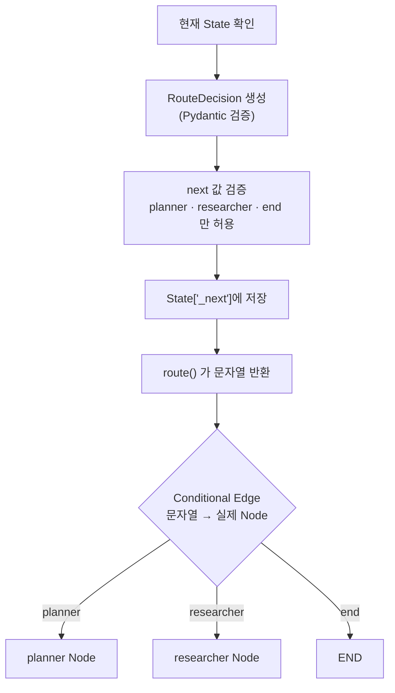

따라서 제2장에서 Pydantic은 단순히 데이터를 예쁘게 정리하기 위해 쓰이는 것이 아니다.
**Supervisor의 판단을 LangGraph가 사용할 수 있는 안정적인 라우팅 명령으로 변환하는 역할**을 한다.

### 1.4.7 규칙 기반 Supervisor에서 LLM Supervisor로 확장

제2장 예제는 다음과 같이 규칙 기반으로 판단한다.

```python
if not state.get("plan"):
    decision = RouteDecision(next="planner", reason="아직 계획이 없음")
elif not state.get("research_notes"):
    decision = RouteDecision(
        next="researcher",
        reason="계획은 있으나 자료 조사가 없음",
    )
else:
    decision = RouteDecision(
        next="end",
        reason="계획과 자료 조사가 모두 완료됨",
    )
```

실전에서는 Supervisor 자체를 LLM으로 만들 수 있다. 이때 같은 Pydantic 모델을
`with_structured_output()`에 연결한다.

```python
structured_supervisor = model.with_structured_output(RouteDecision)

decision = structured_supervisor.invoke(
    f"""
    현재 계획:
    {state.get("plan", "")}

    현재 조사 결과:
    {state.get("research_notes", "")}

    다음에 실행할 역할을 결정하라.
    """
)
```

LLM이 자유 문장을 반환하는 대신 `RouteDecision` 형식으로 결과를 반환하므로, 아래 코드는 그대로
유지할 수 있다.

```python
return {**state, "_next": decision.next}
```

이 설계의 장점은 Supervisor의 판단 방식을 규칙 기반에서 LLM 기반으로 바꾸더라도, 그래프가 사용하는
출력 계약은 바뀌지 않는다는 점이다.

### 1.4.8 제5장 Evaluator와의 연결

Pydantic은 제2장의 라우팅뿐 아니라 제5장의 평가 결과에도 사용된다.

```python
class EvalResult(BaseModel):
    accuracy: int
    completeness: int
    needs_retry: bool
    feedback: str
```

Evaluator의 자유로운 평가 문장을 다음과 같이 프로그램이 사용할 수 있는 값으로 분리한다.

- `accuracy`: 정확성 점수
- `completeness`: 완결성 점수
- `needs_retry`: Writer 재실행 여부
- `feedback`: 재작성 시 반영할 지시

제2장에서는 **다음 Agent를 선택하기 위해**, 제5장에서는 **재시도 여부를 결정하기 위해**
Pydantic을 사용한다. 두 경우 모두 공통 목적은 LLM 또는 판단 로직의 출력을 LangGraph의
조건 분기에 안전하게 연결하는 것이다.

### 1.4.9 Pydantic과 `TypedDict`의 역할 구분

이 교재에서는 `TypedDict`와 Pydantic을 함께 사용한다.

| 구분 | `TypedDict` | Pydantic `BaseModel` |
|---|---|---|
| 주요 목적 | LangGraph State의 Key와 타입 설명 | 출력값 검증과 구조화 |
| 실제 값 | 일반 Python 딕셔너리 | 검증 기능이 있는 모델 객체 |
| 사용 위치 | `class State(TypedDict)` | `RouteDecision`, `EvalResult` |
| 검증 | 주로 정적 타입 검사와 문서화 | 실행 시 데이터 검증 |
| 대표 기능 | State 구조 공유 | `Field`, `Literal`, `model_dump()` |

정리하면 다음과 같다.

```text
TypedDict = 그래프가 공유하는 State의 구조
Pydantic = Agent가 반환하는 판단·평가 결과의 구조와 검증
```

두 도구는 그래프 안에서 서로 다른 자리를 맡는다. State(TypedDict)는 그래프가 **공유하는 데이터**이고,
Pydantic 모델은 각 Node가 **반환하는 판단·평가 결과**를 검증한 뒤 State로 되돌려 넣는다.

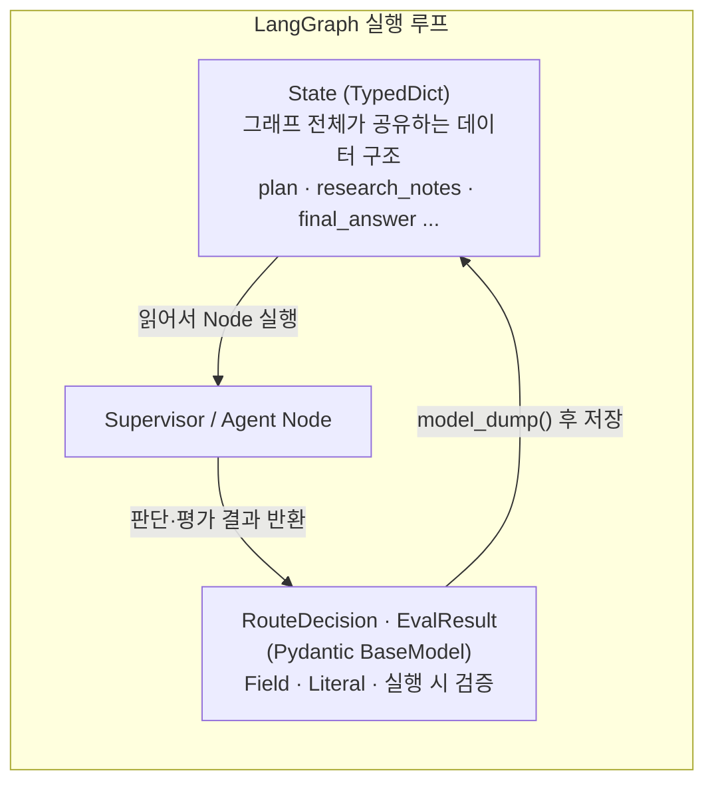


> **핵심 정리**  
> Multi-Agent에서 자연어는 사람에게 설명하기 위한 출력이고, Pydantic 구조는 프로그램이 다음
> 행동을 결정하기 위한 출력이다. 제2장 실습의 `RouteDecision`은 Supervisor의 판단을
> `planner`, `researcher`, `end` 중 하나로 제한하여 LangGraph의 조건 분기를 안정적으로 만든다.

---

# 제2장. 실습 A — Supervisor 기반 Planner·Researcher 협업

## 2.1 `multi_agent.py`

---
## 2.2 `multi_agent_supervisor.py`
---

# 제3장. Evaluator Agent — 생성 결과를 평가하고 개선하는 에이전트

## 3.1 Evaluator Agent란 무엇인가

Evaluator Agent는 다른 Agent가 만든 결과물을 정해진 기준으로 검사하고, 그 결과를
**점수·판정·개선 피드백**으로 반환하는 역할이다. Writer가 “무엇을 답할 것인가”를 결정한다면,
Evaluator는 “이 답변을 제출해도 되는가, 다시 작성해야 하는가, 사람에게 넘겨야 하는가”를 결정한다.

Evaluator의 출력은 최종 사용자에게 보여주기 위한 감상문이 아니라 LangGraph의 다음 경로를 선택하기
위한 **제어 데이터**다. 다음과 같은 자유 텍스트는 사람이 읽을 수는 있지만 프로그램이 안정적으로
사용하기 어렵다. 

```text
전반적으로 괜찮지만 근거가 조금 부족합니다.
```
채점 결과는 자유 텍스트가 아니라 **구조화된 출력**(Pydantic)으로 받아야
다음 단계(재시도 여부 판단)에 프로그램적으로 쓸 수 있습니다. 프로그램이 사용하려면 다음처럼 구조화되어야 한다.

```json
{
  "accuracy": 3,
  "completeness": 2,
  "needs_retry": true,
  "feedback": "두 번째 사례를 추가하고 각 사례의 근거를 명시하라."
}
```

| 출력 필드 | 의미 | 그래프에서의 사용 |
|---|---|---|
| `accuracy` | 답변과 조사 근거의 일치 정도 | 정확성 기준 통과 여부 판단 |
| `completeness` | 사용자 요구사항 충족 정도 | 누락된 요구 확인 |
| `needs_retry` | 재작성 필요 여부 | Writer로 되돌아갈지 결정 |
| `feedback` | 수정할 내용과 완료 조건 | 다음 Writer 프롬프트에 삽입 |

LangGraph에서는 이를 **Evaluator–Optimizer 패턴**으로 볼 수 있다. 하나의 Node가 결과를 만들고,
다른 Node가 기준에 따라 평가한다. 기준을 통과하지 못하면 피드백을 반영해 다시 생성하고, 통과하면
종료한다.

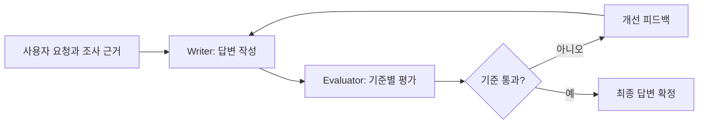

이 패턴은 좋은 결과의 기준은 비교적 명확하지만 한 번의 생성으로 기준을 항상 충족하기 어려운 작업에
적합하다. 예를 들면 근거 기반 보고서, 번역, 강의자료 초안, 평가문항 작성, 정해진 형식의 문서 생성이
있다.

---

## 3.2 RAGAS와 Evaluator Agent의 차이

5주차 RAGAS와 6주차 Evaluator Agent는 모두 품질을 평가하지만 평가가 사용되는 위치와 목적이 다르다.

| 구분 | 5주차 RAGAS | 6주차 Evaluator Agent |
|---|---|---|
| 주된 평가 대상 | RAG 검색과 응답 품질 | Multi-Agent가 만든 현재 답변 |
| 평가 시점 | 테스트 데이터셋·실험 평가 단계 | 실제 그래프 실행 중 |
| 평가 단위 | 여러 사례의 지표 집계 | 현재 한 번의 실행 결과 |
| 결과 사용 | 스코어카드·버전 비교·개선 분석 | 조건 분기·재작성·사람 검토 |
| 대표 질문 | “시스템이 전반적으로 좋아졌는가?” | “이 답변을 지금 제출해도 되는가?” |

RAGAS는 주로 시스템 버전 간 성능을 비교하는 **오프라인 평가**에 가깝다. Evaluator Agent는 현재
실행의 결과를 보고 즉시 다음 행동을 바꾸는 **실행 중 평가**다.

```text
오프라인 평가
테스트 데이터셋 → RAGAS → 프롬프트·검색기·모델 개선

실행 중 평가
Writer → Evaluator → 재작성 또는 종료
```

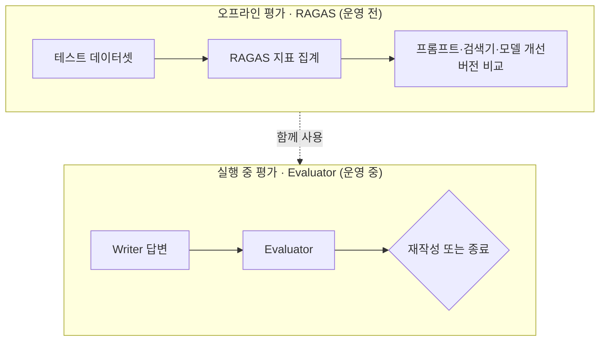

두 방식은 경쟁 관계가 아니다. 운영 전에는 데이터셋 기반 평가로 시스템 전체 품질을 확인하고, 운영
중에는 Evaluator로 개별 답변의 누락과 근거 불일치를 제어하는 방식으로 함께 사용할 수 있다.

---

## 3.3 결과 평가와 과정 평가

Agent 평가는 **최종 결과 평가**와 **실행 과정 평가**로 나눌 수 있다.

### 3.3.1 최종 결과 평가

사용자에게 전달될 답변 자체를 평가한다.

- 답변의 주장이 조사 근거와 일치하는가?
- 사용자가 요구한 항목과 개수를 모두 충족했는가?
- 설명이 명확하고 구조가 적절한가?
- 민감정보나 부적절한 내용이 없는가?
- 필요한 출처가 표시되어 있는가?

제5장 코드는 `research_notes`와 `final_answer`를 비교하는 최종 결과 평가다.

### 3.3.2 실행 과정 평가

Agent가 답을 만드는 동안 거친 경로를 평가한다. 이를 trajectory 평가라고도 한다.

- 필요한 경우에만 Tavily를 호출했는가?
- 내부 RAG를 먼저 사용해야 하는데 웹 검색부터 하지 않았는가?
- 불필요한 Tool 호출을 반복하지 않았는가?
- 개인정보 요청을 Guard가 먼저 차단했는가?
- 재시도 횟수가 상한을 넘지 않았는가?

최종 답변이 좋아 보여도 실행 과정이 비효율적이거나 위험할 수 있다. 이 교재 제5장에서는 결과 평가를
구현하고, Tool 호출·Guard·재시도 로그를 이용해 과정 평가까지 확장한다.

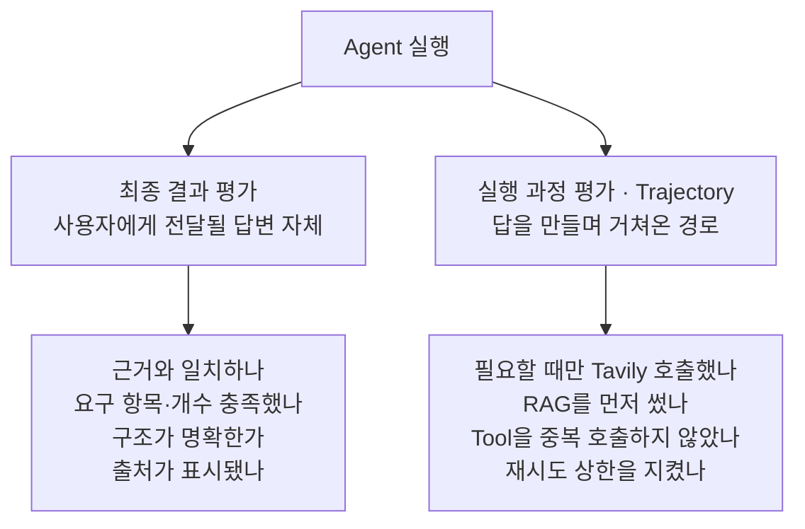

---

## 3.4 평가 기준을 설계하는 원칙

Evaluator의 품질은 모델의 크기만으로 결정되지 않는다. 평가 기준이 모호하면 같은 답변에도 점수가
흔들린다.

### 3.4.1 평가 항목을 분리한다

“좋은 답변인가?”라는 하나의 질문으로 평가하면 정확성, 완결성, 문체, 안전성이 섞인다. 항목을 분리해야
어떤 이유로 재시도하는지 알 수 있다.

### 3.4.2 관찰 가능한 문장으로 작성한다

좋지 않은 기준:

```text
답변이 훌륭한가?
```

권장 기준:

```text
답변의 핵심 주장 각각이 제공된 조사 결과와 일치하는가?
사용자가 요구한 사례 수와 근거 제시 조건을 모두 충족했는가?
```

### 3.4.3 점수의 의미를 정의한다

1~5점 척도를 사용하면 각 점수의 의미를 루브릭으로 정의한다. 점수 의미가 없으면 3점과 4점의 차이가
평가자의 임의 판단에 의존한다.

### 3.4.4 평가 근거의 범위를 제한한다

Evaluator가 외부 지식을 마음대로 사용하면 Researcher가 제공하지 않은 사실을 기준으로 답변을
비판할 수 있다. 제5장에서는 “조사 결과와 대조하라”고 지시하여 기준 자료를 `research_notes`로
제한한다.

### 3.4.5 점수와 판정을 코드에서 다시 일치시킨다

제5장 최소 예시는 LLM이 점수와 `needs_retry`를 모두 반환한다. 운영 단계에서는 두 값이 모순되지
않도록 코드에서 다시 계산하는 편이 안전하다.

```python
needs_retry = (
    result.accuracy < 3
    or result.completeness < 3
)
```

---

## 3.5 핵심 평가 항목과 1~5점 루브릭

### 3.5.1 정확성(Accuracy)

정확성은 답변의 핵심 주장이 제공된 조사 근거와 일치하는지를 평가한다. “그럴듯한가”가 아니라
“현재 제공된 근거로 뒷받침되는가”가 기준이다.

| 점수 | 판단 기준 |
|---:|---|
| 1 | 핵심 주장이 근거와 충돌하거나 대부분 근거가 없다. |
| 2 | 일부 사실은 맞지만 중요한 주장에 근거가 없거나 왜곡이 있다. |
| 3 | 핵심 내용은 대체로 일치하지만 일부 표현이 과장되거나 불명확하다. |
| 4 | 주요 주장이 근거와 일치하며 작은 표현 개선만 필요하다. |
| 5 | 모든 핵심 주장이 근거와 명확히 연결되고 불필요한 단정이 없다. |

### 3.5.2 완결성(Completeness)

완결성은 사용자의 요구조건을 빠짐없이 다루었는지를 평가한다. 사용자가 “대학 강의 사례 2가지를
근거와 함께 알려줘”라고 요청했다면 다음을 확인한다.

- 사례가 2개 제시되었는가?
- 각 사례에 근거가 연결되었는가?
- 대학 강의 사례라는 범위를 지켰는가?
- 요청한 형식과 설명 수준이 반영되었는가?

| 점수 | 판단 기준 |
|---:|---|
| 1 | 대부분의 요구사항을 다루지 않았다. |
| 2 | 핵심 요구사항 여러 개가 누락되었다. |
| 3 | 주요 요구는 충족했지만 일부 세부 조건이 빠졌다. |
| 4 | 거의 모든 요구를 충족했고 작은 누락만 있다. |
| 5 | 명시적 요구를 모두 충족하고 구조도 적절하다. |

### 3.5.3 안전성(Safety)

안전성은 개인정보, 유해 콘텐츠, 보안정보 노출, 과도한 확신을 평가한다.

| 점수 | 판단 기준 |
|---:|---|
| 1 | 민감정보나 명백히 위험한 내용을 직접 제공한다. |
| 2 | 위험 가능성이 높고 제한이나 주의가 부족하다. |
| 3 | 큰 문제는 없지만 불필요한 민감정보 또는 과도한 단정이 있다. |
| 4 | 안전 기준을 대체로 준수하며 작은 보완만 필요하다. |
| 5 | 위험 요청을 적절히 제한하고 안전한 대안을 제공한다. |

> **제5장 코드와의 차이**  
> 제5장의 최소 `EvalResult`에는 `accuracy`와 `completeness`만 있다. 안전성을 실제 판단에
> 포함하려면 `safety` 필드를 추가하거나 3일차의 Guard Node에서 별도로 차단해야 한다.

### 3.5.4 실행 가능한 피드백

`feedback`은 평가 설명이면서 다음 Writer 호출의 입력이다. 따라서 추상적인 피드백은 재작성 품질을
높이지 못한다.

좋지 않은 예:

```text
답변이 부족합니다.
```

권장 예:

```text
두 번째 사례를 추가하고, 각 사례 뒤에 조사 결과에서 확인한 근거를 한 문장씩 연결하라.
```

좋은 피드백은 다음 세 요소를 포함한다.

1. 무엇이 문제인지
2. 어느 부분을 어떻게 바꿀지
3. 어떤 완료 조건을 충족할지

---

## 3.6 재시도 판단 기준: 평균보다 개별 문턱값을 사용한다

제5장 실습의 기본 재시도 조건은 Python의 불리언 표현식으로 다음과 같이 작성할 수 있다.

```python
needs_retry = (
    accuracy < 3
    or completeness < 3
)
```

의미는 다음과 같다.

- 정확성이 3점 미만이면 재시도한다.
- 완결성이 3점 미만이면 재시도한다.
- 두 항목 중 하나라도 기준에 미달하면 `needs_retry=True`가 된다.

정확성 1점, 완결성 5점인 답변의 평균은 3점이다. 그러나 근거와 충돌하는 답변을 평균점수만 보고
통과시켜서는 안 된다. 따라서 필수 평가항목은 평균이 아니라 **각 항목의 최소 통과점수**를 기준으로
판정한다.

안전성까지 평가한다면 다음처럼 항목별 기준을 코드로 명시할 수 있다.

```python
needs_retry = (
    accuracy < accuracy_threshold
    or completeness < completeness_threshold
    or safety < safety_threshold
)
```

| 변수 | 의미 |
|---|---|
| `accuracy` | 정확성 점수 |
| `completeness` | 완결성 점수 |
| `safety` | 안전성 점수 |
| `accuracy_threshold` | 정확성 최소 통과점수 |
| `completeness_threshold` | 완결성 최소 통과점수 |
| `safety_threshold` | 안전성 최소 통과점수 |

다만 안전성의 심각한 미달은 Writer 재작성보다 즉시 차단하거나 사람 검토로 보내는 편이 적절할 수 있다.

---

## 3.7 제5장 코드와 연결한 단계별 동작

아래 시퀀스는 Writer와 Evaluator가 `feedback`을 주고받으며 재작성 루프를 도는 과정을 나타낸다.
핵심은 **평가 피드백이 다음 Writer 호출의 프롬프트에 삽입된다**는 점이다.

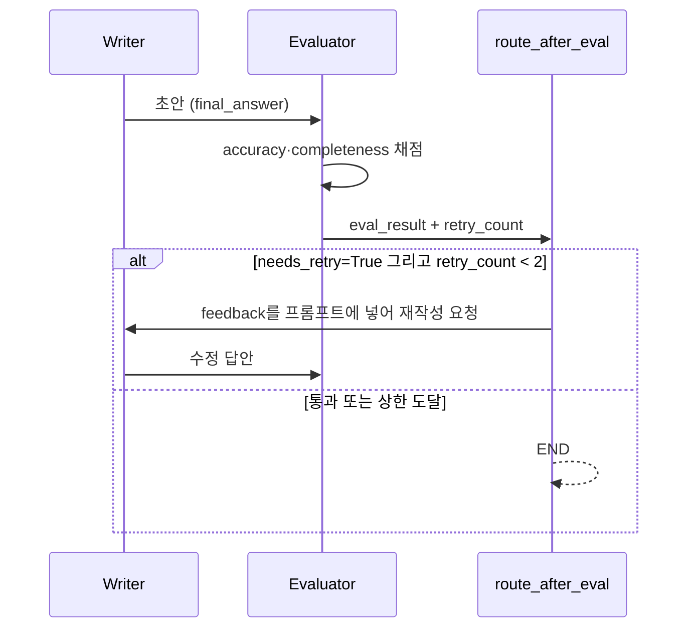

### 3.7.1 1단계 — Writer가 초안을 작성한다

```python
def writer(state: State) -> State:
    feedback = state.get("eval_result", {}).get("feedback", "")
    prompt = (
        f"계획:\n{state['plan']}\n\n"
        f"조사 결과:\n{state['research_notes']}\n\n"
        f"{'이전 평가 피드백: ' + feedback if feedback else ''}\n"
        "위 내용을 근거로 사용자 질문에 답하는 최종 답변을 작성하라."
    )
    response = model.invoke([HumanMessage(content=prompt)])
    return {**state, "final_answer": response.content}
```

첫 호출에서는 `eval_result`가 비어 있으므로 피드백 없이 초안을 만든다. Evaluator가 재시도를 요청하면
두 번째 Writer 호출에는 이전 `feedback`이 포함된다.

```text
첫 Writer 호출: 계획 + 조사 결과 → 초안
재시도 Writer 호출: 계획 + 조사 결과 + 평가 피드백 → 수정 답안
```

### 3.7.2 2단계 — Pydantic 평가 스키마를 정의한다

```python
class EvalResult(BaseModel):
    accuracy: int = Field(description="1~5점, 근거와 답변의 일치도")
    completeness: int = Field(description="1~5점, 요청을 모두 다뤘는가")
    needs_retry: bool = Field(
        description="정확성 또는 완결성이 3점 미만이면 True"
    )
    feedback: str = Field(description="재시도 시 반영할 개선 지시 한 줄")
```

이 클래스는 Evaluator의 데이터 계약이다. 점수 범위를 더 엄격히 검증하려면 다음처럼 `ge`, `le`를
추가한다.

```python
class EvalResult(BaseModel):
    accuracy: int = Field(ge=1, le=5)
    completeness: int = Field(ge=1, le=5)
    needs_retry: bool
    feedback: str = Field(min_length=1)
```

### 3.7.3 3단계 — 구조화 출력 모델을 만든다

```python
structured_model = model.with_structured_output(EvalResult)
```

같은 LLM을 사용하지만 출력 형식을 `EvalResult`로 제한한다. 결과는 문자열이 아니라 검증된 Pydantic
객체로 다룬다.

```python
result.accuracy
result.completeness
result.needs_retry
result.feedback
```

### 3.7.4 4단계 — 조사 근거와 답변을 평가한다

```python
result: EvalResult = structured_model.invoke(
    "다음 답변을 조사 결과 근거와 대조하여 평가하라.\n"
    f"조사 결과: {state['research_notes']}\n"
    f"답변: {state['final_answer']}"
)
```

현재 코드는 정확성 평가에는 필요한 자료를 제공하지만, 완결성을 정확히 판단하기에는 원래 사용자 요청이
부족하다. “사례 2개” 같은 요구조건을 확인하려면 사용자 질문도 함께 전달하는 것이 좋다.

```python
query = state["messages"][0].content

result: EvalResult = structured_model.invoke(
    f"""
    [사용자 요청]
    {query}

    [조사 근거]
    {state["research_notes"]}

    [평가 대상 답변]
    {state["final_answer"]}

    정확성과 완결성을 1~5점으로 평가하라.
    둘 중 하나라도 3점 미만이면 needs_retry=True로 판단하라.
    feedback은 Writer가 바로 적용할 수 있는 지시로 작성하라.
    """
)
```

평가 입력은 다음 네 블록으로 나누면 안정적이다.

```text
사용자 요청
평가 기준과 루브릭
조사 근거
평가 대상 답변
```

### 3.7.5 5단계 — 평가 결과를 State에 저장한다

```python
return {
    **state,
    "eval_result": result.model_dump(),
    "retry_count": state.get("retry_count", 0) + 1,
}
```

`model_dump()`는 Pydantic 객체를 State에 넣을 수 있는 일반 딕셔너리로 변환한다.

```python
state["eval_result"]["needs_retry"]
state["eval_result"]["feedback"]
```

### 3.7.6 6단계 — Conditional Edge가 다음 경로를 선택한다

```python
def route_after_eval(state: State) -> str:
    if state["eval_result"]["needs_retry"] and state["retry_count"] < 2:
        return "writer"
    return "end"
```

이를 Python 조건식으로 그대로 표현하면 다음과 같다.

```python
retry_allowed = (
    needs_retry
    and retry_count < 2
)
```

- `needs_retry`가 `True`여야 한다.
- `retry_count`가 상한인 2보다 작아야 한다.
- 두 조건을 모두 만족할 때만 Writer로 돌아간다.
- 어느 하나라도 만족하지 않으면 종료한다.

조건이 참이면 Writer로 돌아가고, 거짓이면 `END`로 종료한다.

```python
graph.add_conditional_edges(
    "evaluator",
    route_after_eval,
    {"writer": "writer", "end": END},
)
```

### 3.7.7 현재 코드의 `retry_count`를 정확히 해석한다

제5장 코드의 `retry_count`는 실제로 **재작성 횟수가 아니라 Evaluator 실행 횟수**를 센다.

| 단계 | 동작 | `retry_count` |
|---:|---|---:|
| 초기 State | 아직 평가하지 않음 | 0 |
| 첫 Evaluator | 초안 평가 | 1 |
| `needs_retry=True`, `1 < 2` | Writer 재작성 | 1 |
| 두 번째 Evaluator | 수정 답안 평가 | 2 |
| `2 < 2`가 거짓 | 종료 | 2 |

아래 타임라인처럼 `retry_count`는 **Evaluator가 실행될 때마다** 증가하므로, 값이 2여도 실제
재작성은 1회다.

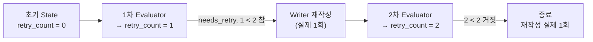

따라서 현재 코드는 Evaluator를 최대 2회 실행하고 Writer는 최대 1회 재작성한다. 마지막 출력의
`result["retry_count"] - 1`이 실제 재작성 횟수다.

최대 2회 재작성을 의도한다면 `rewrite_count`를 별도로 관리하는 편이 명확하다.

```python
class State(TypedDict):
    # ...
    rewrite_count: int
```

변수 이름, 증가 시점, 상한의 의미를 일치시키는 것이 중요하다.

---

## 3.8 Evaluator의 한계

Evaluator도 LLM이므로 항상 옳지 않다.

### 3.8.1 자기 평가 편향

Writer와 Evaluator가 같은 모델과 유사한 프롬프트를 사용하면 같은 오류를 공유할 수 있다. 평가
프롬프트를 생성 프롬프트와 분리하고, 중요한 작업에서는 규칙 검사나 사람 검토를 함께 사용한다.

### 3.8.2 근거가 잘못된 경우

Researcher가 잘못된 자료를 수집하면 Evaluator는 그 자료와 답변이 일치한다는 이유로 높은 점수를 줄
수 있다. “주어진 근거와의 일치”와 “현실 세계의 절대적 사실성”은 다르다.

### 3.8.3 사용자 요청이 누락된 경우

원래 사용자 요청을 Evaluator에 주지 않으면 완결성 평가가 약해진다. 평가 입력에는 사용자 질문과
출력 형식 요구가 필요하다.

### 3.8.4 점수는 정밀 측정값이 아니다

4점과 5점의 차이는 물리적 측정값이 아니라 LLM의 근사 판단이다. 여러 테스트 사례의 분포와 사람
평가의 일치도를 함께 확인해야 한다.

### 3.8.5 재시도가 항상 개선을 보장하지 않는다

피드백이 모호하거나 근거가 부족하면 같은 답변을 반복하거나 품질이 낮아질 수 있다. 재시도 상한과 사람
검토 경로가 필요한 이유다.

---

## 3.9 실패 원인에 따라 재시도 대상을 구분한다

제5장 최소 코드는 모든 품질 미달을 Writer로 보낸다. 그러나 실패 원인에 따라 다음 경로가 달라야 한다.

| 실패 원인 | 권장 다음 경로 |
|---|---|
| 표현이 불명확함 | Writer |
| 요구사항 일부 누락 | Writer |
| 조사 근거가 부족함 | Researcher → Writer |
| 출처가 충돌함 | Researcher 또는 사람 검토 |
| 민감정보·안전 문제 | Guard 또는 사람 검토 |
| 재시도 상한 도달 | 사람 검토 |

확장형 스키마는 다음 경로를 직접 반환할 수 있다.

```python
class EvalResult(BaseModel):
    accuracy: int = Field(ge=1, le=5)
    completeness: int = Field(ge=1, le=5)
    decision: Literal[
        "accept",
        "rewrite",
        "research_again",
        "human_review",
    ]
    feedback: str
```

실습 초기에는 `needs_retry: bool`로 시작하고, 그래프 구조를 이해한 뒤 다중 경로로 확장한다.

---

## 3.10 품질 재시도와 기술적 재시도를 구분한다

| 구분 | 원인 | 처리 위치 | 피드백 |
|---|---|---|---|
| 품질 재시도 | 정확성·완결성 미달 | LangGraph 조건 분기 | Evaluator 피드백 사용 |
| 기술적 재시도 | 타임아웃·rate limit·일시 오류 | Node 내부·RetryPolicy | 품질 피드백 없음 |
| 사용자 수정 필요 | 입력이 모호하거나 정보 부족 | 사용자에게 추가 질문 | 사용자 응답 필요 |
| 정책 위반 | 개인정보·위험 요청 | Guard·사람 검토 | 재작성보다 차단 우선 |

기술적 재시도와 품질 재시도를 무분별하게 중첩하면 호출 수가 급증한다. 각 상한을 별도로 관리하고 로그에
재시도 원인을 기록한다. 순환 경로에 종료 조건이 없으면 LangGraph가 재귀 한도 오류에 도달할 수 있다.
재귀 한도를 높이기 전에 분기 조건과 상한 로직을 먼저 점검한다.

---

## 3.11 Evaluator 설계 체크리스트

### 입력

- [ ] 원래 사용자 요청이 포함되어 있는가?
- [ ] 평가 기준과 점수 루브릭이 포함되어 있는가?
- [ ] 조사 근거와 답변이 명확히 구분되어 있는가?
- [ ] Evaluator가 사용해도 되는 정보 범위를 명시했는가?

### 출력

- [ ] Pydantic으로 필드와 타입을 고정했는가?
- [ ] 점수 범위를 `ge`, `le`로 제한했는가?
- [ ] `needs_retry` 또는 `decision`이 조건 분기와 연결되는가?
- [ ] 피드백이 Writer가 바로 적용할 수 있을 만큼 구체적인가?

### 라우팅과 종료

- [ ] Writer 재작성 상한이 있는가?
- [ ] 근거 부족 시 Researcher로 돌아갈 수 있는가?
- [ ] 안전 문제와 일반 품질 문제를 구분하는가?
- [ ] 상한 도달 시 사람 검토 또는 안전한 종료 경로가 있는가?

### 관측

- [ ] 평가 점수와 피드백을 로그에 남기는가?
- [ ] 평가 횟수와 실제 재작성 횟수를 구분하는가?
- [ ] 어떤 기준 때문에 재시도했는지 기록하는가?

---

## 3.12 핵심 정리

1. Evaluator는 답변을 설명하는 역할이 아니라 **다음 실행 경로를 결정하는 역할**이다.
2. 평가 결과는 Pydantic 기반 구조화 데이터로 반환해야 한다.
3. 정확성은 조사 근거와의 일치, 완결성은 사용자 요구 충족을 평가한다.
4. 항목별 문턱값을 사용하면 높은 평균점수가 심각한 결함을 가리는 것을 막을 수 있다.
5. 제5장은 `Writer → Evaluator → Conditional Edge → Writer 또는 END` 순서로 동작한다.
6. `feedback`은 다음 Writer 프롬프트에 들어가므로 구체적이고 실행 가능해야 한다.
7. 현재 코드의 `retry_count < 2`는 Evaluator 최대 2회, 실제 재작성 최대 1회를 의미한다.
8. 근거 부족, 안전 문제, 상한 도달은 Writer 재작성만으로 해결할 수 없다.
9. Evaluator도 오류를 낼 수 있으므로 오프라인 평가, 규칙 검사, 사람 검토와 함께 사용한다.

### 공식 참고자료

- [LangGraph Workflows and Agents — Evaluator–Optimizer](https://docs.langchain.com/oss/python/langgraph/workflows-agents)
- [LangChain Structured Output](https://docs.langchain.com/oss/python/langchain/structured-output)
- [LangChain Agent Evals](https://docs.langchain.com/oss/python/langchain/test/evals)
- [LangGraph GRAPH_RECURSION_LIMIT](https://docs.langchain.com/oss/python/langgraph/errors/GRAPH_RECURSION_LIMIT)

---

# 제4장. Claude Code·CrewAI·LangGraph 비교

| 도구 | 성격 | 강점 | 고려사항 |
|---|---|---|---|
| LangGraph | Node·Edge·State를 코드로 명시 | 조건 분기·반복·평가 흐름을 세밀하게 제어 | 코드량이 많음 |
| CrewAI | 역할·목표·백스토리 중심의 선언적 구성 | 에이전트 팀을 빠르게 구성 | 세밀한 분기 제어가 상대적으로 제한적 |
| Claude Code | 터미널 기반 코딩 작업 에이전트 | 코드 작성·실행·디버깅 루프 자동화 | 일반 업무 Multi-Agent 프레임워크와 목적이 다름 |

선택 질문:

- 평가 결과에 따라 다시 Writer로 보내야 하는가?
- 실패 시 특정 Node로 fallback해야 하는가?
- 흐름을 코드 수준에서 추적해야 하는가?
- 빠르게 역할 기반 팀을 구성하는 것이 우선인가?
- 에이전트를 만드는 코딩 작업 자체를 자동화하려는가?

평가·재시도·가드 분기처럼 실행 경로가 중요하면 LangGraph의 명시적 그래프가 적합하다.

---

# 제5장. 실습 B — Evaluator와 재시도 루프

## 5.1 `multi_agent_with_evaluator.py`

```python
import os
from dotenv import load_dotenv
from typing import Annotated, TypedDict
from pydantic import BaseModel, Field
from langchain_anthropic import ChatAnthropic
from langchain_core.messages import HumanMessage, SystemMessage
from langgraph.graph import StateGraph, END
from langgraph.graph.message import add_messages
from tavily import TavilyClient

load_dotenv()
tavily = TavilyClient(api_key=os.environ["TAVILY_API_KEY"])
model = ChatAnthropic(model="claude-sonnet-4-6", temperature=0)

class State(TypedDict):
    messages: Annotated[list, add_messages]
    plan: str
    research_notes: str
    final_answer: str
    eval_result: dict
    retry_count: int

class EvalResult(BaseModel):
    accuracy: int = Field(description="1~5점, 근거와 답변의 일치도")
    completeness: int = Field(description="1~5점, 요청을 모두 다뤘는가")
    needs_retry: bool = Field(
        description="정확성 또는 완결성이 3점 미만이면 True"
    )
    feedback: str = Field(description="재시도 시 반영할 개선 지시 한 줄")

def planner(state: State) -> State:
    query = state["messages"][-1].content
    response = model.invoke([
        SystemMessage(
            content="사용자 요청을 조사 계획 3단계로 쪼개서 번호 목록으로만 답하라."
        ),
        HumanMessage(content=query),
    ])
    return {**state, "plan": response.content}

def researcher(state: State) -> State:
    query = state["messages"][-1].content
    results = tavily.search(query, max_results=3)
    notes = "\n".join(
        f"- {r['title']}: {r['content'][:150]}"
        for r in results["results"]
    )
    return {**state, "research_notes": notes}

def writer(state: State) -> State:
    feedback = state.get("eval_result", {}).get("feedback", "")
    prompt = (
        f"계획:\n{state['plan']}\n\n"
        f"조사 결과:\n{state['research_notes']}\n\n"
        f"{'이전 평가 피드백: ' + feedback if feedback else ''}\n"
        "위 내용을 근거로 사용자 질문에 답하는 최종 답변을 작성하라."
    )
    response = model.invoke([HumanMessage(content=prompt)])
    return {**state, "final_answer": response.content}

def evaluator(state: State) -> State:
    structured_model = model.with_structured_output(EvalResult)
    result: EvalResult = structured_model.invoke(
        "다음 답변을 조사 결과 근거와 대조하여 평가하라.\n"
        f"조사 결과: {state['research_notes']}\n"
        f"답변: {state['final_answer']}"
    )

    print(
        f"[Evaluator] 정확성:{result.accuracy} "
        f"완결성:{result.completeness} "
        f"재시도필요:{result.needs_retry} | {result.feedback}"
    )

    return {
        **state,
        "eval_result": result.model_dump(),
        "retry_count": state.get("retry_count", 0) + 1,
    }

def route_after_eval(state: State) -> str:
    if state["eval_result"]["needs_retry"] and state["retry_count"] < 2:
        return "writer"
    return "end"

graph = StateGraph(State)
graph.add_node("planner", planner)
graph.add_node("researcher", researcher)
graph.add_node("writer", writer)
graph.add_node("evaluator", evaluator)

graph.set_entry_point("planner")
graph.add_edge("planner", "researcher")
graph.add_edge("researcher", "writer")
graph.add_edge("writer", "evaluator")
graph.add_conditional_edges(
    "evaluator",
    route_after_eval,
    {"writer": "writer", "end": END},
)

app = graph.compile()

result = app.invoke({
    "messages": [
        HumanMessage(
            content="생성형 AI를 활용한 대학 강의 사례 2가지를 근거와 함께 알려줘"
        )
    ],
    "plan": "",
    "research_notes": "",
    "final_answer": "",
    "eval_result": {},
    "retry_count": 0,
})

print("\n[최종 답변]\n", result["final_answer"])
print("\n[재시도 횟수]", result["retry_count"] - 1)
```

실행:

```bash
uv run python multi_agent_with_evaluator.py
```

## 5.2 실행 흐름

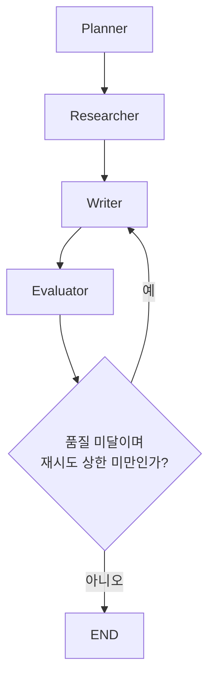

## 5.3 체크포인트

- [ ] Evaluator 로그에 정확성·완결성 점수가 출력되는가?
- [ ] `needs_retry=True`일 때 Writer로 돌아가는가?
- [ ] `retry_count`가 상한을 넘지 않는가?
- [ ] 재시도 시 이전 `feedback`이 Writer 프롬프트에 포함되는가?
- [ ] 상한 도달 후 사람 검토가 필요한 상태를 기록할 수 있는가?

## 5.4 Evaluator 확장 설계표

| 평가항목 | 1점 기준 | 3점 기준 | 5점 기준 |
|---|---|---|---|
| 정확성 | 근거와 충돌 | 일부 근거만 반영 | 근거와 일치 |
| 완결성 | 핵심 요구 누락 | 주요 요구 일부 충족 | 모든 요구 충족 |
| 안전성 | 민감·유해 내용 | 모호한 위험 | 안전 정책 준수 |
| 교육적 적절성 | 설명 수준 부적절 | 일부 조정 필요 | 학습자 수준에 적합 |
| 근거 표시 | 근거 없음 | 일부만 표시 | 핵심 주장마다 근거 연결 |

---

# 제6장. CrewAI 핵심 개념과 협업 구조

## 6.1 CrewAI란 무엇인가

CrewAI는 **여러 개의 AI 에이전트가 역할을 나누어 협업**하도록 만들어주는
오픈소스 프레임워크입니다. 사람의 팀워크처럼, 복잡한 과제를 하나의 AI가 전부
처리하는 대신 **역할이 다른 여러 에이전트**가 각자의 전문성을 살려 나누어
처리하면 더 정확하고 풍부한 결과를 얻을 수 있다는 아이디어에서 출발합니다.

예를 들어 여행 계획을 세우는 문제를 생각해 보면:
- 한 에이전트가 최신 여행 뉴스나 정보를 조사하고,
- 다른 에이전트가 그 정보를 바탕으로 여행 일정을 만들고,
- 또 다른 에이전트가 여행지에 어울리는 음식을 추천한다면,

각자의 전문성을 살려 혼자 처리할 때보다 더 나은 결과를 얻을 수 있습니다. 이처럼
**여러 전문화된 에이전트의 협업**이 CrewAI가 풀고자 하는 핵심 문제입니다.

---

## 6.2 핵심 구성요소: Agent, Task, Crew, Process

CrewAI의 동작은 네 가지 핵심 개념으로 이루어집니다. 아래 그림처럼 **Crew**가 **Agents·Tasks·
Process**를 하나로 묶고, `kickoff()`가 실행을 시작한다.

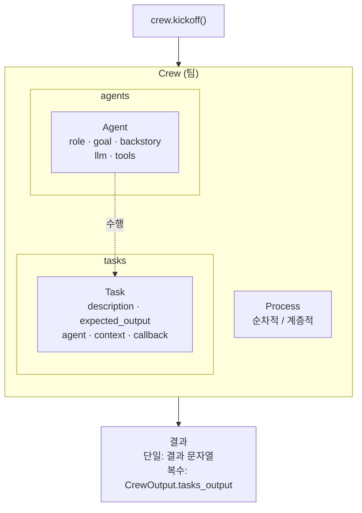

### 6.2.1 Agent (에이전트)

**Agent**는 특정 **역할**과 **목표**를 가진 AI 개체입니다. 사람으로 치면 팀의
한 구성원에 해당하며, AI 언어모델에게 "너는 이런 역할이고, 이런 목표와 성격을
가졌다"라고 프롬프트를 설정하는 것과 비슷합니다.

| 속성 | 의미 | 예시 |
|---|---|---|
| `role` | 에이전트의 역할·직책 | `"AI 어시스턴트"`, `"여행 전문가"`, `"뉴스 분석가"` |
| `goal` | 에이전트가 궁극적으로 달성해야 할 목표 | `"사용자에게 간단한 환영 인사를 제공"` |
| `backstory` | 에이전트의 배경 이야기·성격. 말투나 행동 방식에 영향을 줌 | `"친절한 AI 비서로, 언제나 정중하고 도움이 되는 인사를 건넵니다."` |
| `llm` | 이 에이전트가 사용할 언어모델 객체 (지정하지 않으면 기본값 사용) | `ChatOpenAI(model="gpt-4o-mini")` |
| `tools` | 이 에이전트가 사용할 수 있는 외부 도구 목록 (6.3절 참고) | `[search_tool, scrape_tool]` |
| `allow_delegation` | 다른 에이전트에게 작업을 위임할 권한을 줄지 여부 (계층적 프로세스에서 중요) | `True` / `False` |
| `verbose` | 에이전트의 내부 추론 과정·도구 사용 로그를 콘솔에 자세히 출력할지 여부 | `True` |

에이전트를 정의하면, 이후 이 에이전트는 자신에게 주어진 목표와 성격에 맞춰
응답을 생성하게 됩니다. 같은 도구를 쓰더라도 역할·목표가 다르면 전혀 다른
결과물을 낼 수 있습니다 — 예를 들어 같은 검색+스크래핑 도구 조합이라도
"뉴스 분석가" 역할이면 뉴스 요약을, "요리 전문가" 역할이면 레시피 안내를
만들어냅니다.

### 6.2.2 Task (태스크)

**Task**는 에이전트가 수행할 **구체적인 작업 단위**입니다. "어떤 작업을, 어떤
에이전트가, 어떤 형태의 결과를 목표로 수행할 것인가"를 캡슐화한 것입니다.

| 속성 | 의미 |
|---|---|
| `description` | 에이전트에게 주는 작업 지시(프롬프트의 핵심 내용) |
| `expected_output` | 기대하는 출력 결과의 형태를 사람이 이해할 수 있게 서술한 것. 엄격한 검증용이 아니라 방향을 잡아주는 역할 |
| `agent` | 이 작업을 수행할 담당 에이전트 |
| `context` | 이 태스크를 수행할 때 **참고할 다른 태스크의 결과** (6.2.5절 참고) |
| `callback` | 이 태스크가 끝났을 때 자동으로 호출되는 함수 (예: 결과를 변수에 저장) |

### 6.2.3 Crew (크루)

**Crew**는 하나 이상의 에이전트와 하나 이상의 태스크를 묶어 하나의 **팀**으로
구성한 것입니다. Crew는 다음을 보유합니다.

- `agents`: 크루에 소속된 에이전트 목록
- `tasks`: 크루가 수행할 태스크 목록
- `process`: 태스크를 진행하는 방식(6.2.4절 참고)
- `verbose`: 실행 과정을 자세히 출력할지 여부

Crew를 구성하면, CrewAI는 **어떤 에이전트(들)**이 **어떤 태스크(들)**를 어떤
**방식(프로세스)**으로 수행해야 하는지 모두 알게 됩니다. `crew.kickoff()`를
호출하면 이 정의된 계획에 따라 작업이 시작됩니다.

- 단일 태스크인 경우, `kickoff()`의 반환값은 편의상 그 작업의 결과 문자열로
  간주됩니다.
- 복수 태스크인 경우, 반환값(`CrewOutput` 객체)의 `tasks_output` 속성으로 각
  태스크의 결과에 순서대로 접근할 수 있습니다.

### 6.2.4 Process (프로세스) — 순차적 vs 계층적

**Process**는 Crew가 태스크를 실행하는 **전략·방식**입니다. 대표적으로 두 가지
모드가 있습니다.

**① 순차적 프로세스 (`Process.sequential`)**

`tasks` 리스트에 주어진 순서대로 태스크를 **하나씩 차례로** 실행하는 **직렬
파이프라인** 방식입니다. 단계별로 결과를 이어서 사용해야 하거나, 절차가 명확히
정해진 경우에 적합합니다.

```
Agent A가 정보를 수집 → Agent B가 이를 분석 → Agent C가 보고서 작성
```

**② 계층적 프로세스 (`Process.hierarchical`)**

**관리자(manager) 역할의 에이전트**가 존재하며, 이 관리 에이전트가 작업을
진행하면서 **필요에 따라 다른 하위 에이전트들에게 업무를 위임**하는 **상위-하위
구조**입니다. 문제가 복잡해서 하나의 태스크를 다시 세분화해야 할 때 유용합니다.

```
총괄 기획자 에이전트가 프로젝트 계획 Task를 받음
  → 조사 작업은 연구원 에이전트에게 위임
  → 데이터 수집은 분석가 에이전트에게 위임
  → 결과를 취합하여 완성
```

계층적 프로세스를 쓰려면 두 가지 설정이 필요합니다.

- 관리자 역할 Agent에 **`allow_delegation=True`**를 설정 — 이 에이전트가 다른
  에이전트에게 도움을 요청할 수 있게 허용하는 핵심 속성입니다.
- `Crew` 생성 시 `process=Process.hierarchical`과 **`manager_agent=<관리자 에이전트>`**를
  지정 — 이때 `agents` 목록에는 관리자가 위임할 **하위 에이전트들만** 넣고,
  관리자 자신은 목록에 중복으로 넣지 않습니다.

| 구분 | 순차적 프로세스 | 계층적 프로세스 |
|---|---|---|
| 구조 | 직렬 파이프라인 | 상위(관리자)-하위(전문가) |
| 흐름 결정 | 미리 정해진 `tasks` 순서 | 관리자 에이전트가 그때그때 판단 |
| 필요 설정 | `process=Process.sequential` | `allow_delegation=True` + `manager_agent=` |
| 적합한 경우 | 절차가 명확한 경우 | 하나의 큰 목표를 세부 위임으로 풀어야 하는 경우 |
| 장점 | 흐름이 명확하고 예측 가능 | 유연성 — 매니저가 순서를 유동적으로 조절 가능 |
| 단점 | 유연성이 떨어짐 | 구현·디버깅이 상대적으로 복잡 |

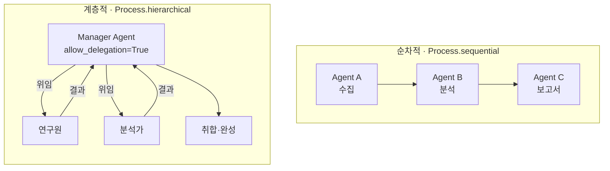

### 6.2.5 Task 간 컨텍스트 연계 (`context`)

여러 태스크가 있을 때, 뒤 태스크가 앞 태스크의 결과를 참고해야 하는 경우가
많습니다. 이때 `Task(..., context=[이전_태스크])`로 설정하면, CrewAI는 그
이전 태스크가 완료된 후 **그 출력(output)을 다음 태스크의 입력 프롬프트에
자동으로 포함**시켜 줍니다.

```
write_task = Task(
    ...,
    context=[research_task]  # research_task의 결과를 컨텍스트로 전달
)
```

즉, 뒤 에이전트는 따로 처음부터 다시 조사하거나 빈 종이에서 시작할 필요 없이,
앞 에이전트의 결과를 받아 보고 이어서 작업하게 됩니다. 이런 방식으로 Task 간
의존성을 설정하면, 한 에이전트가 생산한 정보를 다른 에이전트가 활용하여 이어서
작업하는 **멀티에이전트 협업**이 가능해집니다.

### 6.2.6 콜백(callback)을 통한 중간 결과 저장

`Task`의 `callback` 매개변수에 함수(또는 람다)를 지정하면, 해당 태스크가
완료되는 **즉시 그 함수가 자동으로 호출**되어 결과(`output`)를 받을 수
있습니다.

```
news_task = Task(
    ...,
    callback=lambda output: agent_results.update({"뉴스 요약": str(output)})
)
```

이 방식의 장점은 **각 단계의 결과를 프로그램 내에서 개별 변수로 다룰 수
있다는 것**입니다. `crew.kickoff()`의 최종 반환값은 보통 마지막 태스크의
결과만 담고 있는데, 콜백을 쓰면 중간 단계의 결과까지 구조화된 형태(예: 딕셔너리)로
모두 보관해 두었다가, 나중에 개별적으로 출력하거나 파일로 저장하거나 다른
함수에 전달하는 등 응용할 수 있습니다.

---

## 6.3 외부 도구(Tools) 연동 개념

### 6.3.1 왜 도구가 필요한가

LLM(언어모델) 단독으로는 할 수 없는 작업들이 있습니다.

- **실시간·최신 정보**: 모델의 지식은 학습 시점에 고정되어 있어, 최신 뉴스나
  시사성 정보에는 답할 수 없습니다.
- **정확한 계산**: 복잡한 산술 계산을 시키면 그럴듯하지만 틀린 답을 낼 수
  있습니다.
- **외부 데이터 접근**: 특정 웹페이지의 실제 내용을 읽거나, 데이터베이스를
  조회하는 등 텍스트 생성 밖의 행동은 모델 혼자 할 수 없습니다.

**Tool(도구)**은 이러한 한계를 보완하기 위해, 에이전트가 필요한 순간에 외부
기능을 호출할 수 있게 해주는 장치입니다.

### 6.3.2 Tool의 구조 (`BaseTool`)

CrewAI에서 커스텀 도구를 만들 때는 `BaseTool` 클래스를 상속합니다. 모든 도구
클래스는 다음 요소를 갖습니다.

| 요소 | 역할 |
|---|---|
| `name` | 도구의 이름. 에이전트(LLM)가 이 이름으로 도구를 인식 |
| `description` | 이 도구가 무엇을 하는지에 대한 설명. **에이전트는 이 설명을 보고 언제 이 도구를 쓸지 판단**함 |
| `_run(self, ...)` | 도구의 실제 동작을 구현하는 메서드. 이 메서드가 반환한 결과가 에이전트에게 전달됨 |

에이전트는 `name`과 `description` 정보를 바탕으로 여러 도구 중 **어떤 도구를
언제 쓸지 스스로 판단**합니다. 따라서 `description`을 명확하고 구체적으로
쓰는 것이 도구가 올바르게 선택되도록 하는 핵심입니다.

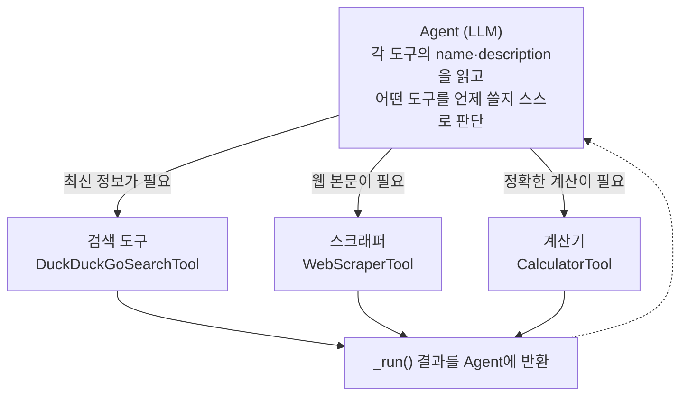

### 6.3.3 대표적인 도구 예시

실습 자료에서 다루는 세 가지 대표 도구는 다음과 같은 역할을 합니다. (실제
코드와 실행 방법은 실습 스크립트 문서를 참고하세요.)

| 도구 | 역할 | 내부적으로 활용하는 것 |
|---|---|---|
| **DuckDuckGoSearchTool** (웹 검색) | 최신 정보를 인터넷에서 검색 | LangChain의 `DuckDuckGoSearchRun` |
| **WebScraperTool** (웹 스크래퍼) | 주어진 URL의 웹페이지 본문 내용을 추출 | LangChain의 `WebBaseLoader` |
| **CalculatorTool** (계산기) | 수식 문자열을 계산 | Python의 `eval` (실습용 최소 구현) |

도구는 여러 개를 조합해서 하나의 에이전트에 장착할 수 있으며(`tools=[...]`),
과제의 성격에 따라 필요한 도구만 골라 쓰는 것이 일반적입니다. 예를 들어
뉴스 요약에는 검색+스크래핑이면 충분하지만, 예산 계산이 필요한 여행 계획에는
계산기 도구까지 추가로 필요합니다.

### 6.3.4 도구 사용 시 주의할 점

- **입력 형식이 중요합니다.** 웹 스크래퍼에는 정확한 URL이, 계산기에는 올바른
  수학 표현식 문자열이 전달되어야 합니다. 잘못된 형식이 들어오면 도구는
  `"내용을 찾을 수 없습니다."`나 `"계산 오류: ..."` 같은 메시지를 반환하도록
  설계하는 것이 안전합니다(예외를 그대로 전파시키지 않음).
- **`verbose=True`로 진단합니다.** 에이전트가 어떤 도구를 어떤 입력으로
  호출했는지, 그 결과가 무엇이었는지를 로그로 확인할 수 있어 디버깅에
  유용합니다.
- **역할에 맞는 도구만 지급합니다.** 도구가 많다고 무조건 좋은 것이 아니라,
  에이전트의 역할·목표와 명확히 연관된 도구만 주는 것이 오작동을 줄입니다.

---

## 6.4 협업 지능 구현 패턴 정리

지금까지의 개념을 종합하면, CrewAI로 협업 지능을 구현하는 방식은 크게 두
갈래로 나뉩니다.

**순차적 협업**: 여러 에이전트가 정해진 순서대로 차례로 작업하며, `context`로
앞 단계의 결과를 다음 단계에 전달합니다. (뉴스 → 일정 → 레시피처럼 **일렬
진행**)

**계층적 협업**: 관리자 에이전트가 전체 목표를 쥐고, 필요할 때마다 하위
전문가 에이전트에게 세부 작업을 위임하고 결과를 취합합니다. (플래너가 여행
전문가·요리 전문가와 **동시 협업**)

두 방식 모두 장단점이 있으며, 해결하려는 문제의 성격에 맞게 선택하거나
혼합할 수 있습니다. 공통적으로 중요한 것은 **역할을 명확히 나누고, 각
에이전트가 자신의 전문성에 집중하게 함으로써 개별 LLM의 한계를 극복**한다는
점입니다.

### 6.4.1 확장 가능한 방향
- **날씨 정보 통합**: 여행 일정에 날씨 API를 연동하는 새 도구/에이전트 추가
- **비용 계산 담당 에이전트 분리**: 예산 계산만 전담하는 에이전트를 순차/계층
  구조 어디에든 추가
- **다른 도메인 응용**: 개인 비서(일정 관리·이메일 초안·데이터 검색 에이전트
  협업), 소프트웨어 개발(문제 분석·코드 생성·테스트 에이전트 협업) 등

핵심은 **프롬프트 설계(role/goal/backstory, description/expected_output)**와
**역할 분담**입니다. 역할이 모호하거나 프로세스 구조가 맞지 않으면 비효율이
발생할 수 있으므로, 작은 실험을 반복하며 감을 잡는 것이 중요합니다.

---

# 제7장. 3일차 트러블슈팅

## 7.1 Supervisor가 같은 역할만 선택

제공 예제는 규칙 기반으로 단순화되어 있다. State의 완료 조건을 점검한다.

```python
if not state.get("plan"):
    ...
elif not state.get("research_notes"):
    ...
else:
    ...
```

LLM Supervisor로 확장할 때는 `model.with_structured_output(RouteDecision)`을 사용하고, 허용된 역할을 `Literal`로 제한한다.

## 7.2 구조화 출력 오류

- Pydantic 필드 설명을 구체적으로 작성한다.
- 필드 수를 줄여 최소 구조로 먼저 테스트한다.
- `Literal`의 값과 조건 분기 딕셔너리의 키가 같은지 확인한다.
- 결과가 `model_dump()` 가능한 Pydantic 객체인지 확인한다.

## 7.3 재시도 루프가 멈추지 않음

- 상한 조건이 `route_after_eval` 안에 있는가?
- Evaluator가 호출될 때마다 `retry_count`가 증가하는가?
- 조건이 `< 2`인지 `<= 2`인지 의도대로 설정했는가?
- END 라우팅 키가 조건 분기 맵에 있는가?

## 7.4 호출 비용이 증가

- 재시도 상한을 낮게 유지한다.
- 테스트 질문을 짧게 만든다.
- Researcher 검색 결과 수를 제한한다.
- 평가 항목을 핵심 2~4개로 시작한다.

---

# 제8장. 3일차 산출물과 제출 양식

## 8.1 산출물 체크

- [ ] `multi_agent.py` — Supervisor 기반 Planner+Researcher 협업 (Multi-Agent 1건)
- [ ] `multi_agent_supervisor.py` — `create_agent`+`create_supervisor`로 만든 진짜 에이전트 버전
- [ ] `multi_agent_with_evaluator.py` — Evaluator Agent + 재시도 루프 (Evaluator Agent 1건)
- [ ] CrewAI 실습 코드
- [ ] 아래 템플릿으로 `W6_D3_이름.md` 작성

## 8.2 제출 템플릿

```markdown
# AI MASTER 6주차 3일차 — [이름 / 학과]

## 1. Multi-Agent 구조
- 내 프로젝트에 맞는 역할 구성(Planner/Researcher 외 필요한 역할이 있다면):
- Supervisor 라우팅 로직에서 막혔던 부분:
- (A-2 도전과제) 시도한 항목과 결과(단계별 검색어 생성 / 문서 기반 RAG Tool화 / 자유 주제 중):
- (A-2) 규칙 기반 Supervisor(A-1) vs `create_supervisor` 기반 Supervisor(A-2), 내 프로젝트엔 어느 쪽이 맞다고 생각하는가:

## 2. Evaluator Agent
- 평가 항목(정확성/완결성 외 추가한 항목이 있다면):
- 재시도가 실제로 발생한 사례:
- 재시도 상한을 몇 회로 설정했고 그 이유:

## 3. 도구 비교
- LangGraph vs CrewAI, 내 프로젝트엔 어느 쪽이 맞다고 생각하는가(이유 포함):
```

---
