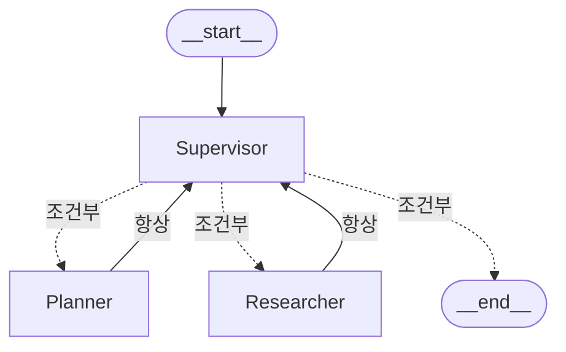

# 3일차 (8/12 수) — Supervisor 기반 Multi-Agent와 Evaluator Agent


준비물 체크
- [ ] 어제(8/11) 만든 `week6-agent` 프로젝트 (그대로 이어서 사용)
- [ ] 어제 산출물( Tavily Web Search, LangGraph Workflow) 정상 실행 확인
- [ ] langgraph-supervisor 설치
```bash
uv add langgraph-supervisor
```
---

## 세션 1  — 왜 하나의 에이전트로는 부족한가

### 1-1. 3주차 AI 조교의 한계, 다시 보기

3일차 워크북에서 이미 짚었던 문제입니다: **"여러 역할을 한 조교가 다 못 한다."**
하나의 프롬프트에 "계획도 세우고, 자료도 찾고, 검증도 하라"고 다 넣으면 프롬프트가
비대해지고, 각 역할이 서로의 지시를 희석시킵니다.

### 1-2. Multi-Agent 역할 분담

| 역할 | 하는 일 | 오늘 구현 여부 |
|---|---|---|
| **Supervisor** | 다음에 누가 일할 차례인지 결정(라우팅) | ✅ 필수 |
| **Planner** | 사용자 요청을 하위 작업으로 쪼갠다 | ✅ 실습 A |
| **Researcher** | Tool·Search로 정보를 수집한다 (어제 만든 Tool Agent 재사용) | ✅ 실습 A |
| **Evaluator** | 결과물의 정확성·안전성을 채점한다 | ✅ 실습 B |

### 1-3. Supervisor 패턴 동작 원리

```
사용자 요청 → Supervisor → Planner → Supervisor → Researcher → Supervisor → Evaluator → Supervisor → 종료
```
핵심 원칙은 각 Worker가 자기 역할만 알고, Supervisor가 전체 실행 순서를 관리하는 것이다.


---

## 세션 2 — 실습 A: Supervisor 기반 2-Agent 협업

### A-1. Planner + Researcher + Supervisor — `multi_agent.py`

```python
# multi_agent.py
import os
from dotenv import load_dotenv
from typing import Annotated, Literal, TypedDict
from pydantic import BaseModel, Field
from langchain.chat_models import init_chat_model
from langchain_core.messages import HumanMessage, SystemMessage
from langgraph.graph import StateGraph, END
from langgraph.graph.message import add_messages
from tavily import TavilyClient

load_dotenv()
tavily = TavilyClient(api_key=os.environ["TAVILY_API_KEY"])
MODEL = "anthropic:claude-sonnet-4-6"  # 모델 선택은 1일차 A-1 박스 참고
model = init_chat_model(MODEL, temperature=0)

class State(TypedDict):
    messages: Annotated[list, add_messages]
    plan: str
    research_notes: str

# --- Supervisor: 다음 순서를 구조화 출력으로 결정 ---
class RouteDecision(BaseModel):
    next: Literal["planner", "researcher", "end"] = Field(description="다음에 일할 역할")
    reason: str = Field(description="그렇게 판단한 이유 한 줄")

def supervisor(state: State) -> State:
    if not state.get("plan"):
        decision = RouteDecision(next="planner", reason="아직 계획이 없음")
    elif not state.get("research_notes"):
        decision = RouteDecision(next="researcher", reason="계획은 있으나 자료 조사가 없음")
    else:
        decision = RouteDecision(next="end", reason="계획과 자료 조사가 모두 완료됨")
    print(f"[Supervisor] 다음 역할: {decision.next} ({decision.reason})")
    return {**state, "_next": decision.next}

# --- Planner: 요청을 하위 작업으로 쪼갠다 ---
def planner(state: State) -> State:
    query = state["messages"][-1].content
    response = model.invoke([
        SystemMessage(content="사용자 요청을 조사 계획 3단계로 쪼개서 번호 목록으로만 답하라."),
        HumanMessage(content=query),
    ])
    return {**state, "plan": response.content}

# --- Researcher: 계획에 따라 검색 실행 ---
def researcher(state: State) -> State:
    query = state["messages"][-1].content
    results = tavily.search(query, max_results=3)
    notes = "\n".join(f"- {r['title']}: {r['content'][:150]}" for r in results["results"])
    return {**state, "research_notes": notes}

def route(state: State) -> str:
    return state["_next"]

graph = StateGraph(State)
graph.add_node("supervisor", supervisor)
graph.add_node("planner", planner)
graph.add_node("researcher", researcher)

graph.set_entry_point("supervisor")
graph.add_conditional_edges("supervisor", route, {
    "planner": "planner",
    "researcher": "researcher",
    "end": END,
})
graph.add_edge("planner", "supervisor")
graph.add_edge("researcher", "supervisor")

app = graph.compile()

result = app.invoke({
    "messages": [HumanMessage(content="생성형 AI를 활용한 대학 강의 사례를 조사해줘")],
    "plan": "",
    "research_notes": "",
})
print("\n[계획]\n", result["plan"])
print("\n[조사 결과]\n", result["research_notes"])
```

```bash
uv run python multi_agent.py
```
### 코드 읽기


* 구조화된 라우팅 결과

`RouteDecision`은 Supervisor가 반환할 라우팅 결과의 형식을 고정한다. 제1장 1.5절에서 설명한
Pydantic 데이터 계약을 실제 Supervisor 라우팅에 적용한 부분이다. `next`는 조건 분기에서 사용할
제어값이고, `reason`은 라우팅 판단을 사람이 확인할 수 있게 하는 설명값이다.

```json
{
  "next": "researcher",
  "reason": "계획은 있으나 자료 조사가 없음"
}
```

제공 예제에서는 흐름을 이해하기 위해 규칙 기반 `if-else`로 Supervisor를 구현하였다. 실전에서는 동일한 Pydantic 스키마를 LLM의 구조화 출력에 연결할 수 있다.

* State 누적

Planner는 `plan`을 채우고 Researcher는 `research_notes`를 채운다. Supervisor는 빈 필드를 확인해 다음 Node를 선택한다.

**[체크포인트]**
- [ ] 로그가 `planner → researcher → end` 순서로 나타나는가?
- [ ] `plan`과 `research_notes`가 서로 다른 Node에서 채워지는가?
- [ ] Researcher가 Planner의 계획을 실제 검색어에 반영하고 있는가?
- [ ] 같은 Node만 반복 호출되는 무한 루프가 없는가?

**[도전 과제]** Researcher가 이미 있는 계획과 무관한 검색을 한다면, Planner의 프롬프트에
"계획의 각 단계를 검색어로 쓸 수 있게 구체적으로 써라"를 추가해 보세요.

### A-2. Supervisor를 "진짜 에이전트"로 업그레이드 — `multi_agent_supervisor.py`

A-1의 Supervisor는 사실 에이전트가 아니라 **`if/else`로 다음 순서를 정하는 평범한
파이썬 함수**였습니다. Planner와 Researcher도 각자 도구 없이 그냥 모델을 한 번 호출하는
Node에 불과했고요. 이번에는 세 역할을 모두 **진짜 에이전트**로 바꿉니다.

- **Planner**·**Researcher**: 각각 `create_agent`로 만든 독립 에이전트. 기존에 함수로
  짜여 있던 로직(계획 쪼개기, 검색하기)을 **Tool로 등록**해서 각 에이전트가 스스로
  호출하게 합니다.
- **Supervisor**: `langgraph-supervisor` 라이브러리의 `create_supervisor`로 만듭니다.
  A-1처럼 우리가 직접 `route()` 함수를 짜는 게 아니라, Supervisor 자신도 하나의
  LLM 에이전트가 되어 "지금 누구에게 맡길지"를 **스스로 판단**하고, 자동으로 만들어진
  `transfer_to_planner` / `transfer_to_researcher`라는 **핸드오프(hand-off) 도구**를
  직접 호출해 작업을 위임합니다.

> 💡 A-1 트러블슈팅에서 이미 힌트를 드렸었죠 — "실전에서는 Supervisor 자체도 LLM
> 호출로 구현하는 것을 권장합니다." 바로 그 업그레이드가 이번 실습입니다.

**그래프 모양**

코드를 실행하면 `multi_agent_graph.png`가 생성됩니다. 구조를 미리 mermaid
다이어그램으로 보면 대략 이런 모양입니다.



`planner`·`researcher`에서 `supervisor`로 가는 화살표는 **항상** 일어나는 실선이고
(작업이 끝나면 반드시 감독에게 보고), `supervisor`에서 나가는 화살표는 **점선**입니다
(그 순간의 판단에 따라 셋 중 하나로 갈 수 있음을 의미). A-1의 그래프(고정된 조건
분기)와 비교하면, A-2는 "누구에게 갈지"가 코드가 아니라 Supervisor의 판단에 달려
있다는 게 그림에서도 드러납니다.
**추가 패키지 설치**

```bash
uv add langchain langgraph-supervisor
```

```python
# multi_agent_supervisor.py
import os
from dotenv import load_dotenv
from langchain_core.tools import tool
from langchain_core.messages import HumanMessage
from langchain.chat_models import init_chat_model
from langchain.agents import create_agent
from langgraph_supervisor import create_supervisor
from tavily import TavilyClient

load_dotenv()
tavily = TavilyClient(api_key=os.environ["TAVILY_API_KEY"])
MODEL = "anthropic:claude-sonnet-4-6"  # 모델 선택은 1일차 A-1 박스 참고
model = init_chat_model(MODEL, temperature=0)


# --- Researcher가 쓸 Tool: Tavily 검색 ---
@tool
def web_search(query: str) -> str:
    """주어진 검색어로 웹을 검색해 관련 자료의 제목과 요약을 반환한다."""
    results = tavily.search(query, max_results=3)
    return "\n".join(f"- {r['title']}: {r['content'][:150]}" for r in results["results"])


# --- Planner가 쓸 Tool: 요청을 조사 계획으로 쪼개는 로직 자체를 도구로 등록 ---
@tool
def make_plan(request: str) -> str:
    """사용자 요청을 조사 가능한 하위 작업 3단계로 쪼갠 계획을 만든다."""
    response = model.invoke(
        f"다음 요청을 조사 계획 3단계로 쪼개서 번호 목록으로만 답하라.\n요청: {request}"
    )
    return response.content


# --- 1. Researcher 에이전트: web_search Tool을 가진 독립 에이전트 ---
researcher_agent = create_agent(
    model=model,
    tools=[web_search],
    system_prompt=(
        "당신은 Researcher 에이전트입니다. web_search 도구로 필요한 자료를 조사하고,"
        " 조사한 내용을 근거와 함께 정리해서 보고하세요."
        " 스스로 결론을 내리기보다 조사 결과 자체를 충실히 전달하는 데 집중하세요."
    ),
    name="researcher",
)

# --- 2. Planner 에이전트: make_plan Tool을 가진 독립 에이전트 ---
planner_agent = create_agent(
    model=model,
    tools=[make_plan],
    system_prompt=(
        "당신은 Planner 에이전트입니다. make_plan 도구로 사용자 요청을 실행 가능한"
        " 조사 계획으로 쪼개세요. 계획만 만들고, 실제 조사나 최종 답변은 하지 않습니다."
    ),
    name="planner",
)

# --- 3. Supervisor: Planner·Researcher를 감독하며 작업을 위임하는 '감독 에이전트' ---
supervisor = create_supervisor(
    agents=[planner_agent, researcher_agent],
    model=model,
    prompt=(
        "당신은 Supervisor입니다. 사용자 요청이 들어오면 먼저 planner에게 계획 수립을"
        " 맡기고, 계획이 나오면 researcher에게 조사를 맡기세요. 두 에이전트의 결과가"
        " 모두 모이면 그 내용을 종합해 사용자에게 최종 답변을 하고 끝내세요."
        " 각 단계에서 지금까지의 진행 상황을 보고 다음에 누구에게 맡길지 스스로 판단하세요."
    ),
).compile()


# --- 그래프 시각화: 전체 Multi-Agent 구조를 그림으로 저장 ---
graph_png = supervisor.get_graph().draw_mermaid_png()
with open("multi_agent_graph.png", "wb") as f:
    f.write(graph_png)
print("그래프 이미지를 multi_agent_graph.png로 저장했습니다. 파일을 열어 확인하세요.")


if __name__ == "__main__":
    result = supervisor.invoke({
        "messages": [HumanMessage(content="생성형 AI를 활용한 대학 강의 사례를 조사해줘")]
    })
    for m in result["messages"]:
        m.pretty_print()
```

```bash
uv run python multi_agent_supervisor.py
```

실행하면 메시지 목록이 대략 이런 순서로 쌓입니다 (실제 문구는 매번 달라질 수 있습니다).

```
HumanMessage        생성형 AI를 활용한 대학 강의 사례를 조사해줘
AIMessage(supervisor)   [도구 호출] transfer_to_planner
ToolMessage             Successfully transferred to planner
AIMessage(planner)      1. ... 2. ... 3. ...  (계획)
AIMessage(planner)      Transferring back to supervisor
ToolMessage             Successfully transferred back to supervisor
AIMessage(supervisor)   [도구 호출] transfer_to_researcher
ToolMessage             Successfully transferred to researcher
AIMessage(researcher)   [도구 호출] web_search(...)
ToolMessage             (검색 결과)
AIMessage(researcher)   조사 결과 요약...
AIMessage(researcher)   Transferring back to supervisor
ToolMessage             Successfully transferred back to supervisor
AIMessage(supervisor)   [최종 답변]
```


**[체크포인트]**
- [ ] `multi_agent_graph.png`에 `supervisor`가 가운데 있고, `planner`·`researcher`로
      점선이, 다시 `supervisor`로 실선이 돌아오는 모양이 보이나요?
- [ ] `researcher_agent`의 그래프를 따로 그려서, 1일차 `agent_graph.py`의 구조와
      같다는 것을 확인했나요?

**A-1과 무엇이 다른가**

| | A-1 (규칙 기반) | A-2 (진짜 에이전트) |
|---|---|---|
| Supervisor | `if/else` 파이썬 코드 | `create_supervisor`가 만든 LLM 에이전트가 스스로 판단 |
| Planner·Researcher | 도구 없는 평범한 함수(Node) | `create_agent`로 만든, 각자 Tool을 가진 독립 에이전트 |
| 라우팅 방식 | 우리가 짠 `route()` 함수 + `add_conditional_edges` | Supervisor가 자동 생성된 `transfer_to_*` 핸드오프 도구를 스스로 호출 |
| 우리가 설계하는 범위 | 흐름 전체(그래프 구조) | 역할·Tool·프롬프트 (흐름 뼈대는 라이브러리 제공) |

**[체크포인트]**
- [ ] 실행 로그에 `transfer_to_planner`, `transfer_to_researcher` 같은 핸드오프 도구
      호출이 보이나요? (Supervisor가 직접 만든 도구를 스스로 호출하는 것 — 이게
      "진짜 에이전트"라는 뜻입니다)
- [ ] Planner는 `make_plan`만, Researcher는 `web_search`만 사용하고, 서로의 존재를
      몰라도 전체 작업이 끝까지 진행되나요?
- [ ] `result["messages"]`를 각각 `pretty_print()`해보고, A-1의 `print` 로그와 비교했을 때
      어떤 정보가 더 (혹은 덜) 보이는지 확인했나요?

**[도전 과제]**

**1. 문서 기반 RAG를 Tool로 추가하기**

> 💬 **자주 나오는 질문**: "`document_search`는 Tool로 등록하는 건가요, 아니면 그냥
> 실행하는 함수인가요?" — A-2에서는 **반드시 Tool로 등록**합니다. A-2의 핵심이 "각
> 에이전트가 상황에 맞는 도구를 스스로 고른다"는 것이므로, 문서 검색도 `@tool`로
> 등록해서 Researcher가 "이 질문엔 웹 검색이 나을지, 내 자료 검색이 나을지"를
> **스스로 판단**하게 만드는 것이 맞습니다. (무조건 실행하는 함수로 만들면 A-1과
> 다를 게 없어집니다.)

**힌트 코드:**

```python
import chromadb
from chromadb.utils import embedding_functions

# ⚠️ 아래 경로와 컬렉션 이름은 예시입니다.
# 4주차 실습에서 본인이 실제로 벡터DB를 저장한 경로/컬렉션 이름으로 반드시 바꾸세요.
CHROMA_DB_PATH = "./my_rag_db"       # TODO: 본인의 4주차 실제 경로로 교체
CHROMA_COLLECTION_NAME = "professor_docs"  # TODO: 본인의 4주차 실제 컬렉션 이름으로 교체

chroma_client = chromadb.PersistentClient(path=CHROMA_DB_PATH)
embedding_fn = embedding_functions.DefaultEmbeddingFunction()  # 4주차와 동일한 임베딩 함수를 써야 함
collection = chroma_client.get_or_create_collection(
    name=CHROMA_COLLECTION_NAME,
    embedding_function=embedding_fn,
)

@tool
def document_search(query: str) -> str:
    """본인 강의·연구자료 벡터DB에서 검색한다.
    강의 개념, 규정, 본인 자료 안에 근거가 있어야 하는 질문에 사용한다.
    최신 뉴스나 시사성 정보에는 사용하지 않는다."""
    results = collection.query(query_texts=[query], n_results=3)
    docs = results["documents"][0] if results["documents"] else []
    return "\n".join(f"- {d[:150]}" for d in docs) or "(관련 문서 없음)"


researcher_agent = create_agent(
    model=model,
    tools=[web_search, document_search],  # 두 Tool을 모두 등록 — 선택은 에이전트가 한다
    system_prompt=(
        "당신은 Researcher 에이전트입니다. 강의자료·규정처럼 본인 자료 안에 근거가"
        " 있어야 하는 질문은 document_search를, 최신 정보나 일반적인 사례 조사는"
        " web_search를 사용하세요. 필요하면 두 도구를 모두 사용해도 됩니다."
    ),
    name="researcher",
)
```

**[체크포인트]** 강의자료에만 있는 질문을 던지면 `document_search`가, 최신 시사성
질문을 던지면 `web_search`가 호출되나요? (두 도구의 설명(docstring)이 서로 다른
상황을 가리키고 있어야 에이전트가 잘 구분합니다 — 1주차에 배운 원칙이 여기서도
그대로 적용됩니다.)

**2. 중복 검색 방지(캐싱)**

같은 검색어를 여러 번 호출하면 비용이 낭비됩니다. 이미 검색한 질의는 다시
검색하지 않도록 캐시를 붙여보세요.

**힌트 코드:**

```python
_search_cache: dict[str, str] = {}

@tool
def cached_web_search(query: str) -> str:
    """웹을 검색한다. 같은 질의는 캐시된 결과를 재사용한다."""
    if query in _search_cache:
        return _search_cache[query]
    result = web_search.invoke({"query": query})
    _search_cache[query] = result
    return result
```

> 이 구조가 바로 6주차 강의계획서에서 말하는 **"Supervisor 기반 Multi-Agent 구현"**의
> 정식 형태입니다. A-1은 그 내부 동작 원리를 손으로 짚어본 것이고, A-2는 실무에서
> 실제로 쓰는 방식입니다.

---

## 세션 3 — Evaluator Agent 설계 / CrewAI

### 3-1. Evaluator Agent란

5주차 RAGAS가 "RAG 결과물"을 채점했다면, Evaluator Agent는 **에이전트의 최종 응답**을
채점합니다. 채점 결과는 자유 텍스트가 아니라 **구조화된 출력**(Pydantic)으로 받아야
다음 단계(재시도 여부 판단)에 프로그램적으로 쓸 수 있습니다.

| 평가 항목 | 확인 내용 |
|---|---|
| 정확성(accuracy) | 조사 결과나 근거와 실제 답변이 일치하는가 |
| 안전성(safety) | 유해하거나 부적절한 내용이 없는가 |
| 완결성(completeness) | 사용자 요청의 모든 부분에 답했는가 |
| 재시도 필요 여부(needs_retry) | 위 항목 중 미달이 있으면 True |

### 3-2. LangGraph / CrewAI 비교


| 도구 | 성격 | 오늘 만든 LangGraph Multi-Agent와의 차이 |
|---|---|---|
| **LangGraph** (오늘 실습) | 그래프를 직접 설계 — Node/Edge를 코드로 명시 | 흐름을 세밀하게 통제 가능, 코드량이 많음 |
| **CrewAI** | 역할(Role)·목표(Goal)·백스토리 중심의 선언적 프레임워크 | 빠르게 팀을 구성 가능, 세밀한 분기 제어는 상대적으로 제한적 |
| **Claude Code** | 코딩 작업에 특화된 자율 에이전트(터미널 기반) | 코드 작성·실행·디버깅 루프 자체를 자동화 — "에이전트를 만드는 에이전트"에 가까움 |

> 오늘 배운 LangGraph 방식이 "왜 필요한가"를 CrewAI와 비교하면 더 명확해집니다:
> **평가·재시도처럼 조건에 따라 흐름이 갈라져야 하는 경우**, LangGraph의 명시적 그래프가
> 유리합니다.

---

## 세션 4  — 실습 B: Evaluator Agent + 재시도 루프

### B-1. Evaluator Node 추가 — `multi_agent_with_evaluator.py`

어제·오늘 오전 코드에 Evaluator Node와 **미달 시 재시도 루프**를 추가합니다.

```python
# multi_agent_with_evaluator.py
import os
from dotenv import load_dotenv
from typing import Annotated, Literal, TypedDict
from pydantic import BaseModel, Field
from langchain.chat_models import init_chat_model
from langchain_core.messages import HumanMessage, SystemMessage
from langgraph.graph import StateGraph, END
from langgraph.graph.message import add_messages
from tavily import TavilyClient

load_dotenv()
tavily = TavilyClient(api_key=os.environ["TAVILY_API_KEY"])
MODEL = "anthropic:claude-sonnet-4-6"  # 모델 선택은 1일차 A-1 박스 참고
model = init_chat_model(MODEL, temperature=0)

class State(TypedDict):
    messages: Annotated[list, add_messages]
    plan: str
    research_notes: str
    final_answer: str
    eval_result: dict
    retry_count: int

class EvalResult(BaseModel):
    accuracy: int = Field(description="1~5점, 근거와 답변의 일치도")
    completeness: int = Field(description="1~5점, 요청을 모두 다뤘는가")
    needs_retry: bool = Field(description="둘 중 하나라도 3점 미만이면 True")
    feedback: str = Field(description="재시도 시 반영할 개선 지시 한 줄")

def planner(state: State) -> State:
    query = state["messages"][-1].content
    response = model.invoke([
        SystemMessage(content="사용자 요청을 조사 계획 3단계로 쪼개서 번호 목록으로만 답하라."),
        HumanMessage(content=query),
    ])
    return {**state, "plan": response.content}

def researcher(state: State) -> State:
    query = state["messages"][-1].content
    results = tavily.search(query, max_results=3)
    notes = "\n".join(f"- {r['title']}: {r['content'][:150]}" for r in results["results"])
    return {**state, "research_notes": notes}

def writer(state: State) -> State:
    """계획+조사 결과로 최종 답변 작성. 재시도라면 이전 피드백을 반영."""
    feedback = state.get("eval_result", {}).get("feedback", "")
    prompt = (
        f"계획:\n{state['plan']}\n\n조사 결과:\n{state['research_notes']}\n\n"
        f"{'이전 평가 피드백: ' + feedback if feedback else ''}\n"
        "위 내용을 근거로 사용자 질문에 답하는 최종 답변을 작성하라."
    )
    response = model.invoke([HumanMessage(content=prompt)])
    return {**state, "final_answer": response.content}

def evaluator(state: State) -> State:
    structured_model = model.with_structured_output(EvalResult)
    result: EvalResult = structured_model.invoke(
        f"다음 답변을 조사 결과 근거와 대조하여 평가하라.\n"
        f"조사 결과: {state['research_notes']}\n답변: {state['final_answer']}"
    )
    print(f"[Evaluator] 정확성:{result.accuracy} 완결성:{result.completeness} "
          f"재시도필요:{result.needs_retry} | {result.feedback}")
    return {**state, "eval_result": result.model_dump(),
            "retry_count": state.get("retry_count", 0) + 1}

def route_after_eval(state: State) -> str:
    if state["eval_result"]["needs_retry"] and state["retry_count"] < 2:
        return "writer"  # 최대 2회까지만 재시도 (무한 루프 방지)
    return "end"

graph = StateGraph(State)
graph.add_node("planner", planner)
graph.add_node("researcher", researcher)
graph.add_node("writer", writer)
graph.add_node("evaluator", evaluator)

graph.set_entry_point("planner")
graph.add_edge("planner", "researcher")
graph.add_edge("researcher", "writer")
graph.add_edge("writer", "evaluator")
graph.add_conditional_edges("evaluator", route_after_eval, {"writer": "writer", "end": END})

app = graph.compile()

result = app.invoke({
    "messages": [HumanMessage(content="생성형 AI를 활용한 대학 강의 사례 2가지를 근거와 함께 알려줘")],
    "plan": "", "research_notes": "", "final_answer": "",
    "eval_result": {}, "retry_count": 0,
})
print("\n[최종 답변]\n", result["final_answer"])
print("\n[재시도 횟수]", result["retry_count"] - 1)
```

```bash
uv run python multi_agent_with_evaluator.py
```

**[체크포인트]**
- [ ] Evaluator 로그에 정확성·완결성 점수가 출력되는가?
- [ ] `needs_retry=True`일 때 Writer로 돌아가는가?
- [ ] 재시도 시 이전 `feedback`이 Writer 프롬프트에 포함되는가?
- [ ] 상한 도달 후 사람 검토가 필요한 상태를 기록할 수 있는가?
- [ ] `retry_count`가 2를 넘지 않고 멈추나요? (**무한 루프 방지 장치 확인 — 중요**)

> ⚠️ **재시도 상한(`retry_count < 2`)을 반드시 두세요.** Evaluator가 계속 낮은 점수를 주면
> 그래프가 영원히 돌면서 API 비용이 무한정 나갈 수 있습니다. 실전에서는 상한 도달 시
> "사람 검토 필요" 태그를 붙여 종료하는 것이 안전합니다.

---

## B-2 CrewAI 실습 

---

### 0. 개발 환경 준비


#### 1. 작업할 상위 폴더로 이동

예를 들어 `D:\agent-prj` 아래에 프로젝트를 만든다면:

```powershell
cd D:\agent-prj
```

#### 2. uv 설치 확인

```powershell
uv --version
```

버전이 출력되면 다음 단계로 넘어갑니다.

`uv`를 찾을 수 없다는 오류가 나오면 먼저 설치합니다.

```powershell
winget install --id=astral-sh.uv -e
```

설치 후 PowerShell을 완전히 닫았다가 다시 실행하고 확인합니다.

```powershell
uv --version
```

#### 3. Python 3.12 설치

시스템에 Python 3.14가 설치되어 있어도 그대로 둡니다. `uv`가 관리하는 별도의 Python 3.12를 설치합니다.

```powershell
uv python install 3.12
```

설치된 Python 목록을 확인합니다.

```powershell
uv python list
```

목록에 다음과 비슷한 항목이 있어야 합니다.

```text
cpython-3.12.x-windows-x86_64
```

#### 4. 프로젝트 생성

요청한 명령으로 프로젝트를 생성합니다.

```powershell
uv init crewai_lab
```

프로젝트 폴더로 이동합니다.

```powershell
cd crewai_lab
```

생성된 파일을 확인합니다.

```powershell
Get-ChildItem -Force
```

일반적으로 다음 파일들이 만들어집니다.

```text
.git
.gitignore
.python-version
README.md
main.py
pyproject.toml
```

#### 5. 프로젝트 Python을 3.12로 지정

```powershell
uv python pin 3.12
```

확인합니다.

```powershell
Get-Content .python-version
```

다음처럼 출력되어야 합니다.

```text
3.12
```

### `pyproject.toml` 확인

```powershell
Get-Content pyproject.toml
```

다음 부분을 찾습니다.

```toml
requires-python = ">=3.14"
```

만약 `>=3.14`로 되어 있다면 VS Code에서 다음과 같이 수정합니다.

```toml
requires-python = ">=3.12,<3.14"
```

Python 3.14가 아닌 3.12 또는 3.13만 사용하도록 제한하는 설정입니다.

#### 6. Python 3.12 가상환경 생성

```powershell
uv venv --python 3.12
```

그러면 프로젝트 안에 `.venv` 폴더가 생성됩니다.

가상환경의 Python 버전을 직접 확인합니다.

```powershell
.\.venv\Scripts\python.exe --version
```

결과가 다음과 같아야 합니다.

```text
Python 3.12.x
```

Python 3.14가 출력되면 안 됩니다.

#### 7. B-2 이후 실습 패키지 설치

업로드한 실습 문서에서는 다음 패키지들을 사용합니다.

```powershell
uv add "crewai[tools]" python-dotenv langchain-community langchain-openai
```
- 문제 생기면 다음을 실행하고 패키지 설치 재시도한다.
```bash
uv python pin 3.12
```

DuckDuckGo 검색과 웹페이지 로딩에 필요한 선택 패키지도 설치합니다.

```powershell
uv add ddgs beautifulsoup4
```

노트북으로 실습하려면 Jupyter 관련 패키지를 개발 의존성으로 설치합니다.

```powershell
uv add --dev jupyter ipykernel
```

한 번에 설치하려면 다음 명령을 사용해도 됩니다.

```powershell
uv add "crewai[tools]" python-dotenv langchain-community langchain-openai ddgs beautifulsoup4 
uv add --dev jupyter ipykernel
```

설치 과정에서 `.venv`와 `uv.lock`이 생성 또는 갱신됩니다.

#### 8. 설치 상태 확인

먼저 프로젝트가 사용하는 Python을 확인합니다.

```powershell
uv run python --version
```

결과:

```text
Python 3.12.x
```

CrewAI import를 확인합니다.

```powershell
uv run python -c "from crewai import Agent, Task, Crew, Process; print('CrewAI import OK')"
```

다음과 같이 나오면 정상입니다.

```text
CrewAI import OK
```

ChromaDB도 별도로 확인합니다.

```powershell
uv run python -c "import chromadb; print('ChromaDB import OK:', chromadb.__version__)"
```

마지막으로 주요 모듈을 함께 검사합니다.

```powershell
uv run python -c "from crewai import Agent; from langchain_openai import ChatOpenAI; from langchain_community.tools import DuckDuckGoSearchRun; print('All imports OK')"
```


#### 9. `.env` 파일 생성

`crewai_lab` 폴더에 `.env` 파일을 만듭니다.

VS Code에서 프로젝트 루트에 `.env`라는 이름으로 생성하고 다음 내용을 작성합니다.

```dotenv
OPENAI_API_KEY=본인의_실제_OpenAI_API_키
```

예:

```dotenv
OPENAI_API_KEY=sk-proj-xxxxxxxxxxxxxxxx
```

주의사항:

- 키를 따옴표로 감싸지 않습니다.
- `=` 앞뒤에 공백을 넣지 않습니다.
- API 키를 Python 코드에 직접 작성하지 않습니다.
- `.env` 파일을 Git에 커밋하지 않습니다.

`.gitignore`를 열어 다음 항목이 있는지 확인하고, 없다면 추가합니다.

```gitignore
.venv/
.env
__pycache__/
*.pyc
.ipynb_checkpoints/
```

API 키 값이 아니라 존재 여부만 확인하려면:

```powershell
uv run python -c "from dotenv import load_dotenv; import os; load_dotenv(); print('API key loaded:', bool(os.getenv('OPENAI_API_KEY')))"
```

정상 결과:

```text
API key loaded: True
```

API 키 자체는 출력하지 않는 것이 안전합니다.

#### 10. VS Code 인터프리터 선택

프로젝트 폴더에서 VS Code를 엽니다.

```powershell
code .
```

VS Code에서:

1. `Ctrl+Shift+P`
2. `Python: Select Interpreter` 입력
3. 다음 인터프리터 선택

```text
crewai_lab\.venv\Scripts\python.exe
```

목록에 보이지 않으면 `Enter interpreter path`를 선택하고 직접 지정합니다.

```text
D:\agent-prj\crewai_lab\.venv\Scripts\python.exe
```

실제 프로젝트를 만든 위치에 맞게 경로를 조정하세요.

VS Code 새 터미널에서 다시 확인합니다.

```powershell
uv run python --version
```

반드시 `Python 3.12.x`가 출력되어야 합니다.

##### 11. Jupyter 커널 등록

노트북으로 실습하려면 전용 커널을 등록합니다.

```powershell
uv run python -m ipykernel install --user --name crewai-lab --display-name "Python 3.12 (crewai_lab)"
```

`.ipynb` 파일을 연 다음 오른쪽 위의 커널 선택 메뉴에서 다음을 선택합니다.

```text
Python 3.12 (crewai_lab)
```

노트북 첫 셀에서 확인합니다.

```python
import sys
print(sys.executable)
print(sys.version)
```

`sys.executable`은 다음과 비슷해야 합니다.

```text
...\crewai_lab\.venv\Scripts\python.exe
```

버전은 `3.12.x`여야 합니다.

**[체크포인트]**
- [ ] `uv run python --version`이 정상적으로 버전을 출력하는가?
- [ ] VS Code 하단 상태 바에 `crewai_lab`의 `.venv`가 선택되어 있는가?
- [ ] `.env` 파일이 프로젝트 루트에 있고 `OPENAI_API_KEY`가 올바르게 들어있는가?

---

### 실습 1. CrewAI 기본 구조 — 두 에이전트 협업 (`researcher_writer.py`)

```python
import os
from dotenv import load_dotenv
from crewai import Agent, Task, Crew, Process

# 1. .env 파일에서 OpenAI API 키 불러오기
load_dotenv()
openai_api_key = os.getenv('OPENAI_API_KEY')
if openai_api_key is None:
    raise EnvironmentError("OPENAI_API_KEY is not set in .env file. Please add your OpenAI API key to .env.")

# 2. 에이전트 정의 (연구원, 작가)
researcher = Agent(
    role="AI Researcher",
    goal="멀티 에이전트 시스템의 주요 장점을 3가지 조사하여 설명합니다.",
    backstory="다년간 AI 트렌드를 연구해온 전문가입니다."
)
writer = Agent(
    role="Technical Writer",
    goal="연구 결과를 바탕으로 간략한 결론을 작성합니다.",
    backstory="복잡한 정보를 쉽게 요약하는 작문 전문가입니다."
)
# llm의 설정이 없으면 기본 openai의 'gpt-4.1-mini'로 만들어짐

# 3. 태스크 정의 (조사 태스크, 작성 태스크)
research_task = Task(
    description="멀티 에이전트 시스템의 주요 장점 3가지를 조사하고 각 장점을 간략히 설명하세요.",
    expected_output="3가지 장점에 대한 간단한 설명 (bullet point 목록)",
    agent=researcher
)
write_task = Task(
    description="위 조사 결과를 참고하여, 멀티 에이전트 시스템의 장점에 대한 짧은 결론을 작성하세요.",
    expected_output="3~4문장으로 구성된 결론 단락",
    agent=writer,
    context=[research_task]  # 이전 태스크의 결과를 활용
)

# 4. 크루 생성 (순차적 프로세스 설정)
crew = Crew(
    agents=[researcher, writer],
    tasks=[research_task, write_task],
    process=Process.sequential,
    verbose=True
)

# 5. 크루 실행 및 결과 출력
# .py 파일에서는 kickoff() 사용
crew_output = crew.kickoff()
# Jupyter Notebook에서는 await 사용
# crew_output = await crew.kickoff_async()

# 6. 각 태스크의 결과를 순차적으로 출력
for idx, task_output in enumerate(crew_output.tasks_output, start=1):
    print(f"\n[Task {idx} Output]\n{task_output}\n")
```

**실행:** `uv run python researcher_writer.py`

**예상 출력:**
```
[Task 1 Output]
- 작업 병렬화로 인한 처리 속도 향상 ...
- 전문성 분담을 통한 성과 향상 ...
- 높은 유연성과 견고성 ...

[Task 2 Output]
요약하면, 멀티 에이전트 시스템은 개별 에이전트의 강점을 모아 더욱 효율적이고
견고한 결과를 도출합니다 ...
```

**[체크포인트]**
- [ ] `[Task 1 Output]`과 `[Task 2 Output]`이 각각 출력되는가?
- [ ] Task 2의 내용이 Task 1에서 나온 키워드(속도 향상, 전문성 등)를 실제로 참고하고 있는가?

**[도전 과제]** researcher의 `goal`이나 writer의 `backstory`를 바꿔보고 결과
어조가 어떻게 달라지는지 관찰해 보세요.

---

### 실습 2. Agent/Task 설계 — 여행 일정 생성

#### 2-1. 두 에이전트 협업 + 웹 검색 도구 — `travel_planner.py`

```python
from dotenv import load_dotenv
import os
from crewai import Agent, Task, Crew, Process, LLM
from crewai.tools import BaseTool
from langchain_community.tools import DuckDuckGoSearchRun

load_dotenv()
llm = LLM(
    model="gpt-5-mini",
    temperature=1
)

# --- 커스텀 웹 검색 도구 ---
class MyCustomDuckDuckGoTool(BaseTool):
    name: str = "DuckDuckGo Search Tool"
    description: str = "웹에서 최신 정보를 검색할 수 있는 도구입니다."

    def _run(self, query: str) -> str:
        duckduckgo_tool = DuckDuckGoSearchRun()
        response = duckduckgo_tool.invoke(query)
        return response

search_tool = MyCustomDuckDuckGoTool()

# 정보 조사 에이전트 정의
research_agent = Agent(
    role="정보 조사자",
    goal="여행에 필요한 최신 정보를 조사하여 제공합니다.",
    backstory="온라인 정보 검색에 능통한 여행 정보 전문가입니다.",
    llm=llm,
    tools=[search_tool],
    verbose=True
)

# 일정 작성 에이전트 정의
planner_agent = Agent(
    role="여행 일정 기획자",
    goal="제공된 정보를 활용해 완성도 높은 여행 일정을 작성합니다.",
    backstory="국내 여행 일정을 여러 차례 기획한 경험이 풍부한 전문가입니다.",
    llm=llm,
    verbose=True
)

# 정보 조사 Task 정의
research_task = Task(
    description=(
        "부산 여행을 위해 알아야 할 핵심 정보를 조사하세요.\n"
        "부산의 인기 관광지 목록, 지역별 맛집 추천, 이동 시 유용한 교통 정보 등을 최신 자료를 기반으로 정리해 주세요."
    ),
    agent=research_agent,
    expected_output="부산 여행에 대한 요약 정보 목록"
)

# 일정 작성 Task 정의 (이전 Task 결과를 context로 활용)
planning_task = Task(
    description=(
        "위의 조사 결과를 참고하여 부산에서 3일 동안 머무는 여행 일정을 작성해 주세요.\n"
        "각 날짜별로 오전/오후/저녁 계획을 세우고, 조사된 관광지와 맛집 정보를 일정에 반영하세요.\n"
        "일정에는 방문지에 대한 간단한 설명이나 여행 팁도 포함해 주세요."
    ),
    agent=planner_agent,
    context=[research_task],
    expected_output="조사된 정보를 반영한 3일간의 여행 일정"
)

# 두 에이전트를 Crew로 묶어 순차 실행
crew_multi = Crew(
    agents=[research_agent, planner_agent],
    tasks=[research_task, planning_task],
    process=Process.sequential,
    verbose=True
)

print("\n=== [협업 에이전트] 부산 3일 일정 생성 시작 ===")
result_multi = crew_multi.kickoff()
# result_multi = await crew_multi.kickoff_async()
print("=== [협업 에이전트] 생성된 부산 3일 일정 ===")
print(result_multi)
```

**실행:** `uv run python travel_planner.py` 

**[체크포인트]** 결과에 **구체적인 장소명**이나 **최신 정보**(예: 실제 지역
맛집 이름, 교통편 정보)가 반영되어 있는가? (에이전트 자체 지식만으로는 얻기
어려운 디테일이 웹 검색을 통해 채워졌는지 확인하는 것이 포인트입니다.)

#### 2-2. 프롬프트 개선 — `travel_planner_improved.py`

에이전트·1차 조사 Task는 2-1과 동일하고, **일정 작성 Task의 프롬프트만
개선**합니다 (예산·교통 제약 조건 추가).

```python
# 개선된 일정 작성 Task 정의 (예산 및 교통 고려 추가)
improved_planning_task = Task(
    description=(
        "위의 조사 결과를 참고하여 부산에서 3일 동안 머무는 여행 일정을 작성해 주세요.\n"
        "각 날짜별로 오전/오후/저녁 계획을 세우고, 조사된 관광지와 맛집 정보를 일정에 반영하세요.\n"
        "가능하면 예산은 하루 10만원 내외로 맞추고, 이동은 모두 대중교통을 이용하는 것으로 고려하세요.\n"
        "버스정류장 및 지하철역을 포함한 대중교통 경로를 제안해 주세요.\n"
        "버스 및 지하철을 이용할 때의 소요 시간도 포함해 주세요.\n"
        "일정에는 방문지에 대한 간단한 설명이나 여행 팁도 포함해 주세요. 결과는 한국어로 작성해 주세요.\n"
    ),
    agent=planner_agent,
    context=[research_task],
    expected_output="예산과 교통을 고려한 3일간의 여행 일정"
)

crew_multi_improved = Crew(
    agents=[research_agent, planner_agent],
    tasks=[research_task, improved_planning_task],
    process=Process.sequential,
    verbose=True
)
print("\n=== [협업 에이전트] 개선된 프롬프트로 일정 생성 ===")
result_multi_improved = crew_multi_improved.kickoff()
print("=== [협업 에이전트] 개선된 일정 결과 ===")
print(result_multi_improved)
```

> 이 코드는 2-1의 `research_agent`, `planner_agent`, `research_task`가 이미
> 정의되어 있다는 전제로 이어서 실행합니다. 별도 파일로 만들 경우 2-1의 앞부분
> (임포트, 에이전트, `research_task` 정의)을 그대로 포함시키세요.

**실행:** `uv run python travel_planner_improved.py`

**[체크포인트]** 결과에 **대중교통 경로·소요 시간·예산 관련 언급**(예: "지하철
1호선 토성역 하차, 약 15분 소요")이 실제로 포함되어 있는가?

---

### 실습 3. 외부 도구(Tools) 모듈 준비 — `tools.py`

다음 실습(협업 지능 구현)에서 에이전트들이 공통으로 사용할 도구 모음입니다.
검색·스크래핑·계산, 세 가지 도구를 하나의 파일에 정의해 둡니다.

```python
# tools.py
from crewai.tools import BaseTool
from langchain_community.tools import DuckDuckGoSearchRun
from langchain_community.document_loaders import WebBaseLoader

class DuckDuckGoSearchTool(BaseTool):
    name: str = "duckduckgo_search"
    description: str = "DuckDuckGo에서 최신 정보를 검색합니다."

    def _run(self, query: str) -> str:
        duckduckgo_tool = DuckDuckGoSearchRun()
        response = duckduckgo_tool.invoke(query)
        return response

class WebScraperTool(BaseTool):
    name: str = "web_scraper"
    description: str = "웹페이지 내용을 추출합니다."

    def _run(self, url: str) -> str:
        loader = WebBaseLoader(url)
        docs = loader.load()
        return docs[0].page_content if docs else "내용을 찾을 수 없습니다."

class CalculatorTool(BaseTool):
    name: str = "calculator"
    description: str = "수학 계산을 수행합니다."

    def _run(self, expression: str) -> str:
        try:
            return str(eval(expression))
        except Exception as e:
            return f"계산 오류: {e}"
```

---

### 실습 4. 협업 지능 구현 — 순차적/계층적 실행

#### 4-1. 콜백으로 중간 결과 저장 — `scenario_sequential_verbose.py`

```python
from crewai import Agent, Task, Crew, Process
from tools import DuckDuckGoSearchTool, WebScraperTool, CalculatorTool
from dotenv import load_dotenv
load_dotenv()

search_tool = DuckDuckGoSearchTool()
scrape_tool = WebScraperTool()
calculator_tool = CalculatorTool()

# 결과 저장용 딕셔너리
agent_results = {}

news_agent = Agent(
    role="뉴스 분석가",
    goal="최신 여행 관련 뉴스를 요약하여 전달합니다.",
    backstory="다양한 언론사의 뉴스를 분석하여 최신 여행 정보를 제공합니다.",
    tools=[search_tool, scrape_tool],
    llm="gpt-5-mini",
    verbose=True
)
travel_agent = Agent(
    role="여행 전문가",
    goal="여행 계획을 세우고 일정을 제안합니다.",
    backstory="오랜 여행 기획 경력을 가진 여행 전문가입니다.",
    tools=[search_tool, scrape_tool],
    llm="gpt-5-mini",
    verbose=True
)
recipe_agent = Agent(
    role="요리 전문가",
    goal="여행지의 현지 음식을 찾아 레시피를 제공합니다.",
    backstory="전 세계의 다양한 음식을 연구하고 요리법을 전파하는 요리 연구가입니다.",
    tools=[search_tool, scrape_tool],
    llm="gpt-5-mini",
    verbose=True
)

# Task 정의 (각 Task에 콜백 함수를 지정하여 결과 저장)
news_task = Task(
    description="최신 여행 뉴스를 검색하여 한국어로 3가지 주요 뉴스를 요약해 제공합니다.",
    expected_output="최신 여행 뉴스 요약 3가지 (한국어)",
    agent=news_agent,
    callback=lambda output: agent_results.update({"뉴스 요약": str(output)})
)
travel_task = Task(
    description="앞에서 제공된 최신 여행 뉴스 요약을 바탕으로 한국에서 3일간의 여행 일정을 상세히 작성합니다.",
    expected_output="3일 여행 일정 상세 안내 (한국어)",
    agent=travel_agent,
    callback=lambda output: agent_results.update({"여행 일정": str(output)})
)
recipe_task = Task(
    description="앞서 제시된 여행 일정의 지역 중 한 곳의 대표적인 현지 음식을 선정하고, "
                "웹 검색으로 해당 음식의 레시피를 검색한 후, 한국어로 상세한 레시피를 제공합니다.",
    expected_output="선택된 지역의 대표 현지 음식 레시피 (한국어)",
    agent=recipe_agent,
    callback=lambda output: agent_results.update({"레시피": str(output)})
)

crew = Crew(
    agents=[news_agent, travel_agent, recipe_agent],
    tasks=[news_task, travel_task, recipe_task],
    process=Process.sequential,
    verbose=True
)

final_result = crew.kickoff()
print("\n--- 최종 결과 출력 ---\n")
for key, value in agent_results.items():
    print(f"\n✅ {key}\n{value}\n")

```

**실행:** `uv run python scenario_sequential_verbose.py`

**[체크포인트]** `agent_results` 딕셔너리에 "뉴스 요약"/"여행 일정"/"레시피"
세 키가 모두 채워지고, 각각 ✅ 표시와 함께 구분되어 출력되는가?

#### 4-2. 계층적 실행 — `scenario_hierarchical.py`

```python
from crewai import Agent, Task, Crew, Process
from tools import DuckDuckGoSearchTool, WebScraperTool, CalculatorTool
from dotenv import load_dotenv
load_dotenv()

search_tool = DuckDuckGoSearchTool()
scrape_tool = WebScraperTool()
calculator_tool = CalculatorTool()

# 여행 전문가 Agent (여행 일정 추천 담당)
travel_agent = Agent(
    role="여행 전문가",
    goal="관광지, 동선 및 일정을 조사합니다.",
    backstory="여행 일정 설계 전문가입니다.",
    llm="gpt-5-mini",
    verbose=True
)

# 요리 전문가 Agent (음식 추천 담당)
culinary_agent = Agent(
    role="음식 전문가",
    goal="현지 음식과 식당을 조사합니다.",
    backstory="지역 음식 조사 전문가입니다.",
    llm="gpt-5-mini",
    verbose=True
)

# 총괄 여행 플래너 (관리자 Agent)
planner_agent = Agent(
    role="총괄 여행 플래너",
    goal=(
        "여행 전문가와 음식 전문가에게 업무를 나누어 위임하고 "
        "결과를 종합합니다."
    ),
    backstory="전문가들을 관리하는 총괄 여행 플래너입니다.",
    llm="gpt-5-mini",
    allow_delegation=True,
    verbose=True

# Task 정의 ( 최종 여행 계획서 작성 지시)
planner_task = Task(
    description="""
    다음 여행자 정보를 바탕으로 맞춤형 여행 계획을 작성하세요.

    1. 여행 목적지: {destination}
    2. 여행 날짜 또는 계절: {travel_dates}
    3. 도착·출발 시간: {arrival_departure}
    4. 여행자 구성: {travelers}
    5. 관심사와 우선순위: {interests}
    6. 식사 선호·제한 및 식사 스타일: {food_preferences}
    7. 예산 또는 숙박 등급: {budget}
    8. 선호 이동수단: {transportation}
    9. 선호 숙소 위치: {accommodation_area}
    10. 꼭 보고 싶은 장소 또는 피하고 싶은 것: {must_see_avoid}
    11. 기타 요청사항: {additional_requests}

    총괄 여행 플래너는 다음 업무를 수행하세요.

    - 여행 동선, 관광지, 교통 정보는 '여행 전문가'에게 위임하세요.
    - 현지 음식, 식당, 식사 제한 관련 조사는 '음식 전문가'에게 위임하세요.
    - 두 전문가의 조사 결과를 종합해 날짜별 여행 일정을 작성하세요.
    - 오전, 점심, 오후, 저녁 단위로 계획을 구분하세요.
    - 이동 방법과 예상 이동 시간을 포함하세요.
    - 여행자의 예산, 관심사, 식사 제한을 반드시 반영하세요.
    - 최신 정보가 필요한 내용은 현재 날짜 기준으로 조사하세요.
""",
    expected_output="""
        여행자의 요구사항을 반영한 맞춤형 여행 일정입니다.

        각 날짜별로 다음 내용을 포함해야 합니다.

        - 오전·점심·오후·저녁 일정
        - 방문 장소와 추천 이유
        - 장소 간 이동수단 및 예상 이동 시간
        - 추천 음식과 식당
        - 예약 또는 운영시간 확인이 필요한 사항
        - 예산 및 여행 시 주의사항
        - 참고한 주요 정보의 출처 URL
        """
)

# 위임 상황 관찰
from crewai.events import crewai_event_bus
from crewai.events.types.tool_usage_events import ToolUsageStartedEvent


@crewai_event_bus.on(ToolUsageStartedEvent)
def watch_delegation(source, event):
    tool_name = event.tool_name or ""

    if "delegate" in tool_name.lower():
        print("\n" + "=" * 60)
        print("매니저가 하위 에이전트에게 업무를 위임했습니다.")
        print("호출 에이전트:", event.agent_role)
        print("위임 도구:", event.tool_name)
        print("위임 내용:", event.tool_args)
        print("=" * 60)


# Crew 구성 (계층적 프로세스 사용)
crew = Crew(
    agents=[travel_agent, culinary_agent],   # 하위 실행에 참여할 에이전트들 (관리자 제외)
    tasks=[planner_task],
    process=Process.hierarchical,
    manager_agent=planner_agent,   # 총괄 여행 플래너를 매니저로 지정
    verbose=True
)

# 입력 양식
travel_inputs = {
    "destination": "일본 교토",
    "travel_dates": "2026-09-10 ~ 2026-09-12",
    "arrival_departure": (
        "9월 10일 10:00 교토역 도착, "
        "9월 12일 18:00 교토역 출발"
    ),
    "travelers": "성인 2인 커플",
    "interests": "역사·문화, 자연·경치, 사진 촬영, 지역 맛집",
    "food_preferences": (
        "알레르기 없음, 지역 맛집 탐방 위주, "
        "하루 한 끼 정도 고급 식당 포함"
    ),
    "budget": "1인당 약 100만 원, 중간급 숙소",
    "transportation": "도보와 대중교통 위주",
    "accommodation_area": "교토역 또는 가와라마치 인근",
    "must_see_avoid": (
        "후시미이나리 신사와 아라시야마는 반드시 포함, "
        "지나치게 혼잡한 시간대는 피하기"
    ),
    "additional_requests": (
        "여유로운 일정, 사진 촬영 시간 확보, "
        "하루에 방문지 3~4곳 이하"
    ),
}

result = crew.kickoff(inputs=travel_inputs)
# result = await crew.kickoff_async(inputs=travel_inputs)
print("\n\n📗 최종 여행 계획서:\n")
print(result)
```

**실행:** `uv run python scenario_hierarchical.py` (플래너가 내부적으로 여러 번
Coworker를 호출할 수 있어 순차 버전보다 시간이 더 걸릴 수 있습니다)

**[체크포인트]**
- [ ] verbose 로그에서 플래너 에이전트가 `travel_agent`·`culinary_agent`에게
      위임(delegate)하는 과정이 보이는가?
- [ ] 최종 결과가 하나의 통합된 문서 형태(1일차/2일차/3일차 + 각 장소별 음식 정보)로
      나오는가?

**[도전 과제]** `agents=[travel_agent, culinary_agent]`에 날씨 정보를 조사하는
에이전트를 하나 더 추가하고, `planner_agent`가 이 에이전트에게도 위임하도록
`planner_task`의 `description`을 수정해 보세요.

---

### 트러블슈팅

- **`OPENAI_API_KEY` 관련 오류** → `.env` 파일이 스크립트와 같은 폴더에
  있는지, 키 앞뒤에 공백·따옴표가 없는지 확인하세요.
- **VS Code 인터프리터 목록에 `crewai_lab`의 `.venv`가 안 보여요** → "Enter interpreter
  path"로 경로를 직접 입력하세요.
  (Windows: `crewai_lab\.venv\Scripts\python.exe`,
  macOS: `crewai_lab/.venv/bin/python`)
- **도구가 이상한 결과를 반환해요** (`"내용을 찾을 수 없습니다."`, `"계산
  오류: ..."`) → 도구에 전달되는 입력 형식을 확인하세요. 웹 스크래퍼에는
  정확한 URL이, 계산기에는 올바른 수식 문자열이 들어가야 합니다. `verbose=True`
  로그에서 에이전트가 도구에 어떤 입력을 넘겼는지 확인할 수 있습니다.
- **웹 검색/스크래핑이 안 돼요** → 인터넷 연결 상태를 확인하세요. 회사·학교
  네트워크에서는 DuckDuckGo 접속이 막혀 있을 수 있습니다.
- **계층적 실행(4-2)에서 응답이 너무 오래 걸리거나 이상해요** → 플래너
  에이전트의 `allow_delegation=True`가 설정되어 있는지, `Crew`의
  `manager_agent`가 올바르게 지정되어 있는지 확인하세요. `agents` 목록에
  관리자 에이전트 자신이 중복으로 들어가 있지 않은지도 확인하세요.
- **실행할 때마다 결과가 달라져요** → LLM 특성상 자연스러운 현상입니다. 형식
  (Day 1/2/3 구분, 재료·조리법 포함 여부 등)이 요구사항과 일치하는지를
  기준으로 확인하세요.

---

## 오늘의 산출물 체크

- [ ] `multi_agent.py` — Supervisor 기반 Planner+Researcher 협업 (Multi-Agent 1건)
- [ ] `multi_agent_supervisor.py` — `create_agent`+`create_supervisor`로 만든 진짜 에이전트 버전
- [ ] `multi_agent_with_evaluator.py` — Evaluator Agent + 재시도 루프 (Evaluator Agent 1건)
- [ ] CrewAI 실습 코드
- [ ] 아래 템플릿으로 `W6_D3_이름.md` 작성

## 제출용 Markdown 템플릿

```markdown
# AI MASTER 6주차 3일차 — [이름 / 학과]

## 1. Multi-Agent 구조
- 내 프로젝트에 맞는 역할 구성(Planner/Researcher 외 필요한 역할이 있다면):
- Supervisor 라우팅 로직에서 막혔던 부분:
- (A-2 도전과제) 시도한 항목과 결과(단계별 검색어 생성 / 문서 기반 RAG Tool화 / 자유 주제 중):
- (A-2) 규칙 기반 Supervisor(A-1) vs `create_supervisor` 기반 Supervisor(A-2), 내 프로젝트엔 어느 쪽이 맞다고 생각하는가:

## 2. Evaluator Agent
- 평가 항목(정확성/완결성 외 추가한 항목이 있다면):
- 재시도가 실제로 발생한 사례:
- 재시도 상한을 몇 회로 설정했고 그 이유:

## 3. 도구 비교
- LangGraph vs CrewAI, 내 프로젝트엔 어느 쪽이 맞다고 생각하는가(이유 포함):
```

---

## 자주 막히는 지점 (트러블슈팅)

- **`multi_agent_graph.png` 생성 시 `draw_mermaid_png()`가 오류를 냅니다** → 이 함수는
  그림을 그리기 위해 외부 서비스(mermaid.ink)에 접속합니다. 실습실 네트워크가 막혀
  있다면 `print(supervisor.get_graph().draw_mermaid())`로 텍스트(mermaid 코드)만
  확인하거나, `uv add grandalf` 후 `print(supervisor.get_graph().draw_ascii())`로
  텍스트 기반 그림으로 대체하세요 (1일차 B-3에서 다룬 것과 같은 방법입니다).
- **Supervisor가 항상 같은 역할만 골라요** → `RouteDecision` 판단 로직을 규칙 기반(if-else)이
  아니라 LLM 판단으로 바꿔보세요. 오늘 예시(A-1)는 이해를 돕기 위해 규칙 기반으로
  단순화했습니다 — A-2에서 다루는 `create_supervisor` 기반 구현이 바로 이 업그레이드입니다.
- **`with_structured_output`이 오류를 냅니다** → Pydantic 필드에 `description`을 구체적으로
  쓰면 안정성이 올라갑니다. 그래도 안 되면 필드 수를 3개 이하로 줄여보세요.
- **재시도 루프가 계속 돌아요** → `retry_count` 조건이 `evaluator` 노드가 아니라
  `route_after_eval` 함수 안에서 정확히 비교되고 있는지 확인하세요.
- **비용이 걱정돼요** → 재시도 상한을 2회로 낮게 잡고, 실습 중에는 짧은 질문으로 반복
  테스트하세요.
- **`ImportError: cannot import name 'create_supervisor'`** → `uv add langgraph-supervisor`가
  실행되었는지 확인하세요. `create_agent`가 안 보인다면 `uv add langchain`(또는
  `uv sync --upgrade`)으로 langchain 버전을 최신으로 올려야 합니다.
- **A-2에서 Supervisor가 핸드오프 도구를 안 부르고 자기가 직접 답해버려요** → Supervisor의
  `prompt`가 충분히 구체적인지 확인하세요. "먼저 planner에게, 그 다음 researcher에게"처럼
  **순서와 조건을 명시**하지 않으면 모델이 스스로 답을 만들어버릴 수 있습니다.
