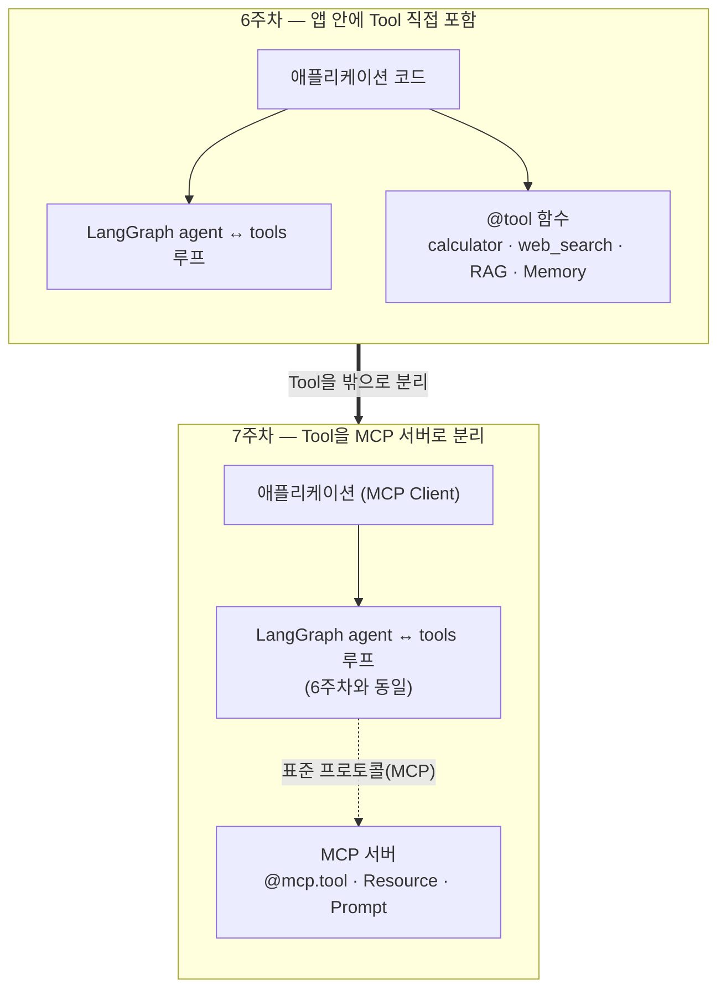
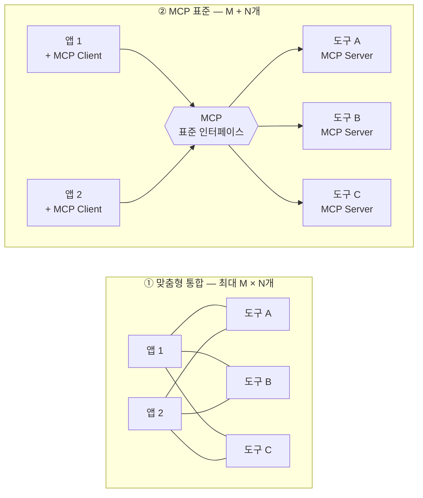
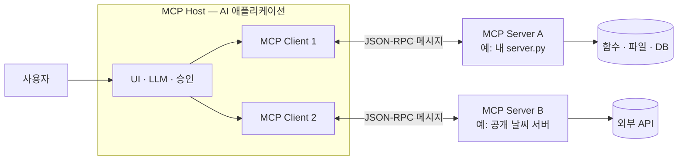
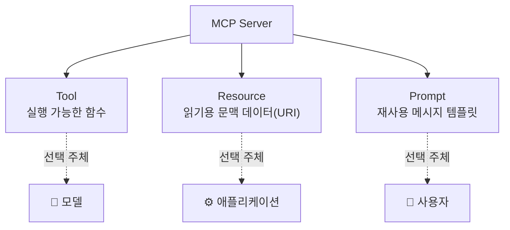
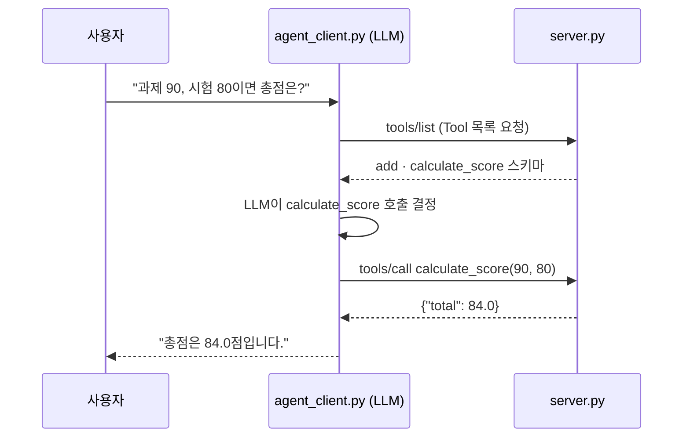
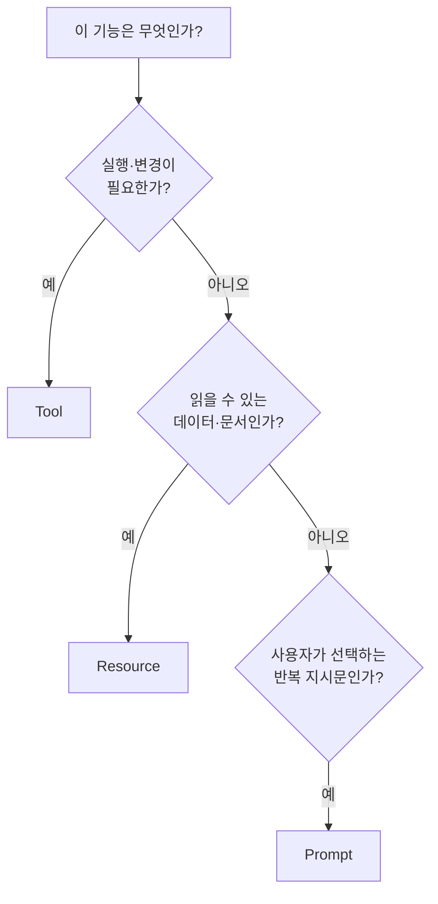

# AI MASTER 7주차 1일차 강의교재 — 8월 18일

## MCP: 내 도구를 표준 서버로

> **오늘의 목표 (한 문장)**
> 내 함수를 **MCP 서버**로 올리고(세션 2) → **에이전트가 스스로 골라 쓰게** 하고(세션 3) →
> 6주차의 진짜 도구와 **공개 MCP(논문·유튜브)**로 확장한 뒤(세션 4) → **Gradio 채팅 UI**로 감쌉니다(세션 5).

오늘 수업은 직전 세션에 **딱 한 가지씩만** 새로 얹는 방식으로 진행합니다.

| 세션 | 새로 얹는 것 | 산출물 |
|---|---|---|
| 세션 1 (40분) | MCP 개념 — 그림 3개로 끝 | — |
| 세션 2 (50분) | 함수를 서버로 | `server.py` |
| 세션 3 (60분) | LLM이 Tool을 스스로 고른다 ★오늘의 핵심 | `agent_client.py` |
| 세션 4 (50분) | 진짜 도구로 교체 + 공개 MCP(arXiv·유튜브) 연결 | `server.py` 확장 |
| 세션 5 (40분) | 채팅창 붙이기 | `app.py` |

> **문서 기준 버전**: MCP 공식 규격 `2026-07-28`, **FastMCP**(`fastmcp` 패키지) 기준.
> LLM은 6주차와 동일한 `claude-sonnet-4-6`을 사용합니다.
> 공개 MCP 서버(날씨·주식·브라우저 등) 연결은 별도 문서 **`W7_참고_공개MCP카탈로그.md`**(선택 읽기 자료)에 있습니다.

---

## 준비물 체크

- [ ] `uv` 설치 확인: `uv --version`
- [ ] Python 3.11+: `python --version`
- [ ] 6주차 `.env`의 `ANTHROPIC_API_KEY` (그대로 재사용)
- [ ] 6주차 `.env`의 `TAVILY_API_KEY` (세션 4에서 사용)
- [ ] 8000번 포트가 비어 있는지 (다른 로컬 서버가 떠 있으면 종료)

> ⚠️ **`.env`는 절대 GitHub에 커밋하지 않습니다.** 프로젝트의 `.gitignore`에 `.env`를 추가하고,
> 저장소에는 키 이름만 적은 `.env.example`만 올립니다. 배포할 때는 플랫폼의 Secrets 기능을 씁니다.

오늘 만드는 프로젝트 — 6주차 `week6-agent`와 **별개의 새 프로젝트**입니다. 6주차 코드는 건드리지
않고, 그 안의 도구(함수)만 이쪽으로 옮겨 옵니다.

```text
mcp-demo/
├── pyproject.toml
├── uv.lock
├── .env              # API Key (커밋 금지)
├── server.py         # 세션 2·4 — Tool·Resource·Prompt를 제공하는 MCP 서버
├── agent_client.py   # 세션 3 — 에이전트가 MCP Tool을 스스로 골라 쓴다 ★
└── app.py            # 세션 5 — Gradio 채팅 UI
```

터미널은 **2개만** 사용합니다. 터미널 1 = 서버, 터미널 2 = 클라이언트/UI.

---

## 세션 1 — MCP 개념 (그림 3개면 충분합니다)

### 1-1. 왜 MCP인가 — 연결 코드의 폭발

6주차까지 만든 에이전트는 `web_search`, `calculator`, RAG, Memory를 **Python 코드 안에 직접**
연결했습니다. 한 프로젝트 안에서는 효율적이지만, 같은 기능을 Claude Desktop, Claude Code,
다른 에이전트, 웹 서비스에서 다시 쓰려면 각 앱마다 연결 코드를 새로 짜야 합니다.

7주차에는 그 도구들을 **MCP 서버가 제공하는 표준 기능**으로 분리합니다. 에이전트 루프
(`agent ↔ tools`)는 6주차와 똑같고, **Tool만 앱 밖의 표준 서버로 빠져나옵니다.**



앱 M개가 도구 N개를 각자 방식으로 연결하면 최대 `M × N`개의 맞춤 연결 코드가 필요합니다.
MCP는 양쪽이 표준 인터페이스를 한 번씩만 구현하게 해서 `M + N`개로 줄입니다.
(예: 앱 4개 × 도구 6개 = 연결 24개 → MCP 방식 4 + 6 = 10개)



> **핵심 문장**: MCP는 라이브러리가 아니라 **표준 인터페이스**입니다. 기기마다 다른 충전 단자를
> USB-C 하나로 통일한 것처럼, AI 앱과 도구 제공자가 서로 호환되도록 연결 규격을 통일한 것입니다.
> (Anthropic이 2024년 11월 공개한 개방형 프로토콜)

### 1-2. 구조 — Host · Client · Server

| 구성요소 | 역할 | 예 |
|---|---|---|
| **MCP Host** | 사용자가 쓰는 AI 앱. 모델·UI·승인·여러 연결을 관리 | Claude Desktop, Claude Code, 내 에이전트 앱 |
| **MCP Client** | Host 안에서 **서버 하나**와 통신하는 연결 부품 | 오늘 `agent_client.py` 안의 연결 객체 |
| **MCP Server** | Tool·Resource·Prompt를 표준 방식으로 제공 | 오늘 만드는 `server.py`, 공개 날씨 서버 |

Host 하나가 서버 3개에 연결하면 Client도 3개 생깁니다(Client 하나 = Server 하나 전담).



### 1-3. 서버가 제공하는 세 가지 — Tool · Resource · Prompt

**누가 선택하는가**로 구분하면 기억하기 쉽습니다.

| Primitive | 의미 | 선택 주체 |
|---|---|---|
| **Tool** | 실행 가능한 함수 (계산·검색·API 호출) | 🤖 모델이 고른다 |
| **Resource** | URI로 읽는 문맥 데이터 (강의계획서 원문 등) | ⚙️ 애플리케이션이 고른다 |
| **Prompt** | 재사용 메시지 템플릿 (슬래시 명령처럼) | 🙋 사용자가 고른다 |



### 1-4. 통신은 두 줄만 기억

1. **무엇을 말하는가** — 모든 요청·응답은 JSON-RPC라는 표준 메시지 형식입니다. SDK가 알아서
   처리하므로 오늘 실습에서 직접 다룰 일은 없습니다.
2. **어떻게 운반하는가** — 로컬 프로세스는 `stdio`, 원격/로컬 서버는 **Streamable HTTP**.
   오늘은 HTTP를 사용하며 주소는 `http://localhost:8000/mcp`입니다.

**[체크포인트]**
- [ ] MCP가 해결하는 문제를 "M × N → M + N"으로 설명할 수 있나요?
- [ ] Tool·Resource·Prompt를 "누가 선택하는가"로 구분할 수 있나요?

---

## 세션 2 — 실습 A: 첫 MCP 서버 `server.py`

이번 세션의 한 가지: **파이썬 함수에 `@mcp.tool()`을 붙이면 표준 서버가 됩니다.**

### A-1. 프로젝트 생성

```bash
uv init mcp-demo
cd mcp-demo
uv add fastmcp
```

확인:

```bash
uv run fastmcp version
```

### A-2. `server.py` 작성

```python
# server.py
from fastmcp import FastMCP

mcp = FastMCP(
    "AI MASTER Demo",
    instructions=(
        "AI MASTER 강의 실습용 서버입니다. "
        "계산 Tool, 강의정보 Resource, 피드백 Prompt를 제공합니다."
    ),
)


@mcp.tool()
def add(a: int, b: int) -> int:
    """두 정수를 더해야 할 때 사용한다."""
    return a + b


@mcp.tool()
def calculate_score(assignment: float, exam: float) -> dict[str, float]:
    """과제 40%, 시험 60% 비율로 총점을 계산한다."""
    total = assignment * 0.4 + exam * 0.6
    return {
        "assignment": assignment,
        "exam": exam,
        "total": round(total, 2),
    }


@mcp.resource("course://{course_id}")
def course_info(course_id: str) -> str:
    """과정 ID에 해당하는 강의 정보를 제공한다."""
    courses = {
        "AI-MASTER": (
            "과정명: AI MASTER\n"
            "주제: MCP 서버와 클라이언트\n"
            "핵심 산출물: server.py, agent_client.py"
        ),
        "WEEK-7": (
            "주차: 7주차\n"
            "목표: 기존 Agent 기능을 MCP 방식으로 분리·재사용"
        ),
    }
    return courses.get(course_id, f"등록되지 않은 과정 ID: {course_id}")


@mcp.prompt()
def feedback_prompt(student_name: str, topic: str = "MCP") -> str:
    """학생별 학습 피드백 작성을 시작하는 Prompt 템플릿이다."""
    return (
        f"{student_name} 학생에게 {topic} 학습 피드백을 작성하라. "
        "잘한 점 1개, 개선할 점 1개, 다음 실습 1개를 포함하라."
    )


if __name__ == "__main__":
    # localhost:8000에서 Streamable HTTP MCP 서버를 실행한다.
    # 기본 MCP endpoint는 /mcp이므로 전체 URL은 http://localhost:8000/mcp 이다.
    mcp.run(
        transport="http",
        host="127.0.0.1",
        port=8000,
    )
```

### A-3. 코드 해설 — 외울 것은 3개뿐

| 코드 | 의미 |
|---|---|
| `@mcp.tool()` | 파이썬 함수를 Tool로 공개. **타입 힌트**가 입력 스키마가 되고, **docstring**이 "언제 쓰는 도구인지" 모델에게 알려주는 설명이 된다 |
| `@mcp.resource("course://{course_id}")` | URI로 읽는 Resource 등록 |
| `@mcp.prompt()` | 인자를 받는 Prompt 템플릿 등록 |

> 💡 **docstring이 곧 Tool 선택 기준**입니다. 6주차 `@tool`과 똑같이, "무엇을 하는가"뿐 아니라
> "언제 쓰는가"가 드러나게 쓰세요.

### A-4. 서버 실행 (터미널 1)

```bash
uv run python server.py
```

서버는 `http://localhost:8000/mcp`에서 요청을 기다립니다. **이 터미널은 실습 내내 켜 둡니다.**
이 주소는 웹 페이지가 아니라 MCP 통신 endpoint이므로 브라우저로 열어 확인하지 않습니다.
서버가 잘 떴는지는 다음 세션의 `agent_client.py`로 확인합니다.

**[체크포인트]**
- [ ] `uv run fastmcp version`이 버전을 출력하나요?
- [ ] 서버가 종료되지 않고 8000번 포트에서 계속 실행 중인가요?

**[도전 과제]**
1. `multiply(a, b)` Tool을 하나 추가해 보세요. 데코레이터+타입힌트+docstring 3요소만 있으면 됩니다.
2. `course_info`에 본인 과목을 추가해 보세요.

---

## 세션 3 — 실습 B: 에이전트 연결 `agent_client.py` ★오늘의 핵심

이번 세션의 한 가지: **LLM이 서버의 Tool 목록을 자동으로 발견하고, 스스로 골라 호출합니다.**

### B-1. 무엇이 일어나는가



- 흐름은 6주차 2일차 `agent_graph.py`의 `agent ↔ tools` 루프와 **동일**합니다.
- 새로 배우는 것은 단 하나 — Tool을 코드에 직접 쓰지 않고 **서버에서 자동으로 받아온다**
  (`get_tools()`)는 점입니다.

```text
[터미널 1] server.py  →  MCP Server (http://localhost:8000/mcp)
                              ▲
                              │ Streamable HTTP + JSON-RPC
                              ▼
[터미널 2] agent_client.py
   MultiServerMCPClient.get_tools() → LLM.bind_tools() → agent ↔ tools 루프
```

### B-2. (참고) 6주차 동기 코드 → 7주차 비동기 코드

이 세션부터 `async`/`await`가 등장하지만, 6주차 동기 호출과 1:1로 대응됩니다.

| 6주차 (동기) | 7주차 (비동기) |
|---|---|
| `def main():` | `async def main():` |
| `result = model.invoke(...)` | `result = await client.get_tools()` |
| `main()` | `asyncio.run(main())` |

규칙은 둘뿐입니다. **① `async def` 안에서만 `await`를 쓴다. ② 최상위 실행은
`asyncio.run(main())`.** MCP 통신은 네트워크 I/O라서 비동기로 처리합니다.

### B-3. 설치

```bash
uv add langgraph langchain-mcp-adapters langchain-anthropic langchain-core python-dotenv
```

```dotenv
# .env  (6주차 것을 복사해 오면 됩니다 — 커밋 금지)
ANTHROPIC_API_KEY=sk-ant-...
```

### B-4. `agent_client.py` 작성

```python
# agent_client.py
import asyncio

from dotenv import load_dotenv
from langchain_anthropic import ChatAnthropic
from langchain_core.messages import HumanMessage, SystemMessage
from langchain_mcp_adapters.client import MultiServerMCPClient
from langgraph.graph import MessagesState, START, StateGraph
from langgraph.prebuilt import ToolNode, tools_condition

load_dotenv()  # .env의 ANTHROPIC_API_KEY를 읽는다

SERVER_URL = "http://localhost:8000/mcp"

SYSTEM_PROMPT = (
    "너는 MCP 서버가 제공하는 Tool을 사용하는 조교다. "
    "계산이 필요하면 반드시 등록된 Tool을 호출하고 직접 암산하지 마라."
)


async def main() -> None:
    # 1) 로컬 MCP 서버(server.py)에 접속해 Tool을 자동으로 불러온다.
    #    HTTP(Streamable HTTP) 전송의 transport 값은 "streamable_http"이다.
    client = MultiServerMCPClient(
        {"ai_master": {"url": SERVER_URL, "transport": "streamable_http"}}
    )
    tools = await client.get_tools()
    print("불러온 MCP Tool:", [t.name for t in tools])

    # 2) 클라우드 LLM에 Tool을 바인딩한다. 6주차와 같은 claude-sonnet-4-6을 사용한다.
    model = ChatAnthropic(model="claude-sonnet-4-6", temperature=0, max_tokens=1024)
    model_with_tools = model.bind_tools(tools)

    async def call_model(state: MessagesState) -> dict:
        response = await model_with_tools.ainvoke(
            [SystemMessage(content=SYSTEM_PROMPT), *state["messages"]]
        )
        return {"messages": [response]}

    # 3) agent ↔ tools 루프를 가진 최소 그래프를 만든다. (6주차 2일차와 동일한 패턴)
    builder = StateGraph(MessagesState)
    builder.add_node("agent", call_model)
    builder.add_node("tools", ToolNode(tools))
    builder.add_edge(START, "agent")
    builder.add_conditional_edges("agent", tools_condition)
    builder.add_edge("tools", "agent")
    graph = builder.compile()

    # 4) 자연어로 질문하면 LLM이 어떤 MCP Tool을 쓸지 스스로 판단한다.
    result = await graph.ainvoke(
        {"messages": [HumanMessage(content="과제 점수 90, 시험 점수 80이면 총점이 얼마야?")]}
    )
    print("최종 답변:", result["messages"][-1].content)


if __name__ == "__main__":
    asyncio.run(main())
```

### B-5. 실행 (터미널 2)

서버(터미널 1)를 켜 둔 상태에서:

```bash
uv run python agent_client.py
```

예상 흐름:

```text
불러온 MCP Tool: ['add', 'calculate_score']
agent → calculate_score Tool 호출(assignment=90, exam=80) → agent → 최종 답변
최종 답변: 총점은 84.0점입니다. ...
```

핵심은 `agent_client.py`가 `calculate_score()` 함수를 **import하지 않는다**는 것입니다.
LLM이 자연어 질문을 보고 어떤 Tool을 쓸지 정하면, 실제 함수 실행은 `server.py` 프로세스에서
일어납니다. `SERVER_URL`만 공개 MCP 서버 주소로 바꾸면 같은 코드가 그대로 확장됩니다
(→ `W7_참고_공개MCP카탈로그.md`).

**[체크포인트]**
- [ ] "불러온 MCP Tool" 목록에 `add`, `calculate_score`가 보이나요?
- [ ] 질문을 "3 더하기 5는?"으로 바꾸면 `add`가 선택되나요?
- [ ] Tool이 필요 없는 질문("안녕?")에는 Tool 호출 없이 바로 답하나요?

**[도전 과제]**
1. 세션 2 도전 과제에서 추가한 `multiply` Tool을 서버 재시작 후 에이전트가 골라 쓰는지 확인해 보세요.
2. `print`로 `result["messages"]` 전체를 출력해, `AIMessage(tool_calls=...)` → `ToolMessage` →
   최종 `AIMessage` 순서를 눈으로 확인해 보세요.

---

## 세션 4 — 실습 C: 도구 확장 — 6주차 도구 이사 + 공개 MCP 연결

이번 세션의 한 가지: **에이전트의 도구를 늘리는 두 방향.**
① 내 함수를 서버에 올린다 — `@tool`을 `@mcp.tool()`로 바꾸면 끝(C-1~C-3).
② 남이 만든 공개 서버를 가져다 쓴다(C-4).

세션 2의 `add`·`calculate_score`는 개념을 보여주는 장난감이었습니다. 이제 6주차 2일차에서 만든
**진짜 도구** — Tavily `web_search` — 를 서버에 올립니다. 함수 본문은 6주차 `agent_graph.py`와
**한 글자도 다르지 않고**, 데코레이터 한 줄만 바뀝니다.

| 6주차 (앱 내부 Tool) | 7주차 (MCP Tool) |
|---|---|
| `@tool` | `@mcp.tool()` |
| 함수 본문 | **동일** |
| 이 앱에서만 사용 | 어떤 MCP Host·에이전트에서도 재사용 |

### C-1. 설치와 API Key

```bash
uv add tavily-python
```

```dotenv
# .env에 추가 (6주차 것 재사용 — 커밋 금지)
TAVILY_API_KEY=tvly-...
```

### C-2. `server.py`에 `web_search` 추가

상단 import 아래에 Tavily 클라이언트를 준비하고:

```python
# server.py — 상단에 추가
import os

from dotenv import load_dotenv
from tavily import TavilyClient

load_dotenv()
tavily = TavilyClient(api_key=os.environ["TAVILY_API_KEY"])
```

기존 Tool들 아래에 6주차 함수를 그대로 붙입니다:

```python
# server.py — 기존 Tool 아래에 추가 (본문은 6주차 agent_graph.py와 동일)
@mcp.tool()
def web_search(query: str) -> str:
    """최신 정보나 강의자료에 없는 내용을 실시간으로 웹에서 검색한다."""
    results = tavily.search(query, max_results=3)["results"]
    return "\n".join(f"- {r['title']}: {r['content'][:200]}" for r in results)
```

### C-3. 재시작하고 에이전트로 확인

터미널 1에서 `Ctrl+C`로 서버를 끄고 다시 켭니다:

```bash
uv run python server.py
```

터미널 2에서 `agent_client.py`의 질문만 바꿔 실행합니다:

```python
    result = await graph.ainvoke(
        {"messages": [HumanMessage(content="2026년 생성형 AI 교육 활용 사례를 검색해서 3줄로 요약해줘.")]}
    )
```

예상 흐름:

```text
불러온 MCP Tool: ['add', 'calculate_score', 'web_search']
agent → web_search Tool 호출 → agent → 최종 답변 (검색 기반 요약)
```

**클라이언트 코드는 한 줄도 바꾸지 않았는데** 새 Tool이 자동 발견되어 사용됩니다. 이것이
"Tool 개발을 쉽게 한다"의 실체입니다 — 서버에 함수를 붙이기만 하면 모든 클라이언트가 씁니다.

### C-4. 공개 MCP 연결 — 논문 검색(arXiv) · 유튜브 자막

C-2가 "내 함수를 서버로 올리기"였다면, 이번엔 반대 방향입니다 — **이미 공개된 MCP 서버를
내 에이전트에 연결**합니다. 두 서버 모두 **API Key가 필요 없고**, `uvx`가 실행하므로
**Node.js도 필요 없습니다.**

새로 알아야 할 것은 전송 방식 하나뿐입니다. 지금까지 쓴 HTTP(`url`)와 달리, 이 공개 서버들은
**`stdio`** — 클라이언트가 서버를 하위 프로세스로 직접 실행하는 방식 — 로 연결합니다.
**터미널을 더 열 필요가 없습니다.** `agent_client.py`의 연결 딕셔너리에 두 항목만 추가합니다.

```python
    client = MultiServerMCPClient(
        {
            "ai_master": {"url": SERVER_URL, "transport": "streamable_http"},
            # 공개 MCP — uvx가 내려받아 하위 프로세스로 실행 (Node·API Key 불필요)
            "arxiv": {"transport": "stdio", "command": "uvx", "args": ["arxiv-mcp-server"]},
            "youtube": {
                "transport": "stdio",
                "command": "uvx",
                "args": ["--with", "mcp<2", "mcp-youtube-transcript"],
            },
        }
    )
```

> - **첫 실행은 느립니다** — `uvx`가 패키지를 내려받는 시간입니다(이후엔 캐시로 빨라짐).
>   수업 전에 미리 한 번 실행해 두면 좋습니다.
> - YouTube 서버의 `--with "mcp<2"`는 **버전 핀**입니다. 이 서버는 최신 `mcp` SDK와 어긋나
>   `ImportError`로 죽는데, 구버전 SDK를 함께 설치해 해결한 것입니다. 공개 서버 생태계의
>   버전 취약성을 눈으로 보는 좋은 사례입니다(트러블슈팅 참고).

질문을 바꿔 실행해 봅니다.

```python
    result = await graph.ainvoke(
        {"messages": [HumanMessage(content=(
            "retrieval augmented generation 관련 최신 논문 2편을 arXiv에서 검색해서 "
            "제목과 한 줄 요약을 알려줘."))]}
    )
```

```python
    result = await graph.ainvoke(
        {"messages": [HumanMessage(content=(
            "https://www.youtube.com/watch?v=영상ID 영상의 자막을 가져와서 "
            "핵심을 3줄로 정리해줘."))]}
    )
```

예상 흐름:

```text
불러온 MCP Tool: ['add', 'calculate_score', 'web_search',
                 'search_papers', 'get_abstract', ..., 'get_transcript']
논문 질문 → search_papers 선택 / 유튜브 질문 → get_transcript 선택
```

Tool이 갑자기 많아졌습니다 — arXiv 서버 하나가 14개를 공개합니다. Tool이 많으면 선택이
흔들릴 수 있으므로, `SYSTEM_PROMPT`에 선택 기준을 한 줄씩 넣어 두면 좋습니다.

```python
SYSTEM_PROMPT = (
    "너는 MCP 서버가 제공하는 Tool을 사용하는 조교다. "
    "계산은 calculate_score·add, 웹 검색은 web_search, "
    "논문 검색은 arXiv Tool(search_papers 등), 유튜브 자막은 get_transcript를 사용하라. "
    "Tool 결과가 없으면 추측하지 말고 없다고 말하라."
)
```

**[체크포인트]**
- [ ] Tool 목록에 `web_search`가 추가되었나요? (클라이언트 수정 없이)
- [ ] 검색 질문에는 `web_search`, 점수 질문에는 `calculate_score`가 각각 선택되나요?
- [ ] 공개 MCP 연결 후 `search_papers`·`get_transcript`가 목록에 보이나요?
- [ ] 논문 질문 → arXiv Tool, 유튜브 질문 → `get_transcript`가 각각 선택되나요?

**[도전 과제]**
1. **RAG 이사**: 6주차의 Chroma `document_search`도 같은 방식으로 올려 보세요.
   ```python
   @mcp.tool()
   def document_search(query: str, top_k: int = 3) -> str:
       """업로드한 강의자료(RAG)에서 질문과 관련된 문단을 찾는다."""
       ...  # 6주차 RAG 실습의 collection.query(...) 본문을 그대로
   ```
2. **메모리 이사**: 6주차 1일차의 mem0도 `remember(text)` / `recall(query)` 두 Tool로 올려 보세요.
   (mem0 설정은 6주차 것을 그대로: 모델 `claude-sonnet-4-6`)
3. **심화 — 서버 분리**: 도구가 많아지면 도메인별로 서버를 나눕니다(예: 검색·RAG용
   `tools_server.py`를 8001 포트에). 클라이언트에서는 연결 딕셔너리에 항목 하나만 추가하면 됩니다.
4. **카탈로그 확장**: `W7_참고_공개MCP카탈로그.md`의 DuckDuckGo(키 없는 웹 검색)·Wikipedia도
   C-4와 같은 방식으로 추가해 보세요.

> **배포 주의(도전 과제 1을 한 경우)**: `chromadb.PersistentClient(path="./chroma_db")`는 로컬
> 폴더에 인덱스를 저장하는데, 무료 호스팅(HF Spaces 등)은 재시작 때 디스크가 초기화됩니다.
> 미리 만든 `chroma_db` 폴더를 저장소에 함께 커밋(읽기 전용)하거나 호스팅형 벡터 DB를 쓰세요.

---

## 세션 5 — 실습 D: Gradio 챗 UI `app.py`

이번 세션의 한 가지: **터미널 출력 대신 웹 채팅창.** 그래프는 세션 3 것을 그대로 재사용합니다.

### D-1. 설치

```bash
uv add gradio
```

### D-2. `app.py` 작성

```python
# app.py — Gradio 최소 챗 UI. 세션 3의 에이전트 그래프를 그대로 재사용한다.
import gradio as gr
from dotenv import load_dotenv
from langchain_anthropic import ChatAnthropic
from langchain_core.messages import HumanMessage, SystemMessage
from langchain_mcp_adapters.client import MultiServerMCPClient
from langgraph.graph import MessagesState, START, StateGraph
from langgraph.prebuilt import ToolNode, tools_condition

load_dotenv()

SERVER_URL = "http://localhost:8000/mcp"
SYSTEM_PROMPT = "너는 MCP Tool을 쓰는 조교다. 계산·검색이 필요하면 반드시 Tool을 호출하라."


async def build_graph():  # 세션 3과 동일한 그래프
    client = MultiServerMCPClient(
        {"ai_master": {"url": SERVER_URL, "transport": "streamable_http"}}
    )
    tools = await client.get_tools()
    model = ChatAnthropic(model="claude-sonnet-4-6", temperature=0, max_tokens=1024).bind_tools(tools)

    async def call_model(state: MessagesState) -> dict:
        res = await model.ainvoke([SystemMessage(content=SYSTEM_PROMPT), *state["messages"]])
        return {"messages": [res]}

    builder = StateGraph(MessagesState)
    builder.add_node("agent", call_model)
    builder.add_node("tools", ToolNode(tools))
    builder.add_edge(START, "agent")
    builder.add_conditional_edges("agent", tools_condition)
    builder.add_edge("tools", "agent")
    return builder.compile()


graph = None


async def chat(message, history):
    global graph
    if graph is None:  # 첫 요청에서 한 번만 그래프를 만든다.
        graph = await build_graph()
    result = await graph.ainvoke({"messages": [HumanMessage(content=message)]})
    return result["messages"][-1].content


gr.ChatInterface(chat, title="내 MCP 에이전트", type="messages").launch()
```

### D-3. 실행 (터미널 2, 서버는 켜 둔 상태)

```bash
uv run python app.py
```

브라우저에서 `http://127.0.0.1:7860`이 열립니다. 채팅창에 "과제 90 시험 80이면 총점은?",
"생성형 AI 최신 사례 검색해줘"를 입력해 보세요.

핵심은 **UI 코드가 에이전트 로직을 전혀 모른다**는 점입니다. `chat()` 함수는 그래프에 메시지를
넣고 마지막 답변만 꺼낼 뿐입니다. UI·에이전트·도구(서버)가 세 층으로 분리된 구조가 완성되었습니다.

**[체크포인트]**
- [ ] 채팅창에서 점수 질문 → `calculate_score`, 검색 질문 → `web_search`가 동작하나요?
- [ ] 서버 터미널 로그에 Tool 호출이 찍히는 것을 확인했나요?

**[도전 과제]**
1. `SYSTEM_PROMPT`를 본인 과목 조교 성격으로 바꿔 보세요.
2. **배포**: 이 `app.py`를 Hugging Face Spaces(Gradio SDK)에 올리면 웹 챗봇이 됩니다.
   `.env`는 커밋하지 말고 Spaces의 **Secrets**에 키를 등록하세요. 단, MCP 서버도 같은 공간에서
   함께 실행되도록 구성해야 합니다(예: `app.py` 시작 시 하위 프로세스로 기동).
3. C-4의 공개 MCP(arXiv·YouTube)를 `app.py`의 연결 딕셔너리에도 추가해, 채팅창에서 논문
   검색과 영상 요약을 해보세요.

---

## 오늘의 산출물 체크

- [ ] `server.py` — Tool 3개(`add`·`calculate_score`·`web_search`) + Resource 1개 + Prompt 1개
- [ ] `agent_client.py` — Tool 목록 자동 발견 + 에이전트가 Tool을 골라 쓴 실행 로그
- [ ] `agent_client.py` — 공개 MCP(arXiv·YouTube 자막) 연결 후 Tool 선택 로그
- [ ] `app.py` — Gradio 채팅 화면에서 대화한 캡처
- [ ] 아래 템플릿으로 `W7_D1_이름.md` 작성

## 제출용 Markdown 템플릿

```markdown
# AI MASTER 7주차 1일차 — [이름 / 학과]

## 1. 내 MCP 서버 (server.py)
- 공개한 Tool (이름과 한 줄 설명):
- 공개한 Resource / Prompt:

## 2. 에이전트 실행 결과 (agent_client.py)
- "불러온 MCP Tool" 출력:
- 질문 → 선택된 Tool → 최종 답변 (2가지 이상):

## 3. Gradio (app.py)
- 실행 화면 캡처 또는 대화 내용:

## 4. 다음 주 프로젝트 계획
- MCP로 올리고 싶은 내 도구와 primitive(Tool/Resource/Prompt):
```

---

## 다음 시간 준비 — 내 프로젝트 MCP 설계표

7주 2일차에는 오늘 구조를 바이브 코딩(Claude Code)으로 확장합니다. 본인 프로젝트의 기능을
어떤 primitive로 올릴지 미리 정해 오세요.



6주차 기능의 매핑 예시:

| 6주차 기능 | MCP 설계 | 이유 |
|---|---|---|
| `calculator` · Tavily `web_search` | Tool | 실행이 필요한 행동 |
| RAG retriever | Tool (동적 검색) 또는 Resource (고정 문서 URI) | 질의 방식에 따라 |
| mem0 검색·추가 | Tool | 조건 검색·상태 변경 |
| 강의계획서 원문 | Resource | 읽기 전용 문맥 |
| 과제 피드백 템플릿 | Prompt | 사용자가 반복 선택 |
| Supervisor·Evaluator | Host 내부 로직 | 서버가 아니라 앱의 오케스트레이션 |

**내 설계표** (2일차에 가져올 것):

| 기능명 | Primitive | 입력 | 출력 | 권한·위험 |
|---|---|---|---|---|
| 예: 강의자료 검색 | Tool | 질의, top_k | 검색 문단 | 읽기 |
|  |  |  |  |  |
|  |  |  |  |  |

---

## 자주 막히는 지점 (트러블슈팅)

- **`Connection refused` / `All connection attempts failed`** → 터미널 1에서 서버가 먼저,
  계속 실행 중인지 확인. URL 끝의 `/mcp`를 빠뜨리지 않았는지, 포트가 서로 같은지 확인.
  `localhost` 해석 문제가 의심되면 `http://127.0.0.1:8000/mcp`로 바꿔 보세요.
- **`Address already in use` (8000번 충돌)** → `server.py`의 `port=8001`로 바꾸고,
  `agent_client.py`·`app.py`의 `SERVER_URL`도 **함께** 8001로 바꿉니다.
- **새 Tool이 안 보여요** → 서버 코드를 고쳤으면 서버를 재시작해야 합니다(`Ctrl+C` 후 재실행).
- **공개 MCP가 `ImportError`로 죽어요** → 서버 패키지와 `mcp` SDK 버전이 어긋난 것입니다.
  YouTube 서버처럼 `uvx --with "mcp<2" 패키지명` 핀으로 해결되는 경우가 많습니다.
  안 되면 그 서버만 빼세요 — 나머지 실습에는 지장 없습니다.
- **공개 MCP 첫 연결이 오래 걸려요** → `uvx`가 패키지를 내려받는 시간입니다. 수업 전에 한 번
  실행해 캐시를 만들어 두면 빨라집니다.
- **에이전트가 Tool을 안 써요** → Tool docstring에 "언제 쓰는지"가 드러나는지 확인.
  "검색한다"보다 "최신 정보나 강의자료에 없는 내용을 검색한다"처럼 씁니다.
- **`KeyError: 'ANTHROPIC_API_KEY'` / `TAVILY_API_KEY`** → `.env` 파일이 프로젝트 폴더에 있고
  `load_dotenv()`가 호출되는지 확인.
- **모델을 최신 모델로 바꿨더니 400 오류** → `claude-opus-5`·`claude-sonnet-5`는 `temperature`
  인자를 받지 않습니다. 교체 시 `temperature=0` 줄을 삭제하세요. (`claude-sonnet-4-6`은 그대로 OK)

### 최소 보안 체크

- [ ] `.env`·API Key·개인정보를 코드나 Resource로 노출하지 않는다 (`.gitignore`에 `.env`)
- [ ] 쓰기·삭제 Tool은 사용자 승인 후 실행한다
- [ ] 신뢰할 수 있는 서버·패키지만 설치한다
- [ ] Tool 결과에 프롬프트 인젝션이 섞일 수 있음을 가정한다

---

## 참고 자료

- **공개 MCP 서버 카탈로그(선택)**: `W7_참고_공개MCP카탈로그.md` — 날씨·주식·검색·브라우저 MCP를
  하나의 에이전트에 연결하는 확장 실습. 2일차 전에 읽어 두면 좋습니다.
- [Anthropic — Introducing the Model Context Protocol](https://www.anthropic.com/news/model-context-protocol)
- [MCP Specification 2026-07-28](https://modelcontextprotocol.io/specification/2026-07-28)
- [FastMCP 공식 문서](https://gofastmcp.com/)
- [LangChain MCP 문서](https://docs.langchain.com/oss/python/langchain/mcp)
