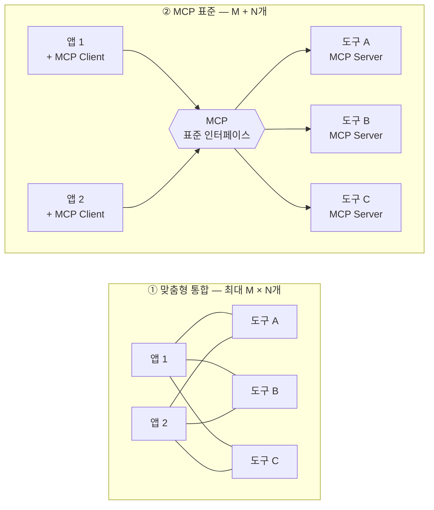
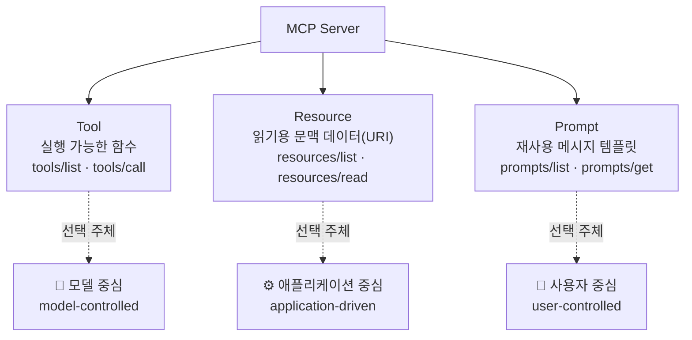
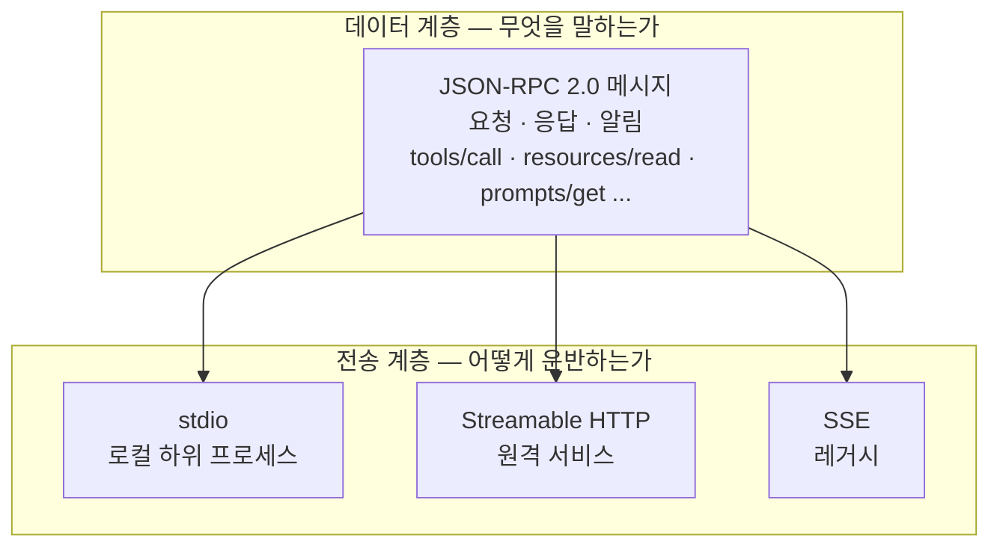
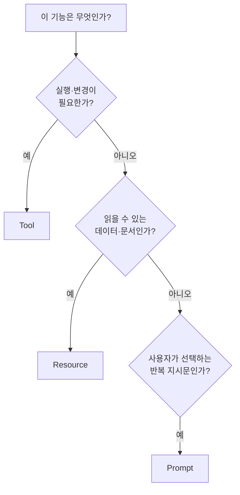
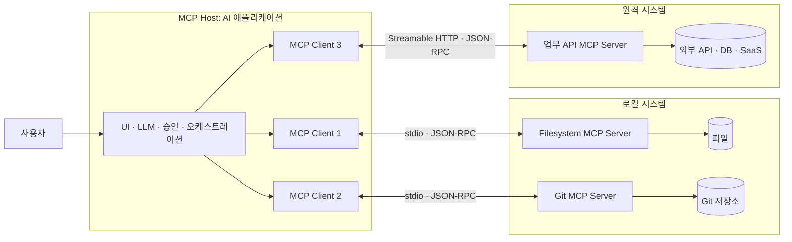
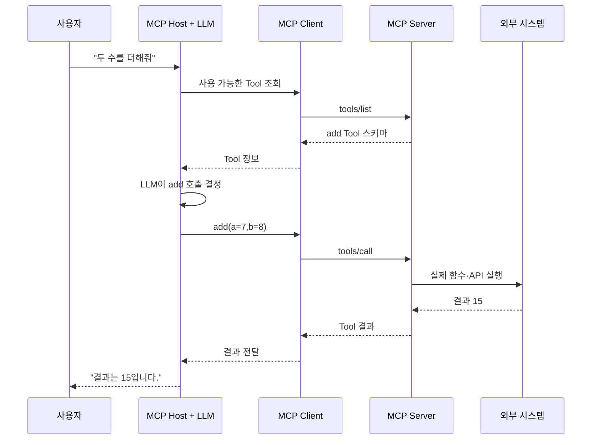
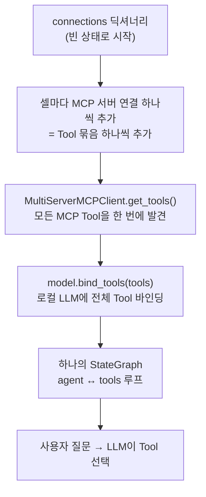

# AI MASTER 7주차 1일차 강의교재 — 8월 18일

## MCP 이론과 MCP 서버·클라이언트 구현

> **오늘의 최종 결과물**  
> Python MCP 서버에서 **Tool·Resource·Prompt**를 공개하고, 별도의 MCP 클라이언트가
> 서버를 실행하여 기능 목록을 조회한 뒤 Tool 호출·Resource 읽기·Prompt 가져오기를 수행한다.

> **문서 기준 버전**  
> 본 교재는 MCP 공식 규격 `2026-07-28`과 **FastMCP**(`fastmcp` 패키지)를 기준으로 작성하였다.
> MCP는 빠르게 개정되는 표준이므로 실제 실습 전 `uv run fastmcp version`과 공식 문서를 확인한다.

---

# 제1장. 학습 목표와 수업 운영

## 1.1 6주차에서 7주차로의 전환

6주차까지 만든 에이전트는 Python 코드 안에서 `calculator`, `web_search`, RAG,
Memory, LangGraph 등을 직접 연결한 구조였다. 이 방식은 한 프로젝트 안에서는
효율적이지만, 같은 기능을 Claude Desktop, Claude Code, VS Code, 다른 에이전트,
웹 서비스에서 재사용하려면 각 애플리케이션에 맞춘 연결 코드를 다시 작성해야 한다.

7주차에는 기존 기능을 **MCP 서버가 제공하는 표준 기능**으로 전환한다.

```text
6주차: 애플리케이션 코드 안에 Tool을 직접 포함
7주차: Tool·Resource·Prompt를 MCP 서버로 분리하고 MCP 클라이언트에서 재사용
```

## 1.2 학습 목표

수업을 마치면 다음을 수행할 수 있어야 한다.

1. MCP가 필요한 이유와 해결하는 통합 문제를 설명한다.
2. MCP Host, MCP Client, MCP Server의 역할과 경계를 구분한다.
3. Tool, Resource, Prompt를 누가 선택하고 어떤 메서드로 호출하는지 설명한다.
4. JSON-RPC 2.0 기반 데이터 계층과 `stdio`, Streamable HTTP 전송 계층을 구분한다.
5. Python MCP 서버를 작성하고 MCP Inspector에서 검증한다.
6. Python MCP 클라이언트로 서버를 실행하고 Tool·Resource·Prompt를 호출한다.
7. 6주차의 Tool·RAG·Memory 기능을 MCP primitive로 재설계한다.


## 1.3 오늘 만드는 프로젝트

```text
mcp-demo/
├── pyproject.toml
├── uv.lock
├── server.py       # Tool·Resource·Prompt를 제공하는 MCP 서버
└── client.py       # localhost의 MCP 서버에 HTTP로 접속해 기능을 호출하는 클라이언트
```

---

# 제2장. MCP란 무엇인가

## 2.1 MCP의 정의

**MCP(Model Context Protocol)**는 AI 애플리케이션과 외부 데이터·도구·업무 시스템
사이의 연결 방법을 표준화한 개방형 프로토콜이다. Anthropic은 2024년 11월 MCP를
공개하면서, 데이터 소스를 MCP 서버로 공개하거나 AI 애플리케이션을 MCP 클라이언트로
구현하여 양쪽을 표준 방식으로 연결할 수 있다고 설명했다.

MCP는 모델 자체나 에이전트 프레임워크가 아니다. 다음 항목을 규정하는 **통신 계약**이다.

- 서버가 어떤 Tool·Resource·Prompt를 제공하는지 발견하는 방법
- Tool 입력값과 결과를 표현하는 방법
- Resource를 URI로 식별하고 읽는 방법
- Prompt 템플릿을 조회하고 인자를 전달하는 방법
- 로컬 프로세스와 원격 서버 사이에서 메시지를 운반하는 방법
- 버전, 기능, 오류, 취소, 알림을 처리하는 방법

> **핵심 문장**  
> MCP는 “LLM이 외부 기능을 사용하게 만드는 라이브러리”가 아니라,
> “AI 애플리케이션과 기능 제공자가 서로 호환되도록 만드는 표준 인터페이스”이다.

## 2.2 MCP의 필요성

### 2.2.1 정보 고립 문제

LLM은 학습된 지식만으로는 다음 정보를 직접 알 수 없다.

- 사용자의 로컬 파일과 사내 문서
- 실시간 웹 정보와 업무 시스템 상태
- 데이터베이스의 최신 레코드
- Git 저장소, 이슈, 로그, 캘린더, 메일
- 조직 내부의 권한과 업무 규칙

따라서 실제 에이전트는 외부 시스템과 연결되어야 한다. 문제는 연결 대상과
애플리케이션이 증가할수록 맞춤형 통합 코드가 폭증한다는 점이다.

### 2.2.2 N×M 통합 문제

애플리케이션 수를 M, 외부 기능·데이터 소스 수를 N이라고 하자. 각 애플리케이션이 각 기능을
개별 방식으로 연결하면 최대 `M × N`개의 맞춤형 통합이 필요하다. MCP에서는 애플리케이션이 MCP
클라이언트를, 기능 제공자가 MCP 서버를 한 번씩만 구현하면 되므로 구현 단위가 `M + N`개로 줄어든다.

예를 들어 AI 애플리케이션 4개와 데이터·도구 6개를 연결한다면, 맞춤형 방식은 최대 4 × 6 = 24개가
필요하지만 MCP 방식은 4 + 6 = 10개면 된다.



MCP가 특히 유리한 조건은 애플리케이션과 기능이 모두 복수이고, 같은 기능을 여러
클라이언트에서 반복 사용해야 하는 경우이다.

### 2.2.3 벤더별 Function Calling 차이

각 LLM API의 Function Calling은 이름, 스키마, 결과 전달 방식, 승인 UI가 서로 다를 수
있다. Python 함수 하나를 특정 모델 SDK에 직접 결합하면 다른 모델이나 호스트로 이동할
때 어댑터를 다시 작성해야 한다.

MCP는 Function Calling을 없애지 않는다. 서버가 Tool 스키마를 표준 방식으로 공개하고,
클라이언트가 이를 모델별 Function Calling 형식으로 변환하도록 **책임을 분리**한다.

### 2.2.4 보안과 운영 경계

도구를 애플리케이션 내부에 모두 포함하면 권한, 비밀키, 파일 접근 범위, 로깅 책임이
섞이기 쉽다. MCP는 Host·Client·Server의 경계를 분리하여 다음을 명확하게 만든다.

- Host: 사용자 동의, 모델 연결, 여러 서버의 조정
- Client: 한 서버와의 프로토콜 통신
- Server: 제한된 도메인 기능과 데이터 제공
- 외부 시스템: 실제 파일, API, DB, Git 저장소

## 2.3 MCP의 해결책

MCP는 다음 네 가지 표준화로 통합 문제를 해결한다.

| 해결책 | 설명 | 효과 |
|---|---|---|
| Primitive 표준화 | Tool·Resource·Prompt의 구조와 호출 방법을 정의 | 기능 종류가 달라도 일관된 사용 방식 제공 |
| Discovery | 서버의 버전·기능·도구 목록을 클라이언트가 조회 | 하드코딩 없이 동적 연결 가능 |
| Schema | Tool 입력과 결과를 JSON Schema로 표현 | 자동 UI 생성, 모델 호출, 입력 검증 가능 |
| Transport 분리 | 동일한 의미의 메시지를 stdio 또는 HTTP로 운반 | 로컬 개발과 원격 배포를 같은 논리로 구현 |

## 2.4 MCP의 핵심 개념

### 2.4.1 Protocol, Framework, API의 차이

| 구분 | 의미 | MCP와의 관계 |
|---|---|---|
| Protocol | 서로 다른 프로그램이 통신하는 규칙 | MCP의 본질 |
| SDK | Protocol을 쉽게 구현하는 언어별 라이브러리 | Python, TypeScript, Java 등 |
| Framework | 에이전트 흐름과 실행 구조를 제공 | LangGraph, CrewAI 등과 함께 사용 가능 |
| API | 특정 서비스가 공개하는 기능 인터페이스 | MCP 서버가 API를 감싸서 Tool·Resource로 제공 가능 |

### 2.4.2 Host, Client, Server

- **MCP Host**: 사용자가 직접 사용하는 AI 애플리케이션. 모델, UI, 사용자 승인,
  여러 MCP 연결을 관리한다.
- **MCP Client**: Host 내부에서 특정 MCP 서버 하나와 통신하는 연결 구성요소다.
- **MCP Server**: Tool·Resource·Prompt를 표준 방식으로 제공하는 프로그램이다.

Host 하나가 서버 3개에 연결하면 일반적으로 MCP Client 인스턴스도 3개가 생성된다.
각 Client는 한 Server와 전용 관계를 가진다.

### 2.4.3 Primitive

서버가 제공하는 핵심 primitive는 다음 세 가지다.

| Primitive | 의미 | 선택 주체 | 대표 메서드 |
|---|---|---|---|
| Tool | 실행 가능한 함수 | 모델 중심(model-controlled) | `tools/list`, `tools/call` |
| Resource | 읽기 위한 문맥 데이터 | 애플리케이션 중심(application-driven) | `resources/list`, `resources/read` |
| Prompt | 재사용 가능한 메시지 템플릿 | 사용자 중심(user-controlled) | `prompts/list`, `prompts/get` |

세 primitive는 **누가 선택하는가**로 구분하면 기억하기 쉽다.



### 2.4.4 Discovery와 Capability

최신 MCP 규격에서 서버는 `server/discover`를 구현하며, 지원하는 규격 버전과
capability를 알린다. 클라이언트는 다음과 같은 질문에 답할 수 있다.

- 이 서버가 Tool을 제공하는가?
- Resource와 Prompt를 제공하는가?
- 목록 변경 알림을 지원하는가?
- 어떤 프로토콜 버전을 사용할 수 있는가?

### 2.4.5 Statelessness

`2026-07-28` 규격의 MCP는 요청 처리에 필요한 프로토콜 버전과 클라이언트 capability를
각 요청의 `_meta`에 포함하는 stateless 모델을 사용한다. 업무 상태가 여러 호출에 걸쳐
필요하다면 연결 자체에 암묵적으로 의존하지 말고, 서버가 명시적인 식별자(handle)를
반환하고 다음 호출에서 그 식별자를 인자로 받아야 한다.

예:

```text
tools/call create_basket → basket_id="bsk_123"
tools/call add_item(basket_id="bsk_123", sku="A100")
```

---

# 제3장. MCP의 핵심 구성 요소

## 3.1 Tool

Tool은 서버가 공개하는 실행 가능한 기능이다. 계산, 검색, 파일 수정, API 호출,
DB 질의, 메시지 전송처럼 **행동**이 필요한 작업을 표현한다.

Tool 정의에는 일반적으로 다음 정보가 포함된다.

| 필드 | 역할 |
|---|---|
| `name` | 서버 내부에서 Tool을 식별하는 고유 이름 |
| `title` | 사용자 UI에 보여줄 이름(선택) |
| `description` | 모델이 언제 Tool을 사용해야 하는지 판단하는 설명 |
| `inputSchema` | 인자의 이름·형식·필수 여부를 정의하는 JSON Schema |
| `outputSchema` | 구조화된 결과의 형식(선택) |
| annotations | 읽기 전용, 파괴적 작업, 멱등성 등의 동작 힌트 |

### Tool 호출 흐름

```text
1. Client → Server: tools/list
2. Server → Client: Tool 이름·설명·입력 스키마
3. Host → LLM: 사용 가능한 Tool 스키마 전달
4. LLM → Host: 특정 Tool과 인자 선택
5. Client → Server: tools/call
6. Server → Client: 실행 결과
7. Host → LLM: Tool 결과를 문맥으로 전달
8. LLM → 사용자: 최종 답변
```

### Tool 설계 원칙

- 이름은 기능이 드러나는 동사형으로 작성한다. 예: `search_courses`, `create_feedback`.
- description에는 “무엇을 하는가”뿐 아니라 “언제 호출하는가”를 포함한다.
- 한 Tool은 한 가지 명확한 책임을 갖게 한다.
- 쓰기·삭제·외부 전송 Tool은 사용자 승인을 거치게 한다.
- 실패를 일반 성공 문자열로 숨기지 말고 오류 상태와 설명을 분명히 반환한다.

## 3.2 MCP Client

MCP Client는 MCP Server와 실제 프로토콜 메시지를 교환하는 구성요소다.
Host와 Client는 같은 말이 아니다.

| 구분 | MCP Host | MCP Client |
|---|---|---|
| 사용자와 직접 상호작용 | 예 | 일반적으로 아니오 |
| LLM 호출 관리 | 예 | 보통 Host가 담당 |
| 여러 서버 조정 | 예 | 서버 하나와 연결 |
| MCP 요청 전송 | Client를 통해 수행 | 직접 수행 |
| 예 | Claude Desktop, Claude Code, IDE, 자체 Agent 앱 | Host 내부의 서버별 연결 객체 |

Client의 주요 책임은 다음과 같다.

1. 서버 실행 또는 원격 URL 연결
2. 규격 버전과 capability 확인
3. Tool·Resource·Prompt 목록 조회
4. Tool 호출, Resource 읽기, Prompt 렌더링
5. 오류·취소·타임아웃 처리
6. 연결 종료와 transport 자원 정리

FastMCP의 `Client`는 `async with` 블록이 연결 수명주기를 관리한다.
블록에 들어가면 서버와 연결하고, 블록을 나가면 HTTP 연결 또는 stdio 하위 프로세스 등
선택한 transport의 자원을 정리한다.

## 3.3 통신 규약

MCP 통신은 **데이터 계층**과 **전송 계층**으로 나누어 이해해야 한다. 같은 JSON-RPC 메시지가
어떤 전송 방식 위에서도 그대로 운반된다는 점이 핵심이다.



### 3.3.1 데이터 계층: JSON-RPC 2.0

MCP는 요청·응답·알림 메시지를 JSON-RPC 2.0 형식으로 표현한다.

```json
{
  "jsonrpc": "2.0",
  "id": 3,
  "method": "tools/call",
  "params": {
    "name": "add",
    "arguments": {"a": 10, "b": 20}
  }
}
```

- `jsonrpc`: 규격 버전 문자열
- `id`: 요청과 응답을 연결하는 식별자
- `method`: 수행할 프로토콜 메서드
- `params`: 메서드에 전달하는 인자
- `result`: 성공 응답
- `error`: 프로토콜 수준 오류 응답

### 3.3.2 전송 계층

| 전송 방식 | 작동 방식 | 적합한 용도 | 특징 |
|---|---|---|---|
| `stdio` | Client가 Server를 하위 프로세스로 실행하고 표준 입출력으로 통신 | 로컬 개발, 데스크톱, IDE | 설정이 단순하고 네트워크 포트 불필요 |
| Streamable HTTP | 하나의 MCP HTTP endpoint에 POST 요청 | 원격 서비스, 다중 사용자 배포 | 인증·프록시·확장·운영에 적합 |
| SSE | 과거 HTTP 전송 방식 | 레거시 호환 | 신규 구현에는 권장하지 않음 |

> **stdio 주의**  
> stdio 서버의 `stdout`은 JSON-RPC 통신선이다. 서버 코드에서 일반 `print()`로 로그를
> 출력하면 메시지를 손상시킬 수 있다. 로그는 `logging`을 사용하여 `stderr`로 보낸다.

## 3.4 Resource

Resource는 모델에게 제공할 **읽기 중심의 문맥 데이터**다. URI로 식별한다.

예:

```text
course://AI-MASTER/syllabus
file:///project/README.md
memory://knowledge-graph
```

Resource가 적합한 사례:

- 강의계획서, 규정, 매뉴얼 원문
- 데이터베이스 스키마
- 학생에게 공개 가능한 강의자료
- 현재 프로젝트 설정과 코드 문서
- 메모리 그래프와 조회 가능한 상태

Resource는 “함수를 실행한다”보다 “이 데이터를 읽는다”에 가깝다.

## 3.5 Prompt

Prompt는 서버가 제공하는 재사용 가능한 메시지 템플릿이다. 사용자가 메뉴,
슬래시 명령, 버튼 등으로 명시적으로 선택한다.

예:

```text
/grade_feedback student_name=홍길동 topic=MCP
/review_code language=python
/fetch url=https://example.com
```

Prompt는 Tool이 아니다. Prompt를 가져오면 서버가 실제 외부 작업을 실행하는 것이 아니라,
LLM에게 전달할 구조화된 메시지가 반환된다.

## 3.6 Primitive 선택 기준

다음 질문으로 구분한다.



| 기능 | 권장 primitive | 이유 |
|---|---|---|
| 최신 논문 검색 | Tool | 검색 API를 실행함 |
| 강의계획서 원문 | Resource | 읽기 위한 문맥 데이터 |
| 과제 피드백 작성 템플릿 | Prompt | 사용자가 선택하는 반복 지시 |
| 학생 선호를 DB에서 조건 검색 | Tool | 질의 조건에 따라 실행됨 |
| 특정 학생의 공개 프로필 URI | Resource | 안정적인 URI로 읽을 수 있음 |

---

# 제4장. MCP 아키텍처

## 4.1 Anthropic 공식 MCP 발표 이미지

아래 이미지는 Anthropic의 MCP 공개 발표 페이지에 게시된 공식 이미지다.


- 출처: [Anthropic — Introducing the Model Context Protocol](https://www.anthropic.com/news/model-context-protocol)
- 이미지 설명: 서로 다른 형태의 정보와 기능이 하나의 표준 연결을 통해 AI 시스템과 연결되는 개념을 시각화한다.

## 4.2 공식 구조를 반영한 MCP 아키텍처



## 4.3 클라이언트-서버 모델의 이해

### 4.3.1 1:1 연결과 1:N 구성

MCP Client 하나는 특정 MCP Server 하나와 통신한다. Host는 여러 Client를 생성하여
여러 Server를 동시에 사용할 수 있다.

```text
Host 1개
 ├─ Client A ↔ Filesystem Server
 ├─ Client B ↔ Git Server
 └─ Client C ↔ Database Server
```

이 구조의 장점은 서버 사이의 격리다. Filesystem Server가 Git Server의 내부 상태나
전체 대화 기록을 자동으로 볼 수 없다. Host가 필요한 정보만 각 서버에 전달한다.

### 4.3.2 로컬 서버와 원격 서버

| 구분 | 로컬 MCP 서버 | 원격 MCP 서버 |
|---|---|---|
| 실행 위치 | 사용자 PC 또는 Host와 같은 머신 | 인터넷·사내망 서버 |
| 주 전송 | stdio | Streamable HTTP |
| 대표 기능 | 로컬 파일, Git, 데스크톱 앱 | SaaS API, 조직 DB, 공유 서비스 |
| 인증 | 환경변수·OS 권한·허용 경로 | OAuth, 토큰, API Key, 조직 권한 |
| 사용자 수 | 보통 단일 Host | 여러 Client 가능 |

### 4.3.3 전체 실행 흐름



## 4.4 신뢰 경계와 보안

MCP는 연결 형식을 표준화하지만 서버를 자동으로 신뢰하게 만들지는 않는다.

- 사용자가 신뢰하지 않는 서버는 설치하거나 연결하지 않는다.
- Tool description과 annotations도 외부 입력으로 보고 검증한다.
- 파일 서버는 허용 디렉터리를 최소 범위로 제한한다.
- 쓰기·삭제·전송 Tool은 명시적 승인을 요구한다.
- API Key는 코드나 Resource에 포함하지 않고 환경변수 또는 비밀 저장소에 둔다.
- Resource 내용과 Tool 결과에는 프롬프트 인젝션이 포함될 수 있음을 가정한다.
- 원격 서버는 인증, 권한 검사, 요청 크기 제한, 로깅, 감사 기록을 갖춘다.

---

# 제5장. 실습 A — MCP 서버 만들기

## 5.1 프로젝트 생성

```bash
uv init mcp-demo
cd mcp-demo
uv add fastmcp
```

확인:

```bash
uv run fastmcp version
```

FastMCP와 `fastmcp` CLI가 설치되어야 한다.

## 5.2 `server.py` 작성

```python
# server.py
from fastmcp import FastMCP

mcp = FastMCP(
    "AI MASTER Demo",
    instructions=(
        "AI MASTER 강의 실습용 서버입니다. "
        "계산 Tool, 강의정보 Resource, 피드백 Prompt를 제공합니다."
    ),
)


@mcp.tool()
def add(a: int, b: int) -> int:
    """두 정수를 더해야 할 때 사용한다."""
    return a + b


@mcp.tool()
def calculate_score(assignment: float, exam: float) -> dict[str, float]:
    """과제 40%, 시험 60% 비율로 총점을 계산한다."""
    total = assignment * 0.4 + exam * 0.6
    return {
        "assignment": assignment,
        "exam": exam,
        "total": round(total, 2),
    }


@mcp.resource("course://{course_id}")
def course_info(course_id: str) -> str:
    """과정 ID에 해당하는 강의 정보를 제공한다."""
    courses = {
        "AI-MASTER": (
            "과정명: AI MASTER\n"
            "주제: MCP 서버와 클라이언트\n"
            "핵심 산출물: server.py, client.py"
        ),
        "WEEK-7": (
            "주차: 7주차\n"
            "목표: 기존 Agent 기능을 MCP 방식으로 분리·재사용"
        ),
    }
    return courses.get(course_id, f"등록되지 않은 과정 ID: {course_id}")


@mcp.prompt()
def feedback_prompt(student_name: str, topic: str = "MCP") -> str:
    """학생별 학습 피드백 작성을 시작하는 Prompt 템플릿이다."""
    return (
        f"{student_name} 학생에게 {topic} 학습 피드백을 작성하라. "
        "잘한 점 1개, 개선할 점 1개, 다음 실습 1개를 포함하라."
    )


if __name__ == "__main__":
    # localhost:8000에서 Streamable HTTP MCP 서버를 실행한다.
    # FastMCP의 "http" 전송이 곧 Streamable HTTP이며,
    # 기본 MCP endpoint는 /mcp이므로 전체 URL은 http://localhost:8000/mcp 이다.
    mcp.run(
        transport="http",
        host="127.0.0.1",
        port=8000,
    )
```

## 5.3 코드 해설

| 코드 | 의미 |
|---|---|
| `FastMCP(...)` | MCP 서버 객체 생성 |
| `@mcp.tool()` | Python 함수를 Tool로 등록 |
| `@mcp.resource("course://{course_id}")` | URI template을 가진 Resource 등록 |
| `@mcp.prompt()` | 인자를 받는 Prompt 템플릿 등록 |
| 타입 힌트 | SDK가 Tool 입력·출력 스키마를 자동 생성 |
| docstring | Tool·Resource·Prompt의 설명으로 사용 |
| `mcp.run(transport="http", ...)` | localhost의 8000번 포트에서 Streamable HTTP MCP 서버 실행 |

## 5.4 localhost 서버 실행

첫 번째 터미널에서 서버를 실행한다.

```bash
uv run python server.py
```

정상 실행되면 서버는 다음 MCP endpoint에서 요청을 기다린다.

```text
http://localhost:8000/mcp
```

이 터미널은 서버가 실행되는 동안 계속 열어 둔다. 주소를 일반 웹 브라우저의 주소창으로
열어 확인하지 않는다. MCP endpoint는 일반 HTML 페이지가 아니라 MCP Client가 JSON-RPC
요청을 보내는 통신 endpoint다.

서버에서 공개한 기능(`add`, `calculate_score` Tool, `course://` Resource, `feedback_prompt` Prompt)은
다음 장의 `client.py`로 조회·호출하여 검증한다.

## 5.5 체크포인트

- [ ] Tool 목록에 `add`, `calculate_score`가 보이는가?
- [ ] 입력 폼의 숫자 타입이 Python type hint에서 자동 생성되는가?
- [ ] `course://AI-MASTER` Resource를 읽을 수 있는가?
- [ ] `feedback_prompt`의 기본 `topic`이 선택 인자로 표시되는가?
- [ ] 서버가 `http://localhost:8000/mcp`에서 계속 실행 중인가?
- [ ] 8000번 포트를 다른 프로그램이 사용하고 있지 않은가?

---

# 제6장. 실습 B — localhost MCP 서버에 접속하기

## 6.1 Client의 목표

이번 실습은 `server.py`와 `client.py`를 **서로 독립된 프로그램**으로 실행하고,
Streamable HTTP를 통해 MCP protocol이 동작하는 과정을 확인한다.

```text
[터미널 1] server.py
    MCP Server
    http://localhost:8000/mcp
              ▲
              │ Streamable HTTP + JSON-RPC
              ▼
[터미널 2] client.py
    MCP Client
```

실행 흐름은 다음과 같다.

1. 첫 번째 터미널에서 `server.py`를 실행한다.
2. 서버는 `localhost:8000`의 `/mcp` endpoint에서 요청을 기다린다.
3. 두 번째 터미널에서 `client.py`를 실행한다.
4. Client가 서버 URL에 접속해 Tool·Resource·Prompt 목록을 조회한다.
5. Client가 Tool을 직접 호출하고 Resource와 Prompt를 읽는다.
6. Client가 종료되어도 서버는 계속 실행된다.
7. 실습이 끝나면 서버 터미널에서 `Ctrl+C`로 서버를 종료한다.

## 6.2 `client.py` 작성

```python
# client.py
import asyncio

from fastmcp import Client


SERVER_URL = "http://localhost:8000/mcp"


async def main() -> None:
    # URL 문자열을 Client에 전달하면 Streamable HTTP transport를 사용한다.
    # server.py가 먼저 실행되어 있어야 한다.
    async with Client(SERVER_URL) as client:
        print("[연결 완료]")
        print("server_url:", SERVER_URL)
        print("protocol_version:", client.initialize_result.protocolVersion)
        print("server_info:", client.initialize_result.serverInfo)

        # 1. Tool 발견
        tools_result = await client.list_tools()
        print("\n[Tool 목록]")
        for tool in tools_result:
            print(f"- {tool.name}: {tool.description}")

        # 2. Tool 호출
        add_result = await client.call_tool("add", {"a": 7, "b": 8})
        print("\n[add 호출 결과]")
        print("structured_content:", add_result.structured_content)
        print("content:", add_result.content)
        print("is_error:", add_result.is_error)

        score_result = await client.call_tool(
            "calculate_score",
            {"assignment": 90, "exam": 80},
        )
        print("\n[calculate_score 호출 결과]")
        print("structured_content:", score_result.structured_content)
        print("content:", score_result.content)
        print("is_error:", score_result.is_error)

        # 3. Resource 발견 및 읽기
        templates_result = await client.list_resource_templates()
        print("\n[Resource Template 목록]")
        for template in templates_result:
            print(f"- {template.uriTemplate}: {template.name}")

        resource_result = await client.read_resource("course://AI-MASTER")
        print("\n[Resource 읽기 결과]")
        for content in resource_result:
            print(getattr(content, "text", content))

        # 4. Prompt 발견 및 가져오기
        prompts_result = await client.list_prompts()
        print("\n[Prompt 목록]")
        for prompt in prompts_result:
            print(f"- {prompt.name}: {prompt.description}")

        prompt_result = await client.get_prompt(
            "feedback_prompt",
            {"student_name": "홍길동", "topic": "MCP Client"},
        )
        print("\n[Prompt 렌더링 결과]")
        for message in prompt_result.messages:
            text = getattr(message.content, "text", message.content)
            print(f"- role={message.role}: {text}")


if __name__ == "__main__":
    asyncio.run(main())
```

### 기존 stdio 코드와 달라진 점

| 변경 항목 | 기존 코드 | 변경 코드 |
|---|---|---|
| 서버 실행 주체 | `client.py`가 `server.py`를 하위 프로세스로 실행 | 사용자가 첫 번째 터미널에서 서버를 먼저 실행 |
| 연결 방식 | `stdio_client(...)` | Streamable HTTP |
| 연결 대상 | Python 실행 명령과 서버 파일 경로 | `http://localhost:8000/mcp` URL |
| 필요한 import | `sys`, `Path`, `StdioServerParameters`, `stdio_client` | `Client`만 사용 |
| Client 종료 후 서버 | Client와 함께 종료 | 독립 실행되므로 계속 동작 |
| 적합한 학습 목표 | 로컬 Host가 서버를 직접 구동하는 구조 | 네트워크 Client–Server 구조와 원격 배포 전 단계 |

## 6.3 실행

### 터미널 1 — 서버 실행

```bash
uv run python server.py
```

서버 터미널은 종료하지 않고 그대로 둔다.

### 터미널 2 — Client 실행

같은 프로젝트 폴더에서 새 터미널을 열고 실행한다.

```bash
uv run python client.py
```

실습이 끝나면 첫 번째 터미널로 돌아가 `Ctrl+C`를 눌러 서버를 종료한다.

## 6.4 예상 출력

```text
[연결 완료]
server_url: http://localhost:8000/mcp
protocol_version: <서버와 협상된 MCP 버전>
server_info: ... AI MASTER Demo ...

[Tool 목록]
- add: 두 정수를 더해야 할 때 사용한다.
- calculate_score: 과제 40%, 시험 60% 비율로 총점을 계산한다.

[add 호출 결과]
structured_content: {'result': 15}
is_error: False

[Resource 읽기 결과]
과정명: AI MASTER
주제: MCP 서버와 클라이언트
핵심 산출물: server.py, client.py

[Prompt 렌더링 결과]
- role=user: 홍길동 학생에게 MCP Client 학습 피드백을 작성하라. ...
```

SDK의 minor 버전과 Tool의 반환 타입에 따라 `structured_content`의 포장 형태는
달라질 수 있다. 값이 없거나 예상과 다르면 `result.content`의 content block도 함께
확인한다.

## 6.5 Client 코드에서 확인할 핵심

| 코드 | 의미 |
|---|---|
| `SERVER_URL` | Client가 접속할 MCP Streamable HTTP endpoint |
| `Client(SERVER_URL)` | URL 문자열을 Streamable HTTP transport로 해석 |
| `async with` | HTTP 연결의 생성·protocol 협상·종료를 관리 |
| `list_tools()` | 서버 기능 발견 |
| `call_tool()` | localhost 서버에서 Tool 실행 |
| `read_resource()` | URI Resource 읽기 |
| `get_prompt()` | Prompt 템플릿 렌더링 |

중요한 점은 `client.py`가 `add()` 함수를 직접 import하거나 실행하지 않는다는 것이다.
Client는 `tools/call` 요청을 HTTP로 보내고, 실제 Python 함수 실행은 `server.py` 프로세스에서
일어난다.

## 6.6 요청 흐름 분석

`add` Tool 호출은 개념적으로 다음 순서로 처리된다.

```text
client.py
  await client.call_tool("add", {"a": 7, "b": 8})
        │
        │ HTTP POST /mcp
        │ JSON-RPC method: tools/call
        ▼
server.py
  입력 schema 검증
        ▼
  add(a=7, b=8) 실행
        ▼
  CallToolResult 생성
        │
        │ HTTP 응답
        ▼
client.py
  structured_content / content / is_error 확인
```

이 구조에서 서버와 Client는 프로세스, 실행 시점, 장애 범위가 분리된다. 이후
`localhost` URL을 실제 서버 URL로 바꾸면 같은 Client 구조를 원격 MCP 서비스에도 적용할
수 있다. 실제 외부 배포에서는 인증, TLS, 접근 제어, Origin/Host 검증을 추가해야 한다.

## 6.7 LLM을 연결할 때의 구조

이번 Client는 Tool을 직접 호출했다. 실제 AI Host는 다음 단계를 추가한다.

```text
Client가 tools/list 실행
        ↓
Tool schema를 LLM API 형식으로 변환
        ↓
사용자 질문과 Tool schema를 LLM에 전달
        ↓
LLM이 Tool name과 arguments 선택
        ↓
Client가 tools/call 실행
        ↓
결과를 LLM에 다시 전달
        ↓
LLM이 최종 자연어 답변 생성
```


# 제7장. 바로 가져다 쓰는 공개 MCP 서버 카탈로그

## 7.1 이 장에서 말하는 “공개 MCP”

이 장의 목적은 MCP 프로토콜 메서드 자체를 외우는 것이 아니다. 이미 다른 개발자나
서비스 제공자가 만들어 둔 **MCP 서버를 설치하거나 원격 URL로 연결한 뒤**, 날씨·주식·검색·
웹 크롤링·브라우저 자동화 기능을 바로 Tool로 사용하는 방법을 정리하는 것이다.

공개 MCP 서버는 크게 두 종류로 나뉜다.

| 구분 | 의미 | 장점 | 주의점 |
|---|---|---|---|
| 서비스 제공자 공식 서버 | API 제공 회사가 직접 운영·관리 | 문서와 API가 함께 관리되고 원격 서버를 제공하는 경우가 많음 | API Key, OAuth, 사용량 과금이 필요할 수 있음 |
| 커뮤니티 공개 서버 | 공개 API를 MCP로 감싼 오픈소스 프로젝트 | 무료이거나 설치가 간단한 경우가 많음 | 유지보수 상태, 보안, 정확도를 직접 확인해야 함 |

> **핵심**: 공개 서버를 연결한 뒤에는 서버별 Tool 이름을 미리 외우기보다
> `list_tools()`로 실제 제공 목록과 입력 스키마를 확인한 다음 `call_tool()`로 호출한다.

## 7.2 실습에 바로 사용할 수 있는 MCP 서버 요약

| 분야 | MCP 서버 | 관리 주체 | 제공 기능 | 연결 방법 | 대표 Tool | 키·비용 |
|---|---|---|---|---|---|---|
| 날씨 | Weather MCP | 커뮤니티, 공식 MCP Registry 등록 | 현재 날씨, 16일 예보, 과거 날씨, 대기질, 경보, 해양·번개·산불 정보 | `npx -y @dangahagan/weather-mcp@latest` | `get_weather_summary`, `get_forecast`, `get_current_conditions`, `get_historical_weather` | 기본 기능은 API Key 없음 |
| 주식·금융 | Alpha Vantage MCP | Alpha Vantage 공식 | 일·주·월 주가, 실시간 시세, 재무제표, 뉴스, RSI·MACD 등 기술지표, 환율·암호화폐·원자재 | 원격 `https://mcp.alphavantage.co/mcp` 또는 `uvx marketdata-mcp-server API_KEY` | `TIME_SERIES_DAILY`, `GLOBAL_QUOTE`, `RSI`, `COMPANY_OVERVIEW` | API Key 필요, 무료·유료 플랜 |
| 단일 페이지 수집·사이트 크롤링 | Firecrawl MCP | Firecrawl 공식 | URL 스크래핑, 사이트 맵, 다중 페이지 크롤링, 구조화 추출, 검색, 리서치 | `FIRECRAWL_API_KEY`를 설정하고 `npx -y firecrawl-mcp` | `firecrawl_scrape`, `firecrawl_crawl`, `firecrawl_map`, `firecrawl_extract`, `firecrawl_search` | API Key 필요, 사용량 기반 |
| 웹 검색·추출·크롤링 | Tavily MCP | Tavily 공식 | 실시간 검색, URL 본문 추출, 사이트 구조 맵, 웹 크롤링 | 원격 `https://mcp.tavily.com/mcp` 또는 API Key 포함 원격 URL | `tavily-search`, `tavily-extract`, `tavily-map`, `tavily-crawl` | API Key 또는 OAuth |
| 동적 웹페이지 조작 | Playwright MCP | Microsoft 공식 | 브라우저 열기, 이동, 클릭, 입력, 접근성 트리 읽기, 네트워크 요청 확인 | `npx @playwright/mcp@latest` | `browser_navigate`, `browser_snapshot`, `browser_click`, `browser_type` | 자체 API Key 없음. 접속 사이트의 계정은 별도 |
| 범용 웹 데이터 수집 | Apify MCP | Apify 공식 | Apify Store의 수천 개 Actor를 검색·실행하여 지도, 쇼핑몰, SNS, 검색결과 등 수집 | 원격 `https://mcp.apify.com` 또는 `npx @apify/actors-mcp-server` | `search-actors`, `fetch-actor-details`, `call-actor`, `apify--rag-web-browser` | OAuth 또는 APIFY_TOKEN, Actor별 과금 가능 |
| 웹·뉴스·이미지 검색 | Brave Search MCP | Brave 공식 | 웹, 뉴스, 이미지, 비디오, 지역 검색 | `BRAVE_API_KEY`를 설정하고 `npx -y @brave/brave-search-mcp-server --transport stdio` | `brave_web_search`, `brave_news_search`, `brave_image_search`, `brave_video_search` | Brave Search API Key 필요 |


## 7.3 제외한 서버

| 제외 서버 | 제외 이유 |
|---|---|
| Alpha Vantage MCP | `ALPHA_VANTAGE_API_KEY` 필요 |
| Firecrawl MCP | `FIRECRAWL_API_KEY` 필요 |
| Tavily MCP | API Key 또는 OAuth 필요 |
| Apify MCP | `APIFY_TOKEN` 또는 OAuth 필요 |
| Brave Search MCP | `BRAVE_API_KEY` 필요 |

이 서버들이 기능적으로 나쁘다는 의미가 아니다. 이번 실습의 제약조건을 “MCP 서버 인증키 없음”으로
설정했기 때문에 제외한 것이다.

## 7.4 실습 방식 — MCP별 Python 파일을 만들지 않는다

기존 구조처럼 `weather_langgraph.py`, `stock_langgraph.py`, `fetch_langgraph.py`를 각각 만들면
MCP 서버 수만큼 Agent 그래프가 중복된다. 이번에는 하나의 Jupyter Notebook에서 다음 순서로
완성한다.



각 MCP 서버가 Tool 하나만 제공하는 것은 아니다. 예를 들어 Weather MCP 하나가 현재 날씨,
예보, 과거 날씨, 대기질 등 여러 Tool을 공개한다. 따라서 정확한 표현은 **“한 셀에 MCP 서버
하나, 즉 Tool 묶음 하나를 추가한다”**이다.

## 7.5 노트북 파일과 설치

실습 파일은 다음 하나다.

```text
public-mcp-langgraph/
└─ public_mcp_langgraph_step_by_step.ipynb
```

패키지를 설치한다.

```bash
uv init public-mcp-langgraph
cd public-mcp-langgraph
uv add langgraph langchain-mcp-adapters langchain-ollama langchain-core ipykernel
uv run python -m ipykernel install --user --name public-mcp-langgraph --display-name "Python 3 (public-mcp-langgraph)"
```

Node.js 18 이상과 `npx`, Python MCP reference server를 실행할 `uvx`가 필요하다.

로컬 LLM을 준비한다.

```bash
ollama pull gpt-oss:20b
```

Playwright까지 실습하려면 Chromium을 설치한다.

```bash
npx playwright install chromium
```

## 7.6 셀 1~3 — 공통 준비

### 셀 1: 모듈과 작업 폴더

```python
import json
import os
import shutil
from pathlib import Path
from typing import Any

from langchain_core.messages import AIMessage, HumanMessage, SystemMessage, ToolMessage
from langchain_mcp_adapters.client import MultiServerMCPClient
from langchain_ollama import ChatOllama
from langgraph.graph import MessagesState, START, StateGraph
from langgraph.prebuilt import ToolNode, tools_condition

WORKSPACE = (Path.cwd() / "mcp_workspace").resolve()
WORKSPACE.mkdir(parents=True, exist_ok=True)
MEMORY_FILE = WORKSPACE / "memory.jsonl"
```

### 셀 2: `npx`와 `uvx` 연결 도우미

Windows Jupyter에서는 `cmd /c npx`가 필요할 수 있으므로 운영체제별 설정을 함수로 만든다.

```python
def npx_server(*args: str, env: dict[str, str] | None = None) -> dict[str, Any]:
    if os.name == "nt":
        config = {"transport": "stdio", "command": "cmd", "args": ["/c", "npx", *args]}
    else:
        config = {"transport": "stdio", "command": "npx", "args": list(args)}
    if env:
        config["env"] = env
    return config


def uvx_server(*args: str, env: dict[str, str] | None = None) -> dict[str, Any]:
    config = {"transport": "stdio", "command": "uvx", "args": list(args)}
    if env:
        config["env"] = env
    return config
```

### 셀 3: 빈 연결표와 서버 점검 함수

```python
connections: dict[str, dict[str, Any]] = {}


async def inspect_server(server_name: str) -> list[Any]:
    temp_client = MultiServerMCPClient(
        {server_name: connections[server_name]},
        tool_name_prefix=True,
        handle_tool_errors=True,
    )
    server_tools = await temp_client.get_tools()
    for tool in sorted(server_tools, key=lambda item: item.name):
        print(f"- {tool.name}: {tool.description}")
    return server_tools
```

## 7.7 셀 4~10 — API Key 없는 MCP를 한 셀씩 추가

### 셀 4: Weather MCP

```python
connections["weather"] = npx_server(
    "-y", "@dangahagan/weather-mcp@latest",
    env={"WEATHER_UNITS": "metric"},
)
weather_tools = await inspect_server("weather")
```

### 셀 5: Yahoo Finance MCP

```python
connections["finance"] = npx_server(
    "-y", "yahoo-finance-mcp-server@latest",
)
finance_tools = await inspect_server("finance")
```

### 셀 6: Fetch MCP

```python
connections["fetch"] = uvx_server("mcp-server-fetch")
fetch_tools = await inspect_server("fetch")
```

### 셀 7: Time MCP

```python
connections["time"] = uvx_server("mcp-server-time")
time_tools = await inspect_server("time")
```

### 셀 8: Filesystem MCP

```python
connections["filesystem"] = npx_server(
    "-y", "@modelcontextprotocol/server-filesystem", str(WORKSPACE),
)
filesystem_tools = await inspect_server("filesystem")
```

### 셀 9: Memory MCP

```python
connections["memory"] = npx_server(
    "-y", "@modelcontextprotocol/server-memory",
    env={"MEMORY_FILE_PATH": str(MEMORY_FILE)},
)
memory_tools = await inspect_server("memory")
```

### 셀 10: Playwright MCP

```python
connections["playwright"] = npx_server(
    "-y", "@playwright/mcp@latest", "--headless", "--isolated",
)
playwright_tools = await inspect_server("playwright")
```

## 7.8 셀 11~13 — 전체 Tool 수집과 로컬 모델 바인딩

Tool 수가 많으면 선택 정확도가 낮아질 수 있으므로 처음에는 Weather, Finance, Fetch, Time만
활성화하고, 정상 동작을 확인한 뒤 나머지를 추가한다.

```python
ACTIVE_SERVER_NAMES = {
    "weather", "finance", "fetch", "time",
    "filesystem", "memory", "playwright",
}

active_connections = {
    name: config
    for name, config in connections.items()
    if name in ACTIVE_SERVER_NAMES
}
```

모든 Tool을 수집한다.

```python
client = MultiServerMCPClient(
    active_connections,
    tool_name_prefix=True,
    handle_tool_errors=True,
)
tools = await client.get_tools()
```

로컬 Ollama 모델에 Tool 전체를 바인딩한다.

```python
model = ChatOllama(
    model="gpt-oss:20b",
    temperature=0,
    validate_model_on_init=True,
)
model_with_tools = model.bind_tools(tools)
```

## 7.9 셀 14~16 — 하나의 LangGraph 완성

System Prompt에는 서버 이름보다 **기능별 Tool 선택 기준**을 작성한다.

```python
SYSTEM_PROMPT = """
사용자 질문과 등록된 Tool 설명을 비교하여 필요한 Tool만 선택하라.
- 날씨·예보는 Weather MCP
- 주가·가격 이력은 Yahoo Finance MCP
- URL 본문은 Fetch MCP
- 현재 시각·시간대 변환은 Time MCP
- 로컬 파일은 Filesystem MCP
- 명시적인 사실 저장·검색은 Memory MCP
- 동적 브라우저 화면은 Playwright MCP
단순 URL 읽기는 Playwright보다 Fetch를 우선한다.
상태 변경 작업은 사용자가 명시적으로 요청했을 때만 실행한다.
Tool 오류나 결과 없음은 숨기지 말고 추측하지 않는다.
""".strip()
```

Agent Node를 정의한다.

```python
async def call_model(state: MessagesState) -> dict[str, Any]:
    response = await model_with_tools.ainvoke(
        [SystemMessage(content=SYSTEM_PROMPT), *state["messages"]]
    )
    return {"messages": [response]}
```

하나의 그래프를 완성한다.

```python
builder = StateGraph(MessagesState)
builder.add_node("agent", call_model)
builder.add_node("tools", ToolNode(tools))
builder.add_edge(START, "agent")
builder.add_conditional_edges("agent", tools_condition)
builder.add_edge("tools", "agent")
graph = builder.compile()
```

실행 흐름은 다음과 같다.

```text
START → agent
          ├─ Tool Call 없음 → END
          └─ Tool Call 있음 → tools → agent → 반복 또는 END
```

## 7.10 셀 17 — 실행 추적 함수

최종 답변만 보면 어떤 MCP가 선택되었는지 알기 어렵다. `AIMessage.tool_calls`와
`ToolMessage`를 출력해 실제 라우팅을 확인한다.

```python
async def run_agent(query: str):
    result = await graph.ainvoke(
        {"messages": [HumanMessage(content=query)]},
        {"recursion_limit": 18},
    )

    for message in result["messages"]:
        if isinstance(message, AIMessage) and message.tool_calls:
            for call in message.tool_calls:
                print("선택 Tool:", call["name"])
                print("arguments:", call.get("args", {}))
        elif isinstance(message, ToolMessage):
            print("Tool 결과:", message.name, message.content)

    print("최종 답변:", result["messages"][-1].content)
    return result
```

## 7.11 셀 18~26 — 질문별 MCP Tool 선택 실습

### Weather MCP

```python
await run_agent("광주의 현재 날씨와 앞으로 3일 예보를 표로 정리해줘.")
```

### Yahoo Finance MCP

```python
await run_agent(
    "AAPL의 최근 3개월 일별 가격 이력을 조회하고 최고 종가와 최저 종가를 요약해줘."
)
```

### Fetch MCP

```python
await run_agent(
    "https://modelcontextprotocol.io/introduction 페이지를 읽고 핵심 내용을 5개로 요약해줘."
)
```

### Time MCP

```python
await run_agent("현재 서울 시각과 같은 순간의 런던 시각을 함께 표시해줘.")
```

### Filesystem MCP

```python
sample_file = WORKSPACE / "course_note.txt"
sample_file.write_text("MCP는 외부 도구와 데이터를 연결하는 표준 프로토콜이다.", encoding="utf-8")
await run_agent(f"{sample_file} 파일을 읽고 핵심 문장을 요약해줘.")
```

### Memory MCP

```python
await run_agent(
    "내 프로젝트 이름은 public-mcp-langgraph이고 목표는 API Key 없는 MCP Tool을 "
    "하나의 LangGraph Agent에 연결하는 것이다. 이 사실을 기억에 저장해줘."
)
await run_agent("내 public-mcp-langgraph 프로젝트의 목표를 기억에서 찾아 알려줘.")
```

### Playwright MCP

```python
await run_agent(
    "Playwright 브라우저로 https://example.com 을 열고 접근성 스냅샷에서 "
    "페이지 제목과 링크 텍스트를 확인해줘. 클릭이나 입력은 하지 마."
)
```

### 여러 MCP를 연속 선택

```python
await run_agent(
    "현재 광주의 날씨를 조회하고 서울의 현재 시각도 함께 표시해서 "
    "오늘 야외 수업 준비 사항을 정리해줘."
)
```

예상 경로는 다음과 같다.

```text
agent → weather_* Tool → agent → time_* Tool → agent → 최종 답변
```

## 7.12 Tool 선택 평가표

| 질문 | 예상 MCP | 실제 선택 Tool | 성공 여부 | 보완 사항 |
|---|---|---|---|---|
| 광주 3일 날씨 | Weather | | | |
| AAPL 3개월 주가 | Yahoo Finance | | | |
| URL 본문 요약 | Fetch | | | |
| 서울·런던 시각 | Time | | | |
| 로컬 파일 요약 | Filesystem | | | |
| 프로젝트 목표 기억 | Memory | | | |
| 동적 페이지 확인 | Playwright | | | |
| 날씨+시간 | Weather+Time | | | |

## 7.13 자주 발생하는 오류

### `npx`를 찾을 수 없음

- Node.js 18 이상을 설치한다.
- 터미널에서 `npx --version`을 확인한다.
- Windows Jupyter에서는 `cmd /c npx` 도우미를 사용한다.

### `uvx`를 찾을 수 없음

- `uv --version`, `uvx --version`을 확인한다.
- Jupyter를 VS Code에서 다시 시작하여 PATH를 갱신한다.

### Ollama 연결 실패

```bash
ollama list
ollama pull gpt-oss:20b
ollama serve
```

### Tool이 너무 많아 잘못 선택함

처음에는 다음 네 개만 남긴다.

```python
ACTIVE_SERVER_NAMES = {"weather", "finance", "fetch", "time"}
```

정상 동작을 확인한 뒤 Filesystem, Memory, Playwright를 하나씩 추가한다.

### Finance MCP가 데이터를 반환하지 않음

- 티커 심볼을 `AAPL`, `MSFT`, `005930.KS`처럼 Yahoo Finance 형식으로 확인한다.
- Yahoo Finance는 비공식 데이터 경로이므로 일시적인 차단이나 형식 변경이 발생할 수 있다.
- 결과가 없으면 Agent가 다른 값을 추측하지 않도록 한다.

### Fetch가 내부 주소에 접근함

`localhost`, 사설 IP, 클라우드 메타데이터 주소 등은 요청하지 않는다. 실제 서비스에서는 URL
허용 목록과 네트워크 차단을 추가한다.

### Playwright가 클릭이나 입력을 실행함

System Prompt만으로는 완전한 보안 통제가 되지 않는다. 실제 서비스에서는 클릭·입력 Tool을 별도
ToolNode로 분리하고 LangGraph interrupt를 사용해 사람 승인을 받은 뒤 실행한다.

## 7.14 실습 산출물

- [ ] `public_mcp_langgraph_step_by_step.ipynb`
- [ ] API Key 없는 MCP 서버 4개 이상 연결 로그
- [ ] 전체 Tool 목록 출력 결과
- [ ] Weather·Finance·Fetch·Time 질문 실행 결과
- [ ] 서로 다른 MCP 두 개를 연속 호출한 실행 경로
- [ ] Tool 선택 평가표

## 7.15 공식 자료

- MCP reference servers: https://github.com/modelcontextprotocol/servers
- Weather MCP: https://github.com/weather-mcp/weather-mcp
- Yahoo Finance MCP Registry entry: https://registry.modelcontextprotocol.io/v0.1/servers?search=io.github.danishashko%2Fyahoo-finance-mcp&version=latest
- Fetch MCP: https://github.com/modelcontextprotocol/servers/tree/main/src/fetch
- Time MCP: https://github.com/modelcontextprotocol/servers/tree/main/src/time
- Filesystem MCP: https://github.com/modelcontextprotocol/servers/tree/main/src/filesystem
- Memory MCP: https://github.com/modelcontextprotocol/servers/tree/main/src/memory
- Playwright MCP: https://github.com/microsoft/playwright-mcp
- LangChain MCP 문서: https://docs.langchain.com/oss/python/langchain/mcp
- LangChain Ollama 문서: https://docs.langchain.com/oss/python/integrations/chat/ollama

---

# 제8장. Function Calling과 MCP의 관계

## 8.1 비교

| 구분 | 애플리케이션 내부 Function Calling | MCP |
|---|---|---|
| Tool 정의 위치 | 애플리케이션 코드 내부 | 독립 MCP 서버 |
| 재사용 범위 | 해당 코드와 모델 SDK 중심 | 여러 MCP Host·Client |
| 기능 발견 | 코드에서 직접 등록 | `tools/list` 등 표준 discovery |
| 통신 | 함수 직접 호출 또는 SDK별 형식 | JSON-RPC 기반 MCP 메서드 |
| 실행 위치 | 같은 프로세스가 많음 | 로컬 하위 프로세스 또는 원격 서버 |
| 제공 primitive | 주로 Tool | Tool·Resource·Prompt |
| 배포 | 앱과 함께 배포 | 서버를 독립 배포 가능 |

## 8.2 대체가 아니라 계층 분리

```text
사용자 질문
   ↓
LLM Function Calling 판단
   ↓
MCP Host의 Tool Router
   ↓
MCP Client
   ↓
MCP Server Tool
   ↓
실제 API·DB·파일·Python 함수
```

LLM의 Function Calling은 “어떤 Tool을 사용할지” 결정하는 모델 인터페이스이고,
MCP는 “그 Tool을 어디서 발견하고 어떤 표준 메시지로 실행할지”를 정의한다.

---

# 제9장. 6주차 기능을 MCP로 전환하기

## 9.1 매핑 예시

| 6주차 기능 | MCP 설계 | 이유 |
|---|---|---|
| `calculator` | Tool | 계산 행동 실행 |
| Tavily `web_search` | Tool | 외부 검색 API 호출 |
| RAG retriever | Tool 또는 Resource | 동적 검색이면 Tool, 고정 문서 URI면 Resource |
| 강의계획서 원문 | Resource | 읽기 전용 문맥 |
| mem0 전체 graph | Resource | 현재 기억 상태를 읽기 가능 |
| mem0 검색·추가 | Tool | 조건 검색 또는 상태 변경 실행 |
| 과제 피드백 템플릿 | Prompt | 사용자가 반복 선택하는 작업 |
| Evaluator | Tool 또는 Host 내부 Node | 독립 호출 기능이면 Tool, 내부 품질 제어면 Host 로직 |
| Supervisor | Host 내부 오케스트레이션 | 여러 서버와 Agent 흐름을 조정 |

## 9.2 개인 프로젝트 설계표

| 기능명 | Primitive | 입력 | 출력 | 권한·위험 | 호출 주체 |
|---|---|---|---|---|---|
| 예: 강의자료 검색 | Tool | 질의, top_k | 검색 문서 | 읽기 | 모델 |
| 예: 강의계획서 | Resource | URI | 원문 | 공개범위 확인 | 애플리케이션 |
| 예: 주간 피드백 | Prompt | 학생명, 주제 | Prompt messages | 개인정보 주의 | 사용자 |
|  |  |  |  |  |  |
|  |  |  |  |  |  |

## 9.3 MVP 범위 결정 질문

- 하나의 MCP 서버가 너무 많은 도메인을 동시에 담당하고 있지 않은가?
- Tool 하나가 여러 작업을 한꺼번에 처리하지 않는가?
- 읽기 전용 데이터를 불필요하게 Tool로 만들지 않았는가?
- 사용자가 선택해야 할 반복 워크플로를 Prompt로 분리할 수 있는가?
- 삭제·수정·전송 Tool에 승인 절차가 있는가?
- localhost HTTP prototype을 외부 네트워크 서비스로 배포해야 하는 실제 이유가 있는가?

---

# 제10장. 트러블슈팅과 보안

## 10.1 `mcp` import 또는 CLI 오류

```bash
uv add fastmcp
uv sync
uv run fastmcp version
```

공식 MCP SDK의 저수준 API(`mcp.server.fastmcp.FastMCP`, `ClientSession`, `stdio_client`)와
FastMCP(`fastmcp`의 `FastMCP`, `Client`) 예제를 혼용하지 않는다.

## 10.2 Client가 localhost 서버에 연결하지 못함

대표 증상은 `Connection refused`, `ConnectError`, `All connection attempts failed` 등이다.

확인 항목:

- 첫 번째 터미널에서 `uv run python server.py`를 먼저 실행했는가?
- 서버 터미널이 종료되지 않고 계속 실행 중인가?
- Client URL이 `http://localhost:8000/mcp`로 정확한가?
- endpoint 끝의 `/mcp`를 빠뜨리지 않았는가?
- 서버와 Client가 같은 포트 번호를 사용하는가?
- 보안 프로그램이나 다른 프로세스가 8000번 포트를 차단하지 않는가?

`localhost` 이름 해석 문제를 의심하면 Client URL을 다음처럼 바꾸어 확인한다.

```python
SERVER_URL = "http://127.0.0.1:8000/mcp"
```

## 10.3 서버가 8000번 포트에서 시작되지 않음

`Address already in use` 또는 포트 사용 오류가 발생하면 다른 포트를 사용한다.
서버와 Client의 포트를 반드시 함께 변경한다.

```python
# server.py
mcp.run(
    transport="http",
    host="127.0.0.1",
    port=8001,
)
```

```python
# client.py
SERVER_URL = "http://localhost:8001/mcp"
```

또한 `mcp.run(...)`은 import 시점이 아니라 다음 보호 구문 안에서 실행한다.

```python
if __name__ == "__main__":
    mcp.run(...)
```

## 10.4 Tool 결과가 오류인데 Python 예외가 발생하지 않음

MCP Tool 실패는 Client에서 `CallToolResult.is_error=True`로 전달될 수 있다.
예외만 기다리지 말고 반드시 다음을 확인한다.

```python
result = await client.call_tool("some_tool", arguments)
if result.is_error:
    print("Tool 실행 실패:", result.content)
```

## 10.5 Resource와 Tool을 잘못 구분함

- 단순히 문서를 읽는다면 Resource를 우선 검토한다.
- 검색어, 필터, 계산, 변경 작업이 필요하면 Tool을 검토한다.
- URI로 안정적으로 식별할 수 있는가를 확인한다.

## 10.6 최소 보안 체크리스트

- [ ] 신뢰할 수 있는 서버와 패키지만 설치한다.
- [ ] 파일 접근 경로를 최소화한다.
- [ ] `.env`, API Key, 개인정보를 Resource로 노출하지 않는다.
- [ ] 쓰기·삭제 Tool은 명시적 사용자 승인 후 실행한다.
- [ ] Tool 인자를 서버에서 다시 검증한다.
- [ ] Resource·Tool 결과의 프롬프트 인젝션 가능성을 고려한다.
- [ ] 원격 HTTP 서버는 인증과 권한 검사를 적용한다.
- [ ] 로그에 비밀값과 개인정보를 남기지 않는다.

---

# 제11장. 산출물과 제출 양식

## 11.1 산출물

- [ ] `server.py`: Tool 2개 이상, Resource 1개 이상, Prompt 1개 이상
- [ ] `client.py`: 목록 조회, Tool 호출, Resource 읽기, Prompt 가져오기
- [ ] MCP Inspector 실행 화면 또는 실행 로그
- [ ] 개인 Agent의 MCP primitive 설계표
- [ ] 보안 체크리스트

## 11.2 제출 템플릿

```markdown
# AI MASTER 7주차 1일차 — [이름 / 학과]

## 1. MCP 서버
- 서버 이름:
- 공개한 Tool과 기능:
- 공개한 Resource URI:
- 공개한 Prompt와 인자:

## 2. MCP 클라이언트 실행 결과
- 발견된 Tool 목록:
- Tool 호출 입력과 결과:
- Resource 읽기 결과:
- Prompt 렌더링 결과:

## 3. 6주차 기능 전환
| 기존 기능 | Tool/Resource/Prompt | 전환 이유 |
|---|---|---|
| | | |

## 4. 보안과 한계
- 서버가 접근할 수 있는 데이터 범위:
- 사용자 승인이 필요한 Tool:
- 현재 남은 오류 또는 한계:
```

---

# 부록 A. 핵심 용어 요약

| 용어 | 한 문장 정의 |
|---|---|
| MCP | AI 애플리케이션과 외부 기능·데이터를 연결하는 개방형 표준 프로토콜 |
| Host | 사용자·LLM·여러 Client를 관리하는 AI 애플리케이션 |
| Client | 특정 MCP Server와 통신하는 Host 내부 연결 구성요소 |
| Server | Tool·Resource·Prompt를 제공하는 프로그램 |
| Tool | 실행 가능한 기능 |
| Resource | URI로 읽는 문맥 데이터 |
| Prompt | 사용자가 선택하는 재사용 메시지 템플릿 |
| JSON-RPC | MCP 데이터 계층의 요청·응답 메시지 형식 |
| stdio | 로컬 하위 프로세스와 표준 입출력으로 통신하는 전송 방식 |
| Streamable HTTP | 원격 MCP 서비스에 사용하는 HTTP 기반 전송 방식 |
| Discovery | 서버 버전과 capability를 확인하는 과정 |

# 부록 B. 공식 참고자료

1. [Anthropic — Introducing the Model Context Protocol](https://www.anthropic.com/news/model-context-protocol)
2. [MCP 공식 아키텍처 문서](https://modelcontextprotocol.io/docs/2026-07-28/learn/architecture)
3. [MCP Specification 2026-07-28](https://modelcontextprotocol.io/specification/2026-07-28)
4. [MCP Python SDK v2](https://py.sdk.modelcontextprotocol.io/) · [FastMCP 공식 문서](https://gofastmcp.com/)
5. [MCP Python SDK GitHub](https://github.com/modelcontextprotocol/python-sdk)
6. [MCP 공식 reference servers](https://github.com/modelcontextprotocol/servers)
7. [MCP Registry](https://modelcontextprotocol.io/registry/about)
8. [Tools specification](https://modelcontextprotocol.io/specification/2026-07-28/server/tools)
9. [Resources specification](https://modelcontextprotocol.io/specification/2026-07-28/server/resources)
10. [Prompts specification](https://modelcontextprotocol.io/specification/2026-07-28/server/prompts)

