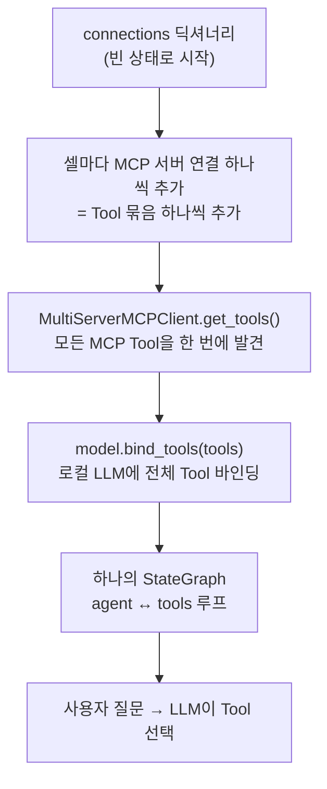

# 7주차 참고자료 — 바로 가져다 쓰는 공개 MCP 서버 카탈로그

> **이 문서는 7주 1일차 본교재의 확장 읽기 자료(선택)입니다.** 본교재에서 만든
> `server.py`·`agent_client.py`와 **같은 패턴**(연결 주소만 교체)으로, 이미 공개되어 있는 MCP 서버
> (날씨·주식·검색·브라우저 자동화 등)를 하나의 LangGraph 에이전트에 연결합니다.
> 7주 2일차(바이브 코딩으로 에이전트 확장) 전에 읽어 두면 좋은 재료가 됩니다.
> 공개 서버는 버전·환경 이슈가 있을 수 있으므로(§5), 수업 시간이 아니라 여유 시간에 시도하세요.

## 1. 이 문서에서 말하는 “공개 MCP”

이 장의 목적은 MCP 프로토콜 메서드 자체를 외우는 것이 아니다. 이미 다른 개발자나
서비스 제공자가 만들어 둔 **MCP 서버를 설치하거나 원격 URL로 연결한 뒤**, 날씨·주식·검색·
웹 크롤링·브라우저 자동화 기능을 바로 Tool로 사용하는 방법을 정리하는 것이다.

공개 MCP 서버는 크게 두 종류로 나뉜다.

| 구분 | 의미 | 장점 | 주의점 |
|---|---|---|---|
| 서비스 제공자 공식 서버 | API 제공 회사가 직접 운영·관리 | 문서와 API가 함께 관리되고 원격 서버를 제공하는 경우가 많음 | API Key, OAuth, 사용량 과금이 필요할 수 있음 |
| 커뮤니티 공개 서버 | 공개 API를 MCP로 감싼 오픈소스 프로젝트 | 무료이거나 설치가 간단한 경우가 많음 | 유지보수 상태, 보안, 정확도를 직접 확인해야 함 |

> **핵심**: 공개 서버를 연결한 뒤에는 서버별 Tool 이름을 미리 외우기보다
> `list_tools()`로 실제 제공 목록과 입력 스키마를 확인한 다음 `call_tool()`로 호출한다.

## 2. 실습에 바로 사용할 수 있는 MCP 서버 요약

| 분야 | MCP 서버 | 관리 주체 | 제공 기능 | 연결 방법 | 대표 Tool | 키·비용 |
|---|---|---|---|---|---|---|
| 날씨 | Weather MCP | 커뮤니티, 공식 MCP Registry 등록 | 현재 날씨, 16일 예보, 과거 날씨, 대기질, 경보, 해양·번개·산불 정보 | `npx -y @dangahagan/weather-mcp@latest` | `get_weather_summary`, `get_forecast`, `get_current_conditions`, `get_historical_weather` | 기본 기능은 API Key 없음 |
| 주식·금융 | Alpha Vantage MCP | Alpha Vantage 공식 | 일·주·월 주가, 실시간 시세, 재무제표, 뉴스, RSI·MACD 등 기술지표, 환율·암호화폐·원자재 | 원격 `https://mcp.alphavantage.co/mcp` 또는 `uvx marketdata-mcp-server API_KEY` | `TIME_SERIES_DAILY`, `GLOBAL_QUOTE`, `RSI`, `COMPANY_OVERVIEW` | API Key 필요, 무료·유료 플랜 |
| 단일 페이지 수집·사이트 크롤링 | Firecrawl MCP | Firecrawl 공식 | URL 스크래핑, 사이트 맵, 다중 페이지 크롤링, 구조화 추출, 검색, 리서치 | `FIRECRAWL_API_KEY`를 설정하고 `npx -y firecrawl-mcp` | `firecrawl_scrape`, `firecrawl_crawl`, `firecrawl_map`, `firecrawl_extract`, `firecrawl_search` | API Key 필요, 사용량 기반 |
| 웹 검색·추출·크롤링 | Tavily MCP | Tavily 공식 | 실시간 검색, URL 본문 추출, 사이트 구조 맵, 웹 크롤링 | 원격 `https://mcp.tavily.com/mcp` 또는 API Key 포함 원격 URL | `tavily-search`, `tavily-extract`, `tavily-map`, `tavily-crawl` | API Key 또는 OAuth |
| 동적 웹페이지 조작 | Playwright MCP | Microsoft 공식 | 브라우저 열기, 이동, 클릭, 입력, 접근성 트리 읽기, 네트워크 요청 확인 | `npx @playwright/mcp@latest` | `browser_navigate`, `browser_snapshot`, `browser_click`, `browser_type` | 자체 API Key 없음. 접속 사이트의 계정은 별도 |
| 범용 웹 데이터 수집 | Apify MCP | Apify 공식 | Apify Store의 수천 개 Actor를 검색·실행하여 지도, 쇼핑몰, SNS, 검색결과 등 수집 | 원격 `https://mcp.apify.com` 또는 `npx @apify/actors-mcp-server` | `search-actors`, `fetch-actor-details`, `call-actor`, `apify--rag-web-browser` | OAuth 또는 APIFY_TOKEN, Actor별 과금 가능 |
| 웹·뉴스·이미지 검색 | Brave Search MCP | Brave 공식 | 웹, 뉴스, 이미지, 비디오, 지역 검색 | `BRAVE_API_KEY`를 설정하고 `npx -y @brave/brave-search-mcp-server --transport stdio` | `brave_web_search`, `brave_news_search`, `brave_image_search`, `brave_video_search` | Brave Search API Key 필요 |
| 논문 검색 | arXiv MCP | 커뮤니티(blazickjp) | 논문 검색·다운로드·본문 읽기·인용 그래프 | `uvx arxiv-mcp-server` | `search_papers`, `get_abstract`, `read_paper` | 키 없음 ✅검증 |
| 유튜브 자막 | YouTube Transcript MCP | 커뮤니티(jkawamoto) | 영상 자막 조회 (YouTube API 키 불필요) | `uvx --with "mcp<2" mcp-youtube-transcript` | `get_transcript` | 키 없음 ✅검증(핀 필요) |
| 웹 검색 (무키) | DuckDuckGo MCP | 커뮤니티(nickclyde) | 키 없는 웹 검색·페이지 본문 가져오기 | `uvx duckduckgo-mcp-server` | `search`, `fetch_content` | 키 없음 ✅검증 |
| 백과 검색 | Wikipedia MCP | 커뮤니티(Rudra-ravi) | 문서 검색·요약·섹션 추출 (`--language ko` 지원) | `uvx wikipedia-mcp` | `search_wikipedia`, `get_summary`, `get_article` | 키 없음 ✅검증 |
| GitHub 저장소 Q&A | DeepWiki MCP | Cognition(Devin) 공식 | 공개 repo 구조·내용에 자연어 질문 | 원격 `https://mcp.deepwiki.com/mcp` | `ask_question`, `read_wiki_structure` | 키 없음 (무인증 원격) |
| 최신 라이브러리 문서 | Context7 | Upstash 공식 | 버전별 최신 문서·코드 예시 주입 | 원격 `https://mcp.context7.com/mcp` 또는 `npx -y @upstash/context7-mcp` | `resolve-library-id`, `get-library-docs` | 키 없이 가능 (429 시 무료 키) |
| 사고 구조화 | Sequential Thinking | MCP 공식 reference | 단계적 사고·계획 도구 | `npx -y @modelcontextprotocol/server-sequential-thinking` | `sequentialthinking` | 키 없음 |

> **✅검증 표시**: 2026-08에 본 교재 작성 환경에서 `uvx` 실행 → MCP 연결 → Tool 목록 조회까지
> 확인한 서버다. YouTube Transcript는 최신 `mcp` SDK와 어긋나므로 반드시 `--with "mcp<2"` 핀을
> 붙인다. DeepWiki·Context7 원격 서버는 교재 작성 환경의 프록시 제한으로 직접 검증하지 못했다.


## 3. 제외한 서버

| 제외 서버 | 제외 이유 |
|---|---|
| Alpha Vantage MCP | `ALPHA_VANTAGE_API_KEY` 필요 |
| Firecrawl MCP | `FIRECRAWL_API_KEY` 필요 |
| Tavily MCP | API Key 또는 OAuth 필요 |
| Apify MCP | `APIFY_TOKEN` 또는 OAuth 필요 |
| Brave Search MCP | `BRAVE_API_KEY` 필요 |

이 서버들이 기능적으로 나쁘다는 의미가 아니다. 이번 실습의 제약조건을 “MCP 서버 인증키 없음”으로
설정했기 때문에 제외한 것이다. **키 없는 웹 검색이 필요하면 DuckDuckGo MCP(§2 표)를 사용한다.**

## 4. 실습 방식 — MCP별 Python 파일을 만들지 않는다

기존 구조처럼 `weather_langgraph.py`, `stock_langgraph.py`, `fetch_langgraph.py`를 각각 만들면
MCP 서버 수만큼 Agent 그래프가 중복된다. 이번에는 하나의 Jupyter Notebook에서 다음 순서로
완성한다.



각 MCP 서버가 Tool 하나만 제공하는 것은 아니다. 예를 들어 Weather MCP 하나가 현재 날씨,
예보, 과거 날씨, 대기질 등 여러 Tool을 공개한다. 따라서 정확한 표현은 **“한 셀에 MCP 서버
하나, 즉 Tool 묶음 하나를 추가한다”**이다.

## 5. 노트북 파일과 설치

실습 파일은 다음 하나다.

```text
public-mcp-langgraph/
└─ public_mcp_langgraph_step_by_step.ipynb
```

패키지를 설치한다. LLM은 `init_chat_model()`로 만들며, 기본은 클라우드 Claude를 사용한다.

```bash
uv init public-mcp-langgraph
cd public-mcp-langgraph
uv add langgraph langchain langchain-mcp-adapters langchain-anthropic langchain-google-genai langchain-openai langchain-core python-dotenv ipykernel
uv run python -m ipykernel install --user --name public-mcp-langgraph --display-name "Python 3 (public-mcp-langgraph)"
```

`.env`에 API Key를 넣는다.

```dotenv
ANTHROPIC_API_KEY=sk-ant-...
# 다른 모델을 쓸 때만 해당 키 추가:  GOOGLE_API_KEY=...  /  OPENAI_API_KEY=...
```

> **최소 성공 경로 (Node.js 불필요)**: 본교재의 `server.py`·`agent_client.py`는 모두
> 순수 Python이라 Node 없이 핵심을 완주할 수 있다. 이 문서의 공개 서버 중에서도 Fetch·Time은 `uvx`로
> 실행되어 npx가 필요 없다(§7 [필수] 셀).

### npx가 부담되면 — npx 없이 하는 3가지 방법

npx는 설치보다 **설치 후 PATH·커널 문제**로 막히는 경우가 많다. npx를 피하려면 아래 순서로 택한다.

1. **(가장 안정) 내가 만든 FastMCP 서버를 쓴다.** 본교재 세션 2의 `server.py`에 파이썬 함수를
   `@mcp.tool`로 더 붙이고, 세션 3의 `agent_client.py`가 그 툴을 골라 쓰게 한다. **Node·npx·uvx 모두 불필요**하고 버전
   충돌도 없다. 오늘 실습에서 tool 로딩·그래프까지 실제로 검증된 경로다.
2. **(가벼움) `uvx` 파이썬 공개 서버.** `Fetch`·`Time`처럼 `uvx mcp-server-*`로 실행하면 npx가
   필요 없다. 다만 공개 reference 서버는 설치되는 `mcp` SDK 버전과 어긋나 `ImportError`가 날 수 있다
   (아래 주의 참고).
3. **(가장 간단) 원격 호스팅 MCP.** URL만 연결하면 로컬 프로세스·npx가 아예 없다. **키조차 필요
   없는 무인증 서버도 있다** — 예: DeepWiki `https://mcp.deepwiki.com/mcp` (GitHub 공개 repo에
   자연어 질문). Tavily `https://mcp.tavily.com/mcp`처럼 API Key가 필요한 원격 서버도 연결 방식은
   같다.

> **주의 — 공개 reference 서버의 버전 취약성**: `uvx mcp-server-fetch`류가
> `ImportError: cannot import name 'McpError' ...`처럼 실패하면 이는 Node 문제가 아니라 서버 코드와
> 설치된 `mcp` 버전이 어긋난 것이다. 서버/`mcp` 버전을 핀하거나, 위 1번(자작 FastMCP 서버)으로
> 대체하는 편이 수업에서 가장 확실하다.
> 핀으로 해결한 실제 예: `uvx --with "mcp<2" mcp-youtube-transcript` (2026-08 검증).

**(선택) Node.js 확장을 하려면 — 3줄 가이드**

1. **`nvm`으로 설치**하면 OS·권한 꼬임을 크게 줄인다: `nvm install 20` (설치 후 `node --version`으로 18+ 확인).
2. **설치 뒤 반드시 터미널·Jupyter 커널을 재시작**한다 — PATH가 갱신되지 않아 `npx`를 못 찾는 것이 가장 흔한 실패다.
3. **Windows Jupyter**는 교재의 `cmd /c npx` 도우미(셀 2)가 이미 처리하므로 그대로 쓴다. Playwright까지 하려면 `npx playwright install chromium`.

(선택) 클라우드 대신 로컬 무료 실행을 원하면 Ollama를 설치해 `ChatOllama`로 바꾼다(§8 참고).

## 6. 셀 1~3 — 공통 준비

### 셀 1: 모듈과 작업 폴더

```python
import json
import os
import shutil
from pathlib import Path
from typing import Any

from langchain_core.messages import AIMessage, HumanMessage, SystemMessage, ToolMessage
from langchain.chat_models import init_chat_model
from langchain_mcp_adapters.client import MultiServerMCPClient
from langgraph.graph import MessagesState, START, StateGraph
from langgraph.prebuilt import ToolNode, tools_condition

WORKSPACE = (Path.cwd() / "mcp_workspace").resolve()
WORKSPACE.mkdir(parents=True, exist_ok=True)
MEMORY_FILE = WORKSPACE / "memory.jsonl"
```

### 셀 2: `npx`와 `uvx` 연결 도우미

Windows Jupyter에서는 `cmd /c npx`가 필요할 수 있으므로 운영체제별 설정을 함수로 만든다.

```python
def npx_server(*args: str, env: dict[str, str] | None = None) -> dict[str, Any]:
    if os.name == "nt":
        config = {"transport": "stdio", "command": "cmd", "args": ["/c", "npx", *args]}
    else:
        config = {"transport": "stdio", "command": "npx", "args": list(args)}
    if env:
        config["env"] = env
    return config


def uvx_server(*args: str, env: dict[str, str] | None = None) -> dict[str, Any]:
    config = {"transport": "stdio", "command": "uvx", "args": list(args)}
    if env:
        config["env"] = env
    return config
```

### 셀 3: 빈 연결표와 서버 점검 함수

```python
connections: dict[str, dict[str, Any]] = {}


async def inspect_server(server_name: str) -> list[Any]:
    temp_client = MultiServerMCPClient(
        {server_name: connections[server_name]},
        tool_name_prefix=True,
        handle_tool_errors=True,
    )
    server_tools = await temp_client.get_tools()
    for tool in sorted(server_tools, key=lambda item: item.name):
        print(f"- {tool.name}: {tool.description}")
    return server_tools
```

## 7. 셀 4~10 — MCP 서버를 한 셀씩 추가 (모두 인증키 불필요)

> **[필수]** Fetch·Time은 `uvx`로 실행되어 **Node.js가 필요 없다.** 이 둘만으로도 실습을 완주할 수 있다.
> **[권장 · uvx/원격]** arXiv·YouTube 자막·DuckDuckGo·Wikipedia·DeepWiki도 Node 없이 동작한다
> (uvx 4종은 2026-08 연결 검증).
> **[선택 · Node 필요]** 나머지는 `npx`로 실행되므로 Node.js 18+가 있어야 한다. 없으면 건너뛴다.
> **막히면**: 공개 서버가 `ImportError`(버전 취약성)로 실패해도, 본교재의 자작 FastMCP 서버로 대체하면
> 학습 목표(에이전트가 MCP 툴을 스스로 선택)는 동일하게 달성된다. (§5 "npx 없이 하는 3가지 방법")

### [필수] Fetch MCP (uvx)

```python
connections["fetch"] = uvx_server("mcp-server-fetch")
fetch_tools = await inspect_server("fetch")
```

### [필수] Time MCP (uvx)

```python
connections["time"] = uvx_server("mcp-server-time")
time_tools = await inspect_server("time")
```

### [권장 · uvx] arXiv MCP — 논문 검색

논문 검색·초록·본문 읽기 Tool을 제공한다. arXiv API 자체가 무인증이라 키가 없다.

```python
connections["arxiv"] = uvx_server("arxiv-mcp-server")
arxiv_tools = await inspect_server("arxiv")
```

### [권장 · uvx] YouTube Transcript MCP — 영상 자막

공개 자막만 가져오므로 YouTube API 키가 필요 없다. 최신 `mcp` SDK와 어긋나므로
**`mcp<2` 핀이 필수**다(§5 주의 참고).

```python
connections["youtube"] = uvx_server("--with", "mcp<2", "mcp-youtube-transcript")
youtube_tools = await inspect_server("youtube")
```

### [권장 · uvx] DuckDuckGo MCP — 키 없는 웹 검색

Tavily·Brave처럼 키가 필요한 검색 대신 쓸 수 있는 무료 검색이다. HTML 기반이라
과도한 호출 시 차단될 수 있다(수업 데모 수준은 무방).

```python
connections["ddg"] = uvx_server("duckduckgo-mcp-server")
ddg_tools = await inspect_server("ddg")
```

### [권장 · uvx] Wikipedia MCP — 백과 검색

한국어 위키 기준으로 쓰려면 `--language ko`를 준다.

```python
connections["wikipedia"] = uvx_server("wikipedia-mcp", "--language", "ko")
wikipedia_tools = await inspect_server("wikipedia")
```

### [권장 · 원격] DeepWiki MCP — GitHub 공개 repo Q&A (무인증)

로컬 프로세스가 아예 없다. URL만 연결하면 되고 키도 필요 없다. 공개 repo만 질문할 수 있다.

```python
connections["deepwiki"] = {
    "transport": "streamable_http",
    "url": "https://mcp.deepwiki.com/mcp",
}
deepwiki_tools = await inspect_server("deepwiki")
```

### [선택 · 원격] Context7 — 최신 라이브러리 문서

키 없이 사용 가능하며, 429(사용량 초과)가 나면 무료 키를 받아 붙인다. 7주 2일차
바이브 코딩에서 최신 문서를 참조할 때 특히 유용하다.

```python
connections["context7"] = {
    "transport": "streamable_http",
    "url": "https://mcp.context7.com/mcp",
}
context7_tools = await inspect_server("context7")
```

---

아래부터는 **Node.js가 있어야 실행되는 선택 확장**이다. Node가 없으면 이 셀들은 건너뛰고 §8로 넘어간다.

### [선택 · Node] Weather MCP (npx)

```python
connections["weather"] = npx_server(
    "-y", "@dangahagan/weather-mcp@latest",
    env={"WEATHER_UNITS": "metric"},
)
weather_tools = await inspect_server("weather")
```

### [선택 · Node] Yahoo Finance MCP (npx)

```python
connections["finance"] = npx_server(
    "-y", "yahoo-finance-mcp-server@latest",
)
finance_tools = await inspect_server("finance")
```

### [선택 · Node] Filesystem MCP (npx)

```python
connections["filesystem"] = npx_server(
    "-y", "@modelcontextprotocol/server-filesystem", str(WORKSPACE),
)
filesystem_tools = await inspect_server("filesystem")
```

### [선택 · Node] Memory MCP (npx)

```python
connections["memory"] = npx_server(
    "-y", "@modelcontextprotocol/server-memory",
    env={"MEMORY_FILE_PATH": str(MEMORY_FILE)},
)
memory_tools = await inspect_server("memory")
```

### [선택 · Node] Playwright MCP (npx)

```python
connections["playwright"] = npx_server(
    "-y", "@playwright/mcp@latest", "--headless", "--isolated",
)
playwright_tools = await inspect_server("playwright")
```

### [선택 · Node] Sequential Thinking MCP (npx)

MCP 공식 reference 서버. 외부 API가 아니라 **모델의 단계적 사고를 돕는 도구**로,
"Tool이 꼭 외부 시스템일 필요는 없다"는 것을 보여주는 예다.

```python
connections["seq"] = npx_server("-y", "@modelcontextprotocol/server-sequential-thinking")
seq_tools = await inspect_server("seq")
```

## 8. 셀 11~13 — 전체 Tool 수집과 모델 바인딩

Tool 수가 많으면 선택 정확도가 낮아질 수 있으므로 처음에는 **Node 없이 되는 Fetch·Time만**
활성화한다. 정상 동작을 확인한 뒤(그리고 Node.js를 설치했다면) 나머지를 하나씩 추가한다.

```python
# 최소 경로: Node.js 없이 uvx만으로 동작
ACTIVE_SERVER_NAMES = {"fetch", "time"}

# uvx 권장 서버까지 확장 (Node.js 불필요)
# ACTIVE_SERVER_NAMES = {"fetch", "time", "arxiv", "youtube", "ddg", "wikipedia"}

# Node.js까지 설치했다면 전체 확장
# ACTIVE_SERVER_NAMES = {
#     "fetch", "time", "arxiv", "youtube", "ddg", "wikipedia", "deepwiki",
#     "weather", "finance", "filesystem", "memory", "playwright",
# }

active_connections = {
    name: config
    for name, config in connections.items()
    if name in ACTIVE_SERVER_NAMES
}
```

모든 Tool을 수집한다.

```python
client = MultiServerMCPClient(
    active_connections,
    tool_name_prefix=True,
    handle_tool_errors=True,
)
tools = await client.get_tools()
```

클라우드 LLM(`init_chat_model`)에 Tool 전체를 바인딩한다. (`.env`의 `ANTHROPIC_API_KEY` 사용 — §5에서 설치 완료)

```python
from dotenv import load_dotenv
from langchain.chat_models import init_chat_model

load_dotenv()  # .env의 ANTHROPIC_API_KEY를 읽는다

MODEL = "anthropic:claude-sonnet-4-6"  # 모델 선택은 6주차 1일차 A-1 박스 참고

model = init_chat_model(MODEL, temperature=0, max_tokens=1024)
model_with_tools = model.bind_tools(tools)
```

> **모델 통일**: 6주차 실습과 동일하게 `MODEL = "anthropic:claude-sonnet-4-6"`을 기본으로 쓴다.
> `MODEL` 문자열만 바꾸면 다른 모델로 전환된다 — 예: `"google_genai:gemini-3-flash"`(`GOOGLE_API_KEY` 필요),
> `"openai:gpt-4.1-mini"`(`OPENAI_API_KEY` 필요). 자세한 전환 방법은 6주차 1일차 A-1 박스 참고.
>
> **주의(최신 모델로 바꿀 때)**: `claude-opus-5`·`claude-sonnet-5` 같은 최신 모델은 `temperature`를
> 넘기면 400 오류가 난다. 이 모델들로 교체한다면 `temperature=0` 줄을 삭제한다.

### (선택) 로컬 무료 실행 — Ollama

클라우드 비용 없이 오프라인으로 돌리려면 Ollama를 설치(`ollama pull gpt-oss:20b`)한 뒤 위 LLM 셀만
아래로 바꾼다. `gpt-oss:20b`는 대략 13~16GB 이상의 메모리가 필요하며, 그래프·Tool·나머지 셀은
그대로 유지된다.

```python
from langchain_ollama import ChatOllama  # 먼저: uv add langchain-ollama

model = ChatOllama(model="gpt-oss:20b", temperature=0, validate_model_on_init=True)
model_with_tools = model.bind_tools(tools)
```

## 9. 셀 14~16 — 하나의 LangGraph 완성

System Prompt에는 서버 이름보다 **기능별 Tool 선택 기준**을 작성한다.

```python
SYSTEM_PROMPT = """
사용자 질문과 등록된 Tool 설명을 비교하여 필요한 Tool만 선택하라.
- 날씨·예보는 Weather MCP
- 주가·가격 이력은 Yahoo Finance MCP
- URL 본문은 Fetch MCP
- 현재 시각·시간대 변환은 Time MCP
- 논문 검색·요약은 arXiv MCP
- 유튜브 영상 자막은 YouTube Transcript MCP
- 일반 웹 검색은 DuckDuckGo MCP
- 백과 지식·정의는 Wikipedia MCP
- GitHub 공개 저장소 질문은 DeepWiki MCP
- 로컬 파일은 Filesystem MCP
- 명시적인 사실 저장·검색은 Memory MCP
- 동적 브라우저 화면은 Playwright MCP
단순 URL 읽기는 Playwright보다 Fetch를 우선한다.
상태 변경 작업은 사용자가 명시적으로 요청했을 때만 실행한다.
Tool 오류나 결과 없음은 숨기지 말고 추측하지 않는다.
""".strip()
```

Agent Node를 정의한다.

```python
async def call_model(state: MessagesState) -> dict[str, Any]:
    response = await model_with_tools.ainvoke(
        [SystemMessage(content=SYSTEM_PROMPT), *state["messages"]]
    )
    return {"messages": [response]}
```

하나의 그래프를 완성한다.

```python
builder = StateGraph(MessagesState)
builder.add_node("agent", call_model)
builder.add_node("tools", ToolNode(tools))
builder.add_edge(START, "agent")
builder.add_conditional_edges("agent", tools_condition)
builder.add_edge("tools", "agent")
graph = builder.compile()
```

실행 흐름은 다음과 같다.

```text
START → agent
          ├─ Tool Call 없음 → END
          └─ Tool Call 있음 → tools → agent → 반복 또는 END
```

## 10. 셀 17 — 실행 추적 함수

최종 답변만 보면 어떤 MCP가 선택되었는지 알기 어렵다. `AIMessage.tool_calls`와
`ToolMessage`를 출력해 실제 라우팅을 확인한다.

```python
async def run_agent(query: str):
    result = await graph.ainvoke(
        {"messages": [HumanMessage(content=query)]},
        {"recursion_limit": 18},
    )

    for message in result["messages"]:
        if isinstance(message, AIMessage) and message.tool_calls:
            for call in message.tool_calls:
                print("선택 Tool:", call["name"])
                print("arguments:", call.get("args", {}))
        elif isinstance(message, ToolMessage):
            print("Tool 결과:", message.name, message.content)

    print("최종 답변:", result["messages"][-1].content)
    return result
```

## 11. 셀 18~26 — 질문별 MCP Tool 선택 실습

### Weather MCP

```python
await run_agent("광주의 현재 날씨와 앞으로 3일 예보를 표로 정리해줘.")
```

### Yahoo Finance MCP

```python
await run_agent(
    "AAPL의 최근 3개월 일별 가격 이력을 조회하고 최고 종가와 최저 종가를 요약해줘."
)
```

### Fetch MCP

```python
await run_agent(
    "https://modelcontextprotocol.io/introduction 페이지를 읽고 핵심 내용을 5개로 요약해줘."
)
```

### Time MCP

```python
await run_agent("현재 서울 시각과 같은 순간의 런던 시각을 함께 표시해줘.")
```

### arXiv MCP

```python
await run_agent(
    "retrieval augmented generation 관련 최신 논문 2편을 arXiv에서 찾아 제목과 핵심을 요약해줘."
)
```

### YouTube Transcript MCP

```python
await run_agent(
    "https://www.youtube.com/watch?v=영상ID 영상의 자막을 가져와 핵심을 3줄로 정리해줘."
)
```

### DuckDuckGo MCP

```python
await run_agent("Model Context Protocol의 최근 동향을 웹에서 검색해 요약해줘.")
```

### Wikipedia MCP

```python
await run_agent("위키백과에서 '전이 학습'을 찾아 두 문장으로 정의해줘.")
```

### Filesystem MCP

```python
sample_file = WORKSPACE / "course_note.txt"
sample_file.write_text("MCP는 외부 도구와 데이터를 연결하는 표준 프로토콜이다.", encoding="utf-8")
await run_agent(f"{sample_file} 파일을 읽고 핵심 문장을 요약해줘.")
```

### Memory MCP

```python
await run_agent(
    "내 프로젝트 이름은 public-mcp-langgraph이고 목표는 API Key 없는 MCP Tool을 "
    "하나의 LangGraph Agent에 연결하는 것이다. 이 사실을 기억에 저장해줘."
)
await run_agent("내 public-mcp-langgraph 프로젝트의 목표를 기억에서 찾아 알려줘.")
```

### Playwright MCP

```python
await run_agent(
    "Playwright 브라우저로 https://example.com 을 열고 접근성 스냅샷에서 "
    "페이지 제목과 링크 텍스트를 확인해줘. 클릭이나 입력은 하지 마."
)
```

### 여러 MCP를 연속 선택

```python
await run_agent(
    "현재 광주의 날씨를 조회하고 서울의 현재 시각도 함께 표시해서 "
    "오늘 야외 수업 준비 사항을 정리해줘."
)
```

예상 경로는 다음과 같다.

```text
agent → weather_* Tool → agent → time_* Tool → agent → 최종 답변
```

## 12. Tool 선택 평가표

| 질문 | 예상 MCP | 실제 선택 Tool | 성공 여부 | 보완 사항 |
|---|---|---|---|---|
| 광주 3일 날씨 | Weather | | | |
| AAPL 3개월 주가 | Yahoo Finance | | | |
| URL 본문 요약 | Fetch | | | |
| 서울·런던 시각 | Time | | | |
| 최신 논문 2편 | arXiv | | | |
| 영상 자막 요약 | YouTube Transcript | | | |
| 키 없는 웹 검색 | DuckDuckGo | | | |
| 백과 정의 | Wikipedia | | | |
| 로컬 파일 요약 | Filesystem | | | |
| 프로젝트 목표 기억 | Memory | | | |
| 동적 페이지 확인 | Playwright | | | |
| 날씨+시간 | Weather+Time | | | |

## 13. 자주 발생하는 오류

### `npx`를 찾을 수 없음 (선택 확장에서만)

- Node 기반 선택 서버(Weather/Finance/Filesystem/Memory/Playwright)를 쓸 때만 필요하다.
- Node.js 18 이상을 설치한다.
- 터미널에서 `npx --version`을 확인한다.
- Windows Jupyter에서는 `cmd /c npx` 도우미를 사용한다.

### `uvx`를 찾을 수 없음

- `uv --version`, `uvx --version`을 확인한다.
- Jupyter를 VS Code에서 다시 시작하여 PATH를 갱신한다.

### 공개 서버가 `ImportError`로 죽음

- 서버 패키지와 설치된 `mcp` SDK 버전이 어긋난 것이다(§5 주의).
- `uvx --with "mcp<2" mcp-youtube-transcript`처럼 구버전 SDK를 함께 핀하면 해결되는 경우가 많다.
- 해결되지 않으면 그 서버만 빼고 진행한다 — 다른 서버 실습에는 지장 없다.

### (선택) Ollama 연결 실패

로컬 Ollama를 쓰는 경우에만 해당한다(기본 경로는 클라우드 LLM(`init_chat_model`)).

```bash
ollama list
ollama pull gpt-oss:20b
ollama serve
```

### Tool이 너무 많아 잘못 선택함

처음에는 Node 없이 되는 두 개만 남긴다.

```python
ACTIVE_SERVER_NAMES = {"fetch", "time"}
```

정상 동작을 확인하고 Node.js를 설치했다면 Weather·Finance·Filesystem·Memory·Playwright를 하나씩 추가한다.

### Finance MCP가 데이터를 반환하지 않음

- 티커 심볼을 `AAPL`, `MSFT`, `005930.KS`처럼 Yahoo Finance 형식으로 확인한다.
- Yahoo Finance는 비공식 데이터 경로이므로 일시적인 차단이나 형식 변경이 발생할 수 있다.
- 결과가 없으면 Agent가 다른 값을 추측하지 않도록 한다.

### Fetch가 내부 주소에 접근함

`localhost`, 사설 IP, 클라우드 메타데이터 주소 등은 요청하지 않는다. 실제 서비스에서는 URL
허용 목록과 네트워크 차단을 추가한다.

### Playwright가 클릭이나 입력을 실행함

System Prompt만으로는 완전한 보안 통제가 되지 않는다. 실제 서비스에서는 클릭·입력 Tool을 별도
ToolNode로 분리하고 LangGraph interrupt를 사용해 사람 승인을 받은 뒤 실행한다.

## 14. 실습 산출물

- [ ] `public_mcp_langgraph_step_by_step.ipynb`
- [ ] MCP 서버 2개 이상(Fetch·Time) 연결 로그 — Node 설치 시 4개 이상 권장
- [ ] 전체 Tool 목록 출력 결과
- [ ] Weather·Finance·Fetch·Time 질문 실행 결과
- [ ] 서로 다른 MCP 두 개를 연속 호출한 실행 경로
- [ ] Tool 선택 평가표

## 15. 공식 자료

- MCP reference servers: https://github.com/modelcontextprotocol/servers
- Weather MCP: https://github.com/weather-mcp/weather-mcp
- Yahoo Finance MCP Registry entry: https://registry.modelcontextprotocol.io/v0.1/servers?search=io.github.danishashko%2Fyahoo-finance-mcp&version=latest
- Fetch MCP: https://github.com/modelcontextprotocol/servers/tree/main/src/fetch
- Time MCP: https://github.com/modelcontextprotocol/servers/tree/main/src/time
- Filesystem MCP: https://github.com/modelcontextprotocol/servers/tree/main/src/filesystem
- Memory MCP: https://github.com/modelcontextprotocol/servers/tree/main/src/memory
- Playwright MCP: https://github.com/microsoft/playwright-mcp
- arXiv MCP: https://github.com/blazickjp/arxiv-mcp-server
- YouTube Transcript MCP: https://github.com/jkawamoto/mcp-youtube-transcript
- DuckDuckGo MCP: https://github.com/nickclyde/duckduckgo-mcp-server
- Wikipedia MCP: https://github.com/Rudra-ravi/wikipedia-mcp
- DeepWiki MCP: https://docs.devin.ai/work-with-devin/deepwiki-mcp
- Context7: https://github.com/upstash/context7
- Sequential Thinking MCP: https://github.com/modelcontextprotocol/servers/tree/main/src/sequentialthinking
- LangChain MCP 문서: https://docs.langchain.com/oss/python/langchain/mcp
- LangChain Ollama 문서: https://docs.langchain.com/oss/python/integrations/chat/ollama

---
