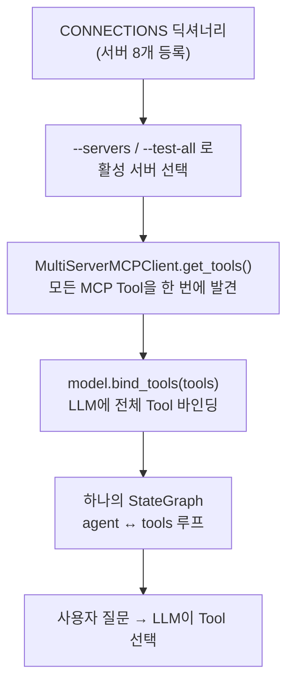

# 7주차 참고자료 — 바로 가져다 쓰는 공개 MCP 서버 카탈로그

> **이 문서는 7주 1일차 본교재의 확장 읽기 자료(선택)입니다.** 본교재에서 만든
> `server.py`·`agent_client.py`와 **같은 패턴**(연결 주소만 교체)으로, 이미 공개되어 있는 MCP 서버
> (검색·논문·백과·문서 등)를 하나의 LangGraph 에이전트에 연결합니다.
> 7주 2일차(바이브 코딩으로 에이전트 확장) 전에 읽어 두면 좋은 재료가 됩니다.
> 공개 서버는 버전·환경 이슈가 있을 수 있으므로(§5), 수업 시간이 아니라 여유 시간에 시도하세요.

## 1. 이 문서에서 말하는 “공개 MCP”

이 장의 목적은 MCP 프로토콜 메서드 자체를 외우는 것이 아니다. 이미 다른 개발자나
서비스 제공자가 만들어 둔 **MCP 서버를 설치하거나 원격 URL로 연결한 뒤**, 날씨·주식·검색·
웹 크롤링·브라우저 자동화 기능을 바로 Tool로 사용하는 방법을 정리하는 것이다.

공개 MCP 서버는 크게 두 종류로 나뉜다.

| 구분 | 의미 | 장점 | 주의점 |
|---|---|---|---|
| 서비스 제공자 공식 서버 | API 제공 회사가 직접 운영·관리 | 문서와 API가 함께 관리되고 원격 서버를 제공하는 경우가 많음 | API Key, OAuth, 사용량 과금이 필요할 수 있음 |
| 커뮤니티 공개 서버 | 공개 API를 MCP로 감싼 오픈소스 프로젝트 | 무료이거나 설치가 간단한 경우가 많음 | 유지보수 상태, 보안, 정확도를 직접 확인해야 함 |

> **핵심**: 공개 서버를 연결한 뒤에는 서버별 Tool 이름을 미리 외우기보다
> `list_tools()`로 실제 제공 목록과 입력 스키마를 확인한 다음 `call_tool()`로 호출한다.

## 2. API Key를 발급받지 않아도 되는 바로 사용할 수 있는 MCP 서버 요약
- 여기에 정리한 MCP 중에서는 사용자 PC에 Node.js가 설치되어 있어야 동작하는 MCP 서버도 있다.
- 실습 스크립트(`public_mcp_langgraph.py`)에는 **Node.js도 인증키도 필요 없는 8개**만 등록되어 있다(아래 ⭐ 표시).

| 분야 | MCP 서버 | 관리 주체 | 제공 기능 | 연결 방법 | 대표 Tool | 키·비용 |
|---|---|---|---|---|---|---|
| ⭐ URL 본문 수집 | Fetch MCP | MCP 공식 reference | URL 본문을 마크다운으로 변환해 읽기 | `uvx --with "mcp<1.20" mcp-server-fetch` | `fetch` | 키 없음 ✅검증(핀 필요) |
| ⭐ 시각·시간대 | Time MCP | MCP 공식 reference | 현재 시각 조회, 시간대 변환 | `uvx --with "mcp<1.20" mcp-server-time` | `get_current_time`, `convert_time` | 키 없음 ✅검증(핀 필요) |
| ⭐ 논문 검색 | arXiv MCP | 커뮤니티(blazickjp) | 논문 검색·다운로드·본문 읽기·인용 그래프 | `uvx arxiv-mcp-server` | `search_papers`, `get_abstract`, `read_paper` | 키 없음 ✅검증 |
| ⭐ 유튜브 자막 | YouTube Transcript MCP | 커뮤니티(jkawamoto) | 영상 자막 조회 (YouTube API 키 불필요) | `uvx --with "mcp<2" mcp-youtube-transcript` | `get_transcript` | 키 없음 ✅검증(핀 필요) |
| ⭐ 웹 검색 (무키) | DuckDuckGo MCP | 커뮤니티(nickclyde) | 키 없는 웹 검색·페이지 본문 가져오기 | `uvx duckduckgo-mcp-server` | `search`, `fetch_content` | 키 없음 ✅검증 |
| ⭐ 백과 검색 | Wikipedia MCP | 커뮤니티(Rudra-ravi) | 문서 검색·요약·섹션 추출 (`--language ko` 지원) | `uvx wikipedia-mcp --language ko` | `search_wikipedia`, `get_summary`, `get_article` | 키 없음 ✅검증 |
| ⭐ GitHub 저장소 Q&A | DeepWiki MCP | Cognition(Devin) 공식 | 공개 repo 구조·내용에 자연어 질문 | 원격 `https://mcp.deepwiki.com/mcp` | `ask_question`, `read_wiki_structure` | 키 없음 (무인증 원격) |
| ⭐ 최신 라이브러리 문서 | Context7 | Upstash 공식 | 버전별 최신 문서·코드 예시 주입 | 원격 `https://mcp.context7.com/mcp` | `resolve-library-id`, `get-library-docs` | 키 없이 가능 (429 시 무료 키) |
| 날씨 | Weather MCP | 커뮤니티, 공식 MCP Registry 등록 | 현재 날씨, 16일 예보, 과거 날씨, 대기질, 경보 | `npx -y @dangahagan/weather-mcp@latest` | `get_weather_summary`, `get_forecast` | 기본 기능은 API Key 없음 (Node.js 필요) |
| 주식·금융 | Yahoo Finance MCP | 커뮤니티 | 주가 이력, 시세, 기업 정보 | `npx -y yahoo-finance-mcp-server@latest` | `get_historical_prices`, `get_quote` | 키 없음 (Node.js 필요) |
| 로컬 파일 | Filesystem MCP | MCP 공식 reference | 허용된 폴더의 파일 읽기·쓰기·검색 | `npx -y @modelcontextprotocol/server-filesystem <경로>` | `read_file`, `write_file`, `list_directory` | 키 없음 (Node.js 필요) |
| 사실 저장·검색 | Memory MCP | MCP 공식 reference | 지식 그래프 형태의 사실 저장·검색 | `npx -y @modelcontextprotocol/server-memory` | `create_entities`, `search_nodes` | 키 없음 (Node.js 필요) |
| 동적 웹페이지 조작 | Playwright MCP | Microsoft 공식 | 브라우저 열기, 이동, 클릭, 입력, 접근성 트리 읽기 | `npx @playwright/mcp@latest` | `browser_navigate`, `browser_snapshot`, `browser_click` | 자체 API Key 없음 (Node.js 필요) |
| 사고 구조화 | Sequential Thinking | MCP 공식 reference | 단계적 사고·계획 도구 | `npx -y @modelcontextprotocol/server-sequential-thinking` | `sequentialthinking` | 키 없음 (Node.js 필요) |
| 단일 페이지 수집·사이트 크롤링 | Firecrawl MCP | Firecrawl 공식 | URL 스크래핑, 사이트 맵, 다중 페이지 크롤링, 구조화 추출 | `FIRECRAWL_API_KEY` 설정 후 `npx -y firecrawl-mcp` | `firecrawl_scrape`, `firecrawl_crawl` | API Key 필요, 사용량 기반 |
| 웹 검색·추출·크롤링 | Tavily MCP | Tavily 공식 | 실시간 검색, URL 본문 추출, 사이트 구조 맵 | 원격 `https://mcp.tavily.com/mcp` | `tavily-search`, `tavily-extract` | API Key 또는 OAuth |
| 범용 웹 데이터 수집 | Apify MCP | Apify 공식 | Apify Store의 수천 개 Actor를 검색·실행 | 원격 `https://mcp.apify.com` | `search-actors`, `call-actor` | OAuth 또는 APIFY_TOKEN |
| 웹·뉴스·이미지 검색 | Brave Search MCP | Brave 공식 | 웹, 뉴스, 이미지, 비디오, 지역 검색 | `BRAVE_API_KEY` 설정 후 `npx -y @brave/brave-search-mcp-server` | `brave_web_search`, `brave_news_search` | Brave Search API Key 필요 |

> **✅검증 표시**: 2026-08에 본 교재 작성 환경에서 `uvx` 실행 → MCP 연결 → Tool 목록 조회까지
> 확인한 서버다. Fetch·Time은 최신 `mcp` SDK와 어긋나므로 `--with "mcp<1.20"`, YouTube Transcript는
> `--with "mcp<2"` 핀을 반드시 붙인다.

## 3. API Key 혹은 OAuth를 필요로 하는 서버

| 제외 서버 | 제외 이유 |
|---|---|
| Alpha Vantage MCP | `ALPHA_VANTAGE_API_KEY` 필요 |
| Firecrawl MCP | `FIRECRAWL_API_KEY` 필요 |
| Tavily MCP | API Key 또는 OAuth 필요 |
| Apify MCP | `APIFY_TOKEN` 또는 OAuth 필요 |
| Brave Search MCP | `BRAVE_API_KEY` 필요 |

이 서버들이 기능적으로 나쁘다는 의미가 아니다. 이번 실습의 제약조건을 “MCP 서버 인증키 없음”으로
설정했기 때문에 제외한 것이다. **키 없는 웹 검색이 필요하면 DuckDuckGo MCP(§2 표)를 사용한다.**

Node.js(`npx`)가 필요한 Weather·Yahoo Finance·Filesystem·Memory·Playwright·Sequential Thinking도
같은 이유(실행 환경 제약)로 실습 스크립트에서는 제외했다. Node.js가 설치되어 있다면 §2 표의
연결 방법을 그대로 `CONNECTIONS`에 추가하면 된다.

## 4. 실습 방식 — `public_mcp_langgraph.py`



각 MCP 서버가 Tool 하나만 제공하는 것은 아니다. 예를 들어 Wikipedia MCP 하나가 검색, 요약,
섹션 추출 등 여러 Tool을 공개한다. 따라서 정확한 표현은 **“`CONNECTIONS` 항목 하나 = MCP 서버
하나 = Tool 묶음 하나”**이다.

## 5. 실습 파일과 설치

실습 파일은 다음 하나다. 노트북을 셀 단위로 실행하지 않고, 하나의 스크립트를 옵션으로 실행한다.

```text
public-mcp-langgraph/
└─ public_mcp_langgraph.py
```

패키지를 설치한다. LLM은 `init_chat_model()`로 만들며, 기본은 Gemini `gemini-3.5-flash-lite`를 사용한다.

| Model | 일일 무료 프리티어(매일 리셋) |
|---|---|
| gemini-3.1-flash-lite | 1500번 |
| gemini-3.5-flash-lite | 500번 |
| gemini-3.5-flash | 20번 |

```bash
uv init public-mcp-langgraph
cd public-mcp-langgraph
uv add langgraph langchain langchain-mcp-adapters langchain-google-genai langchain-anthropic langchain-openai langchain-core python-dotenv
```

`.env`에 API Key를 넣는다. 기본 모델이 Gemini이므로 `GOOGLE_API_KEY`만 있으면 된다.

```dotenv
GOOGLE_API_KEY=...
# 다른 모델을 쓸 때만 해당 키 추가:  ANTHROPIC_API_KEY=sk-ant-...  /  OPENAI_API_KEY=...
```

### 실행 방법

```bash
uv run python public_mcp_langgraph.py --list-tools all      # LLM 없이 전 서버 연결 점검
uv run python public_mcp_langgraph.py --test-all            # 전 서버 대표 질문 실행 + 요약
uv run python public_mcp_langgraph.py --test-all ddg wikipedia
uv run python public_mcp_langgraph.py --test-all --preview 0   # 결과를 자르지 않고 전문 출력
uv run python public_mcp_langgraph.py --servers fetch,time --ask "서울 현재 시각 알려줘"
uv run python public_mcp_langgraph.py --servers all --demo --preview 0 --verbose
```

| 옵션 | 설명 |
|---|---|
| `--servers` | 활성 서버 목록(쉼표 구분, `all` 가능). 기본값 `fetch,time` |
| `--list-tools [SERVER...]` | LLM 호출 없이 Tool 목록만 점검. 생략하면 활성 서버, `all`이면 전체 |
| `--test-all [SERVER...]` | 서버를 **하나씩만** 활성화해 대표 질문을 실행하고 성공/실패를 요약. 생략하면 등록된 전체 |
| `--preview N` | Tool 결과·답변 출력 길이. `0`이면 자르지 않는다. 기본 600 |
| `--ask QUERY` | 실행할 질문(반복 지정 가능) |
| `--demo` | 활성 서버에 맞는 데모 질문을 실행 |
| `--verbose` | `--demo`/`--ask` 실행 시 Tool 인자·중간 결과까지 함께 출력 |

환경 변수 `MCP_ACTIVE_SERVERS`(활성 서버), `MCP_MODEL`(LLM)로도 지정할 수 있으며 CLI 옵션이 우선한다.

> **최소 성공 경로 (Node.js 불필요)**: 이 스크립트에 등록된 8개 서버는 모두 `uvx`(Python) 또는
> 원격 HTTP라서 Node.js가 전혀 필요 없다. 스크립트로 실행하므로 노트북에서 필요했던 이벤트 루프·
> stderr 우회 패치도 필요 없다.

### npx가 부담되면 — npx 없이 하는 3가지 방법

npx는 설치보다 **설치 후 PATH·커널 문제**로 막히는 경우가 많다. npx를 피하려면 아래 순서로 택한다.

1. **(가장 안정) 내가 만든 FastMCP 서버를 쓴다.** 본교재 세션 2의 `server.py`에 파이썬 함수를
   `@mcp.tool`로 더 붙이고, 세션 3의 `agent_client.py`가 그 툴을 골라 쓰게 한다. **Node·npx·uvx 모두 불필요**하고 버전
   충돌도 없다.
2. **(가벼움) `uvx` 파이썬 공개 서버.** `Fetch`·`Time`처럼 `uvx mcp-server-*`로 실행하면 npx가
   필요 없다. 다만 공개 reference 서버는 설치되는 `mcp` SDK 버전과 어긋나 `ImportError`가 날 수 있다
   (아래 주의 참고).
3. **(가장 간단) 원격 호스팅 MCP.** URL만 연결하면 로컬 프로세스·npx가 아예 없다. **키조차 필요
   없는 무인증 서버도 있다** — 예: DeepWiki `https://mcp.deepwiki.com/mcp`, Context7
   `https://mcp.context7.com/mcp`.

> **주의 — 공개 reference 서버의 버전 취약성**: `uvx mcp-server-fetch`류가
> `ImportError: cannot import name 'McpError' ...`처럼 실패하면 이는 Node 문제가 아니라 서버 코드와
> 설치된 `mcp` 버전이 어긋난 것이다. 그래서 이 스크립트는 Fetch·Time에 `--with "mcp<1.20"`,
> YouTube Transcript에 `--with "mcp<2"` 핀을 붙여 두었다 (2026-08 검증).

## 6. `public_mcp_langgraph.py` 핵심 코드

### 서버 등록표 — `CONNECTIONS`

연결 방식은 두 가지뿐이다. `stdio`는 `uvx`가 Python 서버를 자식 프로세스로 띄우고 `args`가 그대로
CLI 인자가 된다. `streamable_http`는 원격 서버에 URL로 붙으므로 로컬 프로세스도 실행기도 없다.

```python
CONNECTIONS: dict[str, dict[str, Any]] = {
    # -- uvx (Python 서버, stdio) --------------------------------------------
    "fetch": {
        "transport": "stdio",
        "command": "uvx",
        "args": ["--with", "mcp<1.20", "mcp-server-fetch"],  # 버전 핀 필수
    },
    "time": {
        "transport": "stdio",
        "command": "uvx",
        "args": ["--with", "mcp<1.20", "mcp-server-time"],  # 버전 핀 필수
    },
    "arxiv": {
        "transport": "stdio",
        "command": "uvx",
        "args": ["arxiv-mcp-server"],
    },
    "youtube": {
        "transport": "stdio",
        "command": "uvx",
        "args": ["--with", "mcp<2", "mcp-youtube-transcript"],  # 버전 핀 필수
    },
    "ddg": {
        "transport": "stdio",
        "command": "uvx",
        "args": ["duckduckgo-mcp-server"],
    },
    "wikipedia": {
        "transport": "stdio",
        "command": "uvx",
        "args": ["wikipedia-mcp", "--language", "ko"],
    },
    # -- 원격 HTTP -----------------------------------------------------------
    "deepwiki": {  # 무인증
        "transport": "streamable_http",
        "url": "https://mcp.deepwiki.com/mcp",
    },
    "context7": {  # 키 없이 가능, 429 나면 무료 키 발급
        "transport": "streamable_http",
        "url": "https://mcp.context7.com/mcp",
    },
}

# 최소 경로. Tool 수가 많으면 선택 정확도가 떨어지므로 좁게 시작한다.
DEFAULT_ACTIVE_SERVERS = ("fetch", "time")
```

> 서버 이름(`"fetch"`, `"time"` …)이 곧 `--servers`·`--test-all`에 쓰는 키다.
> 새 MCP를 붙이고 싶으면 이 딕셔너리에 항목 하나만 추가하면 된다.

### 서버 점검 함수

`--list-tools`가 호출하는 부분이다. 서버 하나만 열어 Tool 이름과 설명 첫 줄을 출력한다.

```python
async def inspect_server(server_name: str) -> list[Any]:
    temp_client = MultiServerMCPClient(
        {server_name: CONNECTIONS[server_name]},
        tool_name_prefix=True,
        handle_tool_errors=True,
    )
    server_tools = await temp_client.get_tools()
    for tool in sorted(server_tools, key=lambda item: item.name):
        description = (tool.description or "").strip().splitlines()
        summary = description[0] if description else ""
        print(f"- {tool.name}: {summary}")
    return server_tools
```

공개 서버는 버전 충돌로 죽는 경우가 흔하므로, 여러 서버를 돌 때는 실패한 서버를 건너뛰고 계속한다.

```python
async def inspect_servers(server_names: list[str]) -> dict[str, list[Any]]:
    results: dict[str, list[Any]] = {}
    for name in server_names:
        print(f"\n=== {name} ===")
        try:
            results[name] = await inspect_server(name)
        except Exception as exc:
            print(f"  !! 연결 실패: {type(exc).__name__}: {exc}")
    return results
```

### 활성 서버 결정과 모델 바인딩

`--servers` → `MCP_ACTIVE_SERVERS` → 기본값 순으로 정한다.

```python
def resolve_active_servers(raw: str | None) -> list[str]:
    source = raw or os.getenv("MCP_ACTIVE_SERVERS")
    if not source:
        return list(DEFAULT_ACTIVE_SERVERS)
    if source.strip() == "all":
        return list(CONNECTIONS)
    names = [item.strip() for item in source.split(",") if item.strip()]
    unknown = [name for name in names if name not in CONNECTIONS]
    if unknown:
        raise SystemExit(
            f"등록되지 않은 서버: {', '.join(unknown)}\n"
            f"사용 가능: {', '.join(sorted(CONNECTIONS))}"
        )
    return names
```

LLM은 `init_chat_model()`로 만든다. 기본은 Gemini이고 `MCP_MODEL`로 교체한다.

```python
DEFAULT_MODEL = "google_genai:gemini-3.5-flash-lite"  # GOOGLE_API_KEY 필요

# temperature 를 거부하거나(claude 최신 모델은 400) 무시하는(gemini-3 계열은 경고) 모델
MODELS_WITHOUT_TEMPERATURE = (
    "claude-opus-5", "claude-sonnet-5", "claude-fable-5",
    "claude-opus-4-7", "claude-opus-4-8", "gemini-3",
)


def build_model(tools: list[Any]):
    model_name = os.getenv("MCP_MODEL", DEFAULT_MODEL)
    kwargs: dict[str, Any] = {"max_tokens": 1024}
    if not any(marker in model_name for marker in MODELS_WITHOUT_TEMPERATURE):
        kwargs["temperature"] = 0
    model = init_chat_model(model_name, **kwargs)
    print(f"model: {model_name}  |  tools: {len(tools)}")
    return model.bind_tools(tools)
```

> **모델 교체**: `MCP_MODEL` 환경변수 하나만 바꾸면 된다 — 예:
> `MCP_MODEL="anthropic:claude-sonnet-4-6"`(`ANTHROPIC_API_KEY` 필요),
> `MCP_MODEL="openai:gpt-4.1-mini"`(`OPENAI_API_KEY` 필요). 자세한 전환 방법은 6주차 1일차 A-1 박스 참고.
>
> **주의**: `claude-opus-5`·`gemini-3` 계열은 `temperature`를 넘기면 400 오류가 나거나 경고가 뜬다.
> 위 `MODELS_WITHOUT_TEMPERATURE` 목록이 그 처리를 자동으로 한다. 새 모델을 쓸 때 400이 나면
> 이 목록에 이름 조각을 추가한다.

## 7. 하나의 LangGraph 완성

System Prompt에는 서버 이름보다 **기능별 Tool 선택 기준**을 작성한다. 등록된 8개 서버에 맞춰
항목도 8줄이다.

```python
SYSTEM_PROMPT = """
사용자 질문과 등록된 Tool 설명을 비교하여 필요한 Tool만 선택하라.
- URL 본문은 Fetch MCP
- 현재 시각·시간대 변환은 Time MCP
- 논문 검색·요약은 arXiv MCP
- 유튜브 영상 자막은 YouTube Transcript MCP
- 일반 웹 검색은 DuckDuckGo MCP
- 백과 지식·정의는 Wikipedia MCP
- GitHub 공개 저장소 질문은 DeepWiki MCP
- 라이브러리 최신 문서·코드 예시는 Context7
상태 변경 작업은 사용자가 명시적으로 요청했을 때만 실행한다.
Tool 오류는 결과 없음을 숨기지 말고 추측하지 않는다.
""".strip()
```

Agent Node와 그래프를 한 함수에서 만든다.

```python
def build_graph(tools: list[Any]):
    model_with_tools = build_model(tools)

    async def call_model(state: MessagesState) -> dict[str, Any]:
        response = await model_with_tools.ainvoke(
            [SystemMessage(content=SYSTEM_PROMPT), *state["messages"]]
        )
        return {"messages": [response]}

    builder = StateGraph(MessagesState)
    builder.add_node("agent", call_model)
    builder.add_node("tools", ToolNode(tools))
    builder.add_edge(START, "agent")
    builder.add_conditional_edges("agent", tools_condition)
    builder.add_edge("tools", "agent")
    return builder.compile()
```

실행 흐름은 다음과 같다.

```text
START → agent
          ├─ Tool Call 없음 → END
          └─ Tool Call 있음 → tools → agent → 반복 또는 END
```

### 실행 추적 함수

최종 답변만 보면 어떤 MCP가 선택되었는지 알기 어렵다. `AIMessage.tool_calls`와
`ToolMessage`를 기록해 실제 라우팅을 확인한다. 호출 한 건을 `ToolCallRecord`,
질문 한 건을 `AgentRun`으로 남긴다.

```python
@dataclass
class ToolCallRecord:
    tool: str
    args: dict[str, Any]
    result: str = ""


@dataclass
class AgentRun:
    query: str
    calls: list[ToolCallRecord]
    answer: str


async def run_agent(graph, query: str, preview: int = 600, verbose: bool = True) -> AgentRun:
    if verbose:
        print(f"\n>> 질문: {query}")
    result = await graph.ainvoke(
        {"messages": [HumanMessage(content=query)]},
        {"recursion_limit": 18},
    )

    calls: list[ToolCallRecord] = []
    pending: dict[str, ToolCallRecord] = {}  # tool_call_id -> 기록
    for message in result["messages"]:
        if isinstance(message, AIMessage) and message.tool_calls:
            for call in message.tool_calls:
                record = ToolCallRecord(tool=call["name"], args=call.get("args", {}) or {})
                calls.append(record)
                if call.get("id"):
                    pending[call["id"]] = record
                if verbose:
                    print(f"\n   [Tool] {record.tool}")
                    print(f"   [인자] {json.dumps(record.args, ensure_ascii=False)}")
        elif isinstance(message, ToolMessage):
            text = as_text(message.content)
            record = pending.get(message.tool_call_id)
            if record is not None:
                record.result = text
            elif calls:  # id 매칭이 안 되면 마지막 호출에 붙인다
                calls[-1].result = text
            if verbose:
                status = " (오류)" if getattr(message, "status", None) == "error" else ""
                print(f"   [결과]{status} {shorten(text, preview)}")

    answer = as_text(result["messages"][-1].content)
    if verbose:
        print(f"\n   [답변] {shorten(answer, preview)}")
    return AgentRun(query=query, calls=calls, answer=answer)
```

보조 함수 세 개가 출력 품질을 담당한다.

- `as_text(content)` — 모델이 `[{'type': 'text', ...}]` 블록 리스트로 답할 때(특히 Gemini는 내부
  서명 필드까지 섞어 보낸다) 원시 dict 대신 읽을 수 있는 텍스트로 편다.
- `shorten(text, limit)` — `limit` 초과분을 자르고 남은 글자 수를 알려준다. `limit<=0`이면 전문 출력(`--preview 0`).
- `looks_empty(text)` — `""` 뿐 아니라 `[]`, `{}`, `null` 같은 “내용 없는 결과”도 실패로 잡는다.

## 8. `--test-all` — 서버별 대표 질문 자동 실행

서버 하나당 대표 질문 하나를 표로 두고, `--test-all`이 이 표를 순회한다.

```python
SMOKE_QUERIES: dict[str, str] = {
    "fetch": "https://modelcontextprotocol.io/introduction 페이지를 읽고 핵심 내용을 5개로 요약해줘.",
    "time": "현재 서울 시각과 같은 시각의 뉴욕 시각을 함께 표시해줘.",
    "arxiv": "retrieval augmented generation 관련 최신 논문 2편을 arXiv에서 찾아 제목과 핵심을 요약해줘.",
    "youtube": "https://www.youtube.com/watch?v=jNQXAC9IVRw 영상의 자막을 가져와 핵심을 3줄로 정리해줘.",
    "ddg": "Model Context Protocol의 최근 동향을 웹에서 검색해 요약해줘.",
    "wikipedia": "위키백과에서 '전이 학습'을 찾아 세 문장으로 설명해줘.",
    "deepwiki": "GitHub 저장소 modelcontextprotocol/servers 는 어떤 구조로 되어 있는지 알려줘.",
    "context7": "langgraph 라이브러리의 최신 문서를 찾아 StateGraph 사용법을 요약해줘.",
}
```

서로 다른 MCP를 연달아 선택해야 하는 질문은 따로 둔다. `--demo`에서 필요한 서버가 모두
활성일 때만 실행된다.

```python
COMBO_QUERIES: list[tuple[tuple[str, ...], str]] = [
    (
        ("wikipedia", "time"),
        "위키백과에서 '기계 학습'의 정의를 찾아 두 문장으로 알려주고, 지금 서울 시각도 함께 표시해줘.",
    ),
    (
        ("ddg", "fetch"),
        "DuckDuckGo로 Model Context Protocol 공식 사이트를 검색한 뒤, 찾은 URL의 본문을 읽어 세 줄로 요약해줘.",
    ),
]
```

`--test-all`의 핵심은 **서버를 하나씩만 바인딩한다**는 점이다. 8개를 한 번에 붙이면 Tool이
수십 개가 되어 선택 정확도가 떨어지므로, 서버별로 격리해 ‘연결 → Tool 선택 → 인자 → 실제 결과
→ 답변’까지 확인한다.

```python
async def test_all_servers(server_names: list[str], preview: int = 600) -> int:
    results: list[tuple[str, str, str, AgentRun | None]] = []  # (서버, 판정, 비고, 실행기록)

    for index, name in enumerate(server_names, start=1):
        query = SMOKE_QUERIES.get(name)
        print(f"\n{'=' * 78}\n[{index}/{len(server_names)}] {name}\n{'=' * 78}")
        if query is None:
            results.append((name, "SKIP", "대표 질문 미정의", None))
            continue
        try:
            client = MultiServerMCPClient(
                {name: CONNECTIONS[name]},
                tool_name_prefix=True,
                handle_tool_errors=True,
            )
            tools = await client.get_tools()
            graph = build_graph(tools)
            run = await run_agent(graph, query, preview=preview)
        except Exception as exc:
            results.append((name, "FAIL", f"{type(exc).__name__}: {exc}", None))
            continue

        empty = [call.tool for call in run.calls if looks_empty(call.result)]
        if not run.calls:
            results.append((name, "NO-TOOL", "모델이 Tool을 호출하지 않음", run))
        elif empty:
            results.append((name, "EMPTY", f"결과가 비어 있음: {', '.join(empty)}", run))
        else:
            results.append((name, "OK", f"{len(run.calls)}회 호출", run))
    ...
    passed = sum(1 for _, verdict, _, _ in results if verdict == "OK")
    print(f"\n{passed}/{len(results)} 서버 통과")
    return 0 if passed == len(results) else 1
```

판정은 네 가지다.

| 판정 | 의미 |
|---|---|
| `OK` | Tool을 호출했고 결과도 비어 있지 않다 |
| `NO-TOOL` | 연결은 됐지만 모델이 Tool을 고르지 않았다 (프롬프트·Tool 설명 문제) |
| `EMPTY` | Tool은 호출했으나 결과가 `[]`·`{}`·빈 문자열이다 (서버·질의 문제) |
| `FAIL` | 연결 자체가 실패했다 (버전 충돌·네트워크) |

`--demo`/`--ask`로 실행할 때는 질문마다 고정 블록 형식으로 요약이 출력된다.

```text
------------------------------------------------------------------------------  [1/3]
* 테스트 MCP 도구이름: wikipedia__search_wikipedia, time__get_current_time
* 질문: ...
* 결과: ...
------------------------------------------------------------------------------
```

## 9. Tool 선택 평가표

`--test-all` 결과를 보고 채운다.

| 질문 | 예상 MCP | 실제 선택 Tool | 판정(OK/NO-TOOL/EMPTY/FAIL) | 보완 사항 |
|---|---|---|---|---|
| URL 본문 요약 | Fetch | | | |
| 서울·뉴욕 시각 | Time | | | |
| 최신 논문 2편 | arXiv | | | |
| 영상 자막 요약 | YouTube Transcript | | | |
| 키 없는 웹 검색 | DuckDuckGo | | | |
| 백과 설명 | Wikipedia | | | |
| GitHub repo 구조 | DeepWiki | | | |
| 라이브러리 최신 문서 | Context7 | | | |
| 백과 + 시각 | Wikipedia+Time | | | |
| 검색 + 본문 읽기 | DuckDuckGo+Fetch | | | |

## 10. 자주 발생하는 오류

### `uvx`를 찾을 수 없음

- `uv --version`, `uvx --version`을 확인한다.
- 설치 직후라면 터미널을 다시 열어 PATH를 갱신한다.

### 공개 서버가 `ImportError`로 죽음 (`FAIL`)

- 서버 패키지와 설치된 `mcp` SDK 버전이 어긋난 것이다(§5 주의).
- 이 스크립트는 Fetch·Time에 `--with "mcp<1.20"`, YouTube Transcript에 `--with "mcp<2"` 핀을
  이미 걸어 두었다. 다른 서버가 같은 증상을 보이면 `CONNECTIONS`의 `args` 앞에 동일하게 핀을 추가한다.
- 해결되지 않으면 그 서버만 빼고 진행한다 — `--test-all fetch time wikipedia`처럼 이름을 나열하면 된다.

### 모델이 Tool을 고르지 않음 (`NO-TOOL`)

- Tool이 너무 많으면 선택 정확도가 떨어진다. `--servers fetch,time`처럼 좁게 시작한다.
- `--test-all`은 애초에 서버를 하나씩만 붙이므로 이 문제를 거의 겪지 않는다.
- 그래도 반복되면 `SYSTEM_PROMPT`의 해당 서버 줄을 더 구체적으로 쓴다.

### 결과가 비어 있음 (`EMPTY`)

- DuckDuckGo MCP는 HTML 기반이라 과도한 호출 시 일시 차단될 수 있다(수업 데모 수준은 무방).
- Context7 원격 서버는 사용량 초과 시 429를 반환한다. 무료 키를 발급받아 붙인다.
- YouTube Transcript는 자막이 없는 영상이면 빈 결과가 나온다. 자막이 있는 영상으로 바꾼다.

### `temperature` 관련 400 오류

- 최신 모델(`claude-opus-5`, `gemini-3` 계열 등)은 `temperature`를 거부하거나 무시한다.
- `MODELS_WITHOUT_TEMPERATURE`에 모델 이름 조각을 추가하면 자동으로 제외된다.

### Gemini 스키마 경고가 화면을 덮음

- `langchain-google-genai`가 MCP Tool 스키마를 변환하며 지원하지 않는 키(`additionalProperties` 등)를
  버릴 때마다 경고를 찍는다. 동작에는 영향이 없어 스크립트가 `ERROR` 이상만 남기도록 막아 두었다.

```python
logging.getLogger("langchain_google_genai").setLevel(logging.ERROR)
```

### Fetch가 내부 주소에 접근함

`localhost`, 사설 IP, 클라우드 메타데이터 주소 등은 요청하지 않는다. 실제 서비스에서는 URL
허용 목록과 네트워크 차단을 추가한다.

### 한글이 깨져 보임

Windows 콘솔(cp949 등) 대응으로 스크립트가 표준 출력 인코딩을 UTF-8로 다시 설정한다.

```python
for _stream in (sys.stdout, sys.stderr):
    if hasattr(_stream, "reconfigure"):
        _stream.reconfigure(encoding="utf-8", errors="replace")
```

## 11. 실습 산출물

- [ ] `public_mcp_langgraph.py`
- [ ] `--list-tools all` 실행 결과 (8개 서버 연결 로그, 전체 Tool 목록)
- [ ] `--test-all` 실행 결과와 마지막 `n/8 서버 통과` 요약
- [ ] `--servers all --demo` 로 실행한 복합 질문(Wikipedia+Time, DuckDuckGo+Fetch) 실행 경로
- [ ] Tool 선택 평가표

## 12. 공식 자료

- MCP reference servers: https://github.com/modelcontextprotocol/servers
- Fetch MCP: https://github.com/modelcontextprotocol/servers/tree/main/src/fetch
- Time MCP: https://github.com/modelcontextprotocol/servers/tree/main/src/time
- arXiv MCP: https://github.com/blazickjp/arxiv-mcp-server
- YouTube Transcript MCP: https://github.com/jkawamoto/mcp-youtube-transcript
- DuckDuckGo MCP: https://github.com/nickclyde/duckduckgo-mcp-server
- Wikipedia MCP: https://github.com/Rudra-ravi/wikipedia-mcp
- DeepWiki MCP: https://docs.devin.ai/work-with-devin/deepwiki-mcp
- Context7: https://github.com/upstash/context7
- Weather MCP: https://github.com/weather-mcp/weather-mcp
- Yahoo Finance MCP Registry entry: https://registry.modelcontextprotocol.io/v0.1/servers?search=io.github.danishashko%2Fyahoo-finance-mcp&version=latest
- Filesystem MCP: https://github.com/modelcontextprotocol/servers/tree/main/src/filesystem
- Memory MCP: https://github.com/modelcontextprotocol/servers/tree/main/src/memory
- Playwright MCP: https://github.com/microsoft/playwright-mcp
- Sequential Thinking MCP: https://github.com/modelcontextprotocol/servers/tree/main/src/sequentialthinking
- LangChain MCP 문서: https://docs.langchain.com/oss/python/langchain/mcp

---
